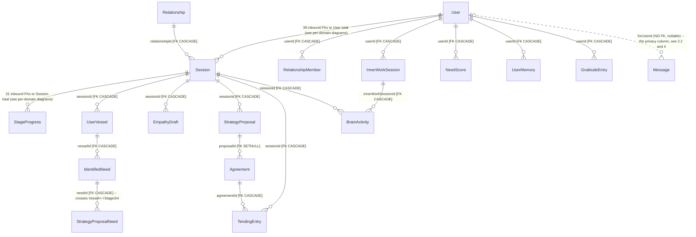
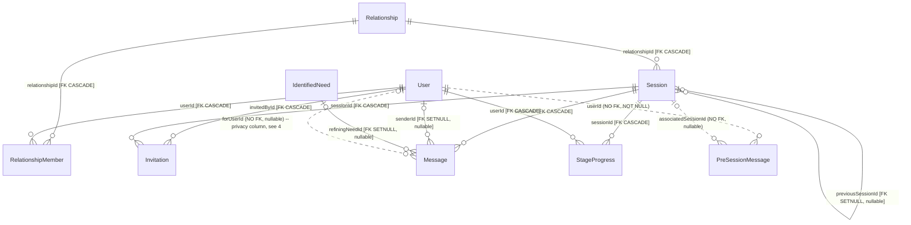
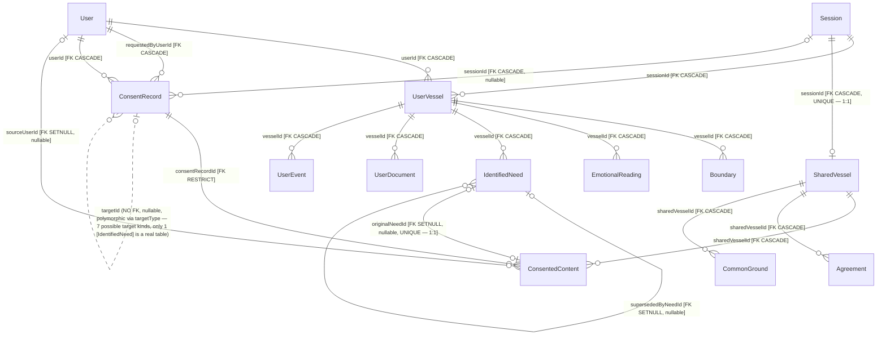
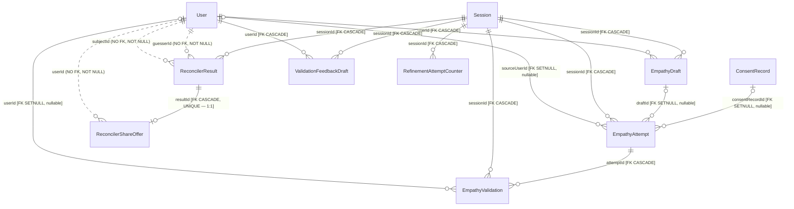
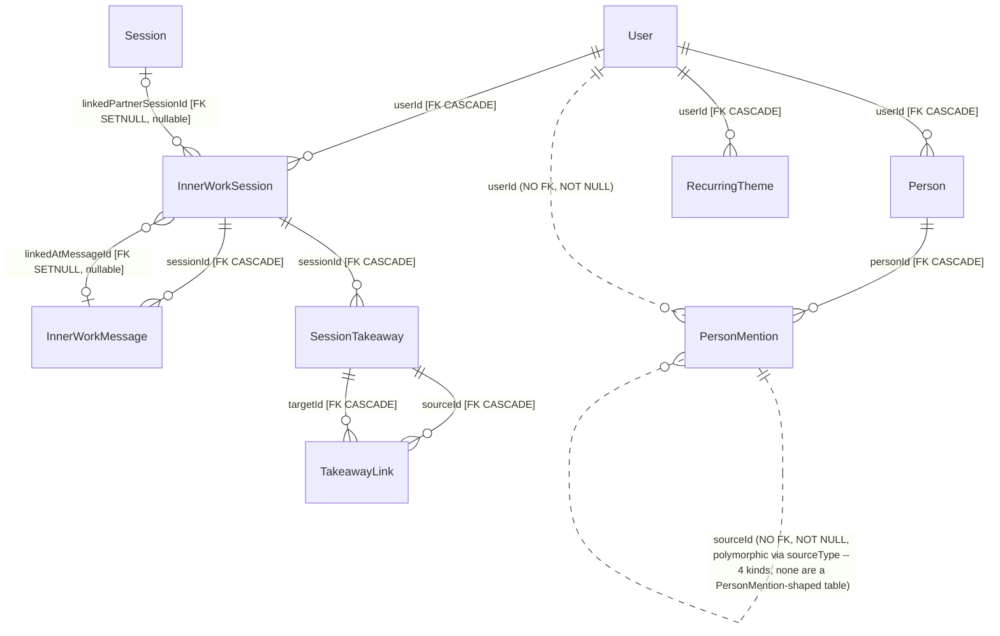
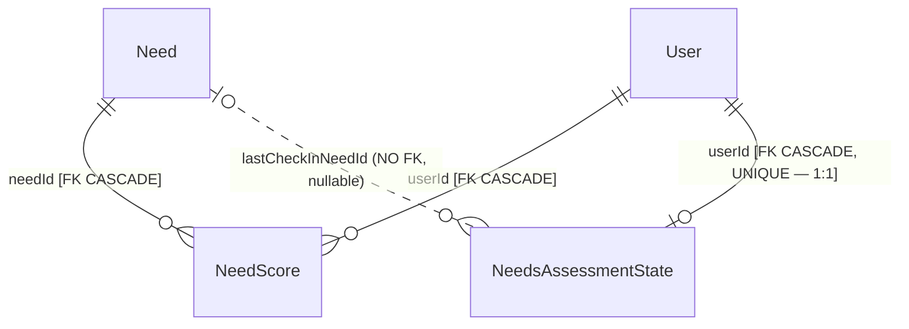
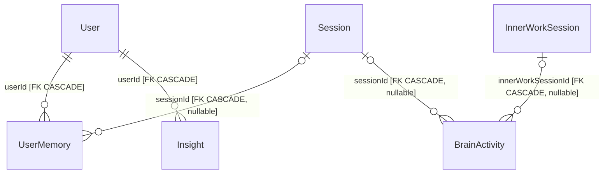

# ERD — Current State (As-Is)

This document is the "before" picture for a proposed redesign. It was produced by building a
**scratch database from the actual migration history** (`npx prisma migrate deploy`, all 74
migrations, PostgreSQL 16.14 + pgvector 0.8.6, matching production's stated environment) and
reading every fact below out of `information_schema` and `pg_catalog`. Nothing here was inferred
from `schema.prisma`; the appendix gives the exact queries so anyone can re-run them.

There is an earlier audit at [`schema-audit.md`](./schema-audit.md), built by introspecting the
**live production** database on 2026-08-12. Section 1.2 below reports where this migration-head
build disagrees with it.

## 1. Method and headline numbers

A database named `erd_asis_<pid>` was created on the local `mwf-postgres` container
(pgvector/pgvector:pg16), all 74 migrations in `backend/prisma/migrations/` were applied with
`prisma migrate deploy`, and the result was introspected cold — no seed data beyond what the
migrations themselves insert (see §1.3). The database was dropped at the end of this session (see
§7 for confirmation).

| Measure | This build (migration head) | Audit (live prod, 2026-08-12) | Match? |
|---|---|---|---|
| Tables (excl. `_prisma_migrations`) | 68 | 68 | yes |
| Columns (excl. `_prisma_migrations`) | 669 (434 NOT NULL, 235 nullable) | 669 (434 NOT NULL, 235 nullable) | yes — §1.2 |
| Enum types | 51 | 51 | yes |
| Indexes total / unique | 203 / 98 | 203 / 98 | yes |
| Foreign keys | 118 (96 CASCADE, 21 SET NULL, 1 RESTRICT) | 118 (96/21/1) | yes |
| Relation-shaped columns | 159 (118 enforced, 41 unenforced) | 159 (118/41) | yes |
| FKs missing a supporting index | 25 | 25 | yes |
| Mandatory (NOT NULL) unenforced relations | 9 | 9 (same 9 columns) | yes |
| Array-of-IDs columns | 10 | 10 (same 10 columns) | yes |
| Structural islands (no inbound/outbound FK) | `GlobalLibraryItem`, `PreSessionMessage` | same two | yes |
| Migrations applied | 74, linear, clean | 74, linear, clean | yes |
| CHECK constraints / triggers / views / sequences / RLS policies | 0 / 0 / 0 / 0 / 0 | 0 / 0 / 0 / 0 / 0 | yes |
| User-defined functions (excl. pgvector) | 0 | 0 | yes |

Every structural measure that determines *shape* — tables, FKs (and their delete rules), indexes
(and which are unique), enum types, the specific 9 mandatory-unenforced columns, the specific 10
array-of-IDs columns, the two structural islands, and the zero-counts for CHECK/trigger/view/
sequence/RLS — matches the audit exactly, digit for digit and name for name. The only place this
build appeared to disagree with the audit was the raw column count, and that resolved to a
counting-scope artifact rather than drift. That resolution, and one smaller
factual correction, are reported next.

### 1.1 New since the audit? No — the migration directory hasn't changed

The audit was created 2026-08-12. `backend/prisma/migrations/` was last modified 2026-08-12
08:46 (mtimes on the six newest migration directories), and git shows no commits touching
`backend/prisma/migrations` or `backend/prisma/schema.prisma` after `4cc3043d` (2026-05-22). So
the discrepancy below is not "new migrations landed since the audit was written" — the migration
history this build applied is identical to what the audit's 74-migration database was built from.

### 1.2 Resolved: the 677 vs 669 column count is a counting-scope artifact

This build reports **677** columns; the audit reports **669**. The gap is exactly the 8 columns of
Prisma's own bookkeeping table, `_prisma_migrations` — which this introspection counted and the
audit excluded. Verified directly:

```sql
-- all base tables in public
677 cols (439 NOT NULL, 238 nullable)
-- excluding _prisma_migrations
669 cols (434 NOT NULL, 235 nullable)
```

Both the total and the NOT NULL/nullable split match the audit exactly once the bookkeeping table
is excluded (434/235). `npx prisma migrate diff --from-url <scratch> --to-schema-datamodel
prisma/schema.prisma` also returns an empty diff, so `schema.prisma`, the migration history and
this build agree column for column.

**There is no production drift here, and no production query is needed to settle it.** An earlier
revision of this document offered "production has 8 columns no migration knows about" as one of two
candidate explanations. That reading is now excluded: the count is reproducible locally, and the
audit's own summary states "no table/column drift", which is consistent only with the artifact
explanation.

Counts elsewhere in this document **include** `_prisma_migrations` where they come from a catalog
query over all base tables. It is Prisma's table, not part of the application's data model, and a
future rewrite that removes Prisma removes it too — so when comparing against the audit, subtract
it.

query; it cannot be settled by working only from migration history.

### 1.3 Disagreement 2 (minor, factual): `Message.forUserId` — indexed, contra the audit's prose

The audit's §3(d) describes `Message.forUserId` as "nullable, **unindexed-as-leading-column**,
un-foreign-keyed text." This build shows it *is* the leading column of two indexes:

```sql
CREATE INDEX "Message_forUserId_idx" ON "Message"("forUserId");                          -- migration 20260102225910
CREATE INDEX "Message_sessionId_forUserId_role_idx" ON "Message"("sessionId","forUserId","role");  -- migration 20260223000003
```

Both statements are in the migration source verbatim (`backend/prisma/migrations/20260102225910_add_message_for_user_id/migration.sql`
and `.../20260223000003_cleanup_indexes_and_dead_fields/migration.sql`), so this isn't a
migration-vs-production question — the same migrations produced the audit's database. This
appears to be a slip in the audit's prose rather than a real discrepancy. **What the audit got
right, and what still stands**: the column is nullable, `text`, and has no foreign key — that part
is confirmed below and is the important part. See §2.2 and §4 for the callout the task asked for.

### 1.4 Not disagreements — supersets, not contradictions

- The audit names 6 free-text status-like columns lacking enum backing; this build finds 9
  (superset — the audit's list wasn't claimed to be exhaustive). See §3.5.
- The 41 unenforced relation-shaped columns break down identically by count and by the two
  explicitly-named categories (9 mandatory NOT NULL, 10 array-of-IDs); the audit's prose only
  narrates a handful of illustrative examples from the rest, not all 41. The complete list is in
  §3.3.

---

## 2. Entity-relationship diagrams

**Grouping rationale.** Tables are grouped by the domain the product docs already use (stages,
Vessel model, Tending) rather than by naming prefix, because that's how the FKs actually cluster —
e.g. every `Stage4*` table's foreign keys terminate at `Session`, `StrategyProposal`, or each
other, never at `Tending*`. Ten groups, all 68 tables accounted for once each:

| Domain | Tables | Count |
|---|---|---|
| Core identity & session | User, Relationship, RelationshipMember, Session, Invitation, Message, PreSessionMessage, StageProgress | 8 |
| Vessels, consent & shared state | UserVessel, SharedVessel, Boundary, EmotionalReading, IdentifiedNeed, UserDocument, UserEvent, ConsentRecord, ConsentedContent, Agreement, CommonGround | 11 |
| Empathy & reconciler (Stage 2) | EmpathyDraft, EmpathyAttempt, EmpathyValidation, ReconcilerResult, ReconcilerShareOffer, ValidationFeedbackDraft, RefinementAttemptCounter | 7 |
| Stage 3/4 — strategy & closure | StrategyProposal, StrategyProposalNeed, StrategyRanking, Stage4ProposalRevision, Stage4ProposalSelection, Stage4NeedCoverage, Stage4NeedDeclination, Stage4SubChat, Stage4SubChatMessage, Stage4Closure | 10 |
| Tending (post-resolution) | TendingEntry, TendingCheckin, TendingResponse, TendingResponsePartialClosure, TendingEntryOutcome, TendingNeedOutcome, TendingAdjustment, TendingReminder, TendingBetweenPeriodNote, TendingCoordinationCycle | 10 |
| Inner work & knowledge | InnerWorkSession, InnerWorkMessage, SessionTakeaway, TakeawayLink, Person, PersonMention, RecurringTheme | 7 |
| Needs reference & assessment | Need, NeedScore, NeedsAssessmentState | 3 |
| Memory & brain activity | UserMemory, BrainActivity, Insight | 3 |
| Wellbeing satellites | GratitudeEntry, GratitudePreferences, MeditationSession, MeditationStats, MeditationFavorite, MeditationPreferences, SavedMeditation, EmotionalExerciseCompletion | 8 |
| Operations / global | GlobalLibraryItem | 1 |

**Notation** (standard crow's-foot, verified against this repo's existing usage in
`schema-audit.md` and rendering rules for Docusaurus's Mermaid plugin):

- Solid line (`--`) = enforced by a real foreign key. Dotted line (`..`) = relation-shaped column
  with **no FK** — implied by name/usage only.
- The symbol next to the **parent** entity encodes whether the child's referencing column is
  **nullable**: `||` = NOT NULL (child must reference exactly one parent); `|o` = nullable (child
  may reference zero or one parent).
- The symbol next to the **child** entity encodes multiplicity: `o{` = zero-or-many (ordinary
  FK); `o|` = zero-or-one (the referencing column is also covered by a UNIQUE index/constraint,
  i.e. a de-facto 1:1); `o{` on both ends (`}o..o{`) = many-to-many, used only for the
  array-of-IDs columns, which are genuinely many-to-many and unenforceable by a plain FK.
- Every edge's label is `columnName [FK <ON DELETE behavior>]` for enforced relations, or
  `columnName (NO FK)` — with `NOT NULL` called out where true — for unenforced ones.
- `User` and `Session` reappear in most diagrams below (both are hubs — see §2.1); that repetition
  is intentional so every relationship's cardinality/nullability is shown at least once, rather
  than only once in a master diagram.

### 2.1 Overview — domain clusters and what crosses between them



This is a routing map, not an exhaustive edge list — every edge appears in full, with correct
cardinality/nullability, in its domain diagram below. Two things to notice here already: (1)
`User` and `Session` are the only two tables every other domain reaches back to, confirming the
audit's "hub" framing (39 and 31 inbound FKs respectively); (2) the Vessel→Stage3/4 and
Stage3/4→Tending crossings are the only places a strict domain split breaks down, because
`Agreement` (Vessel-owned) is the join between "what was proposed" (Stage 3/4) and "what gets
tended after" (Tending).

### 2.2 Core identity & session



`PreSessionMessage` is one of the two structural islands (§1, §3.2): it has no real FK in either
direction, only the two dotted edges above.

### 2.3 Vessels, consent & shared state



`ConsentRecord.consentRecordId -> ConsentedContent` is the schema's **only `RESTRICT`** — the one
place the database refuses a delete rather than cascading or nulling. `ConsentRecord.targetId`'s
dotted self-loop is a simplification for renderability; its `targetType` discriminator names 7
kinds (`IDENTIFIED_NEED`, `EVENT_SUMMARY`, `EMOTIONAL_PATTERN`, `BOUNDARY`, `EMPATHY_DRAFT`,
`EMPATHY_ATTEMPT`, `STRATEGY_PROPOSAL`) and only `IDENTIFIED_NEED` clearly names an existing table.

### 2.4 Empathy & reconciler (Stage 2)



This is the subsystem that decides the empathy-gap analysis between two named people, and both
"who is this about" columns (`guesserId`, `subjectId`) plus `ReconcilerShareOffer.userId` are
`NOT NULL` with no FK — 3 of the schema's 9 mandatory-unenforced columns live here.

### 2.5 Stage 3/4 — strategy, proposals & closure

```mermaid
erDiagram
    Session ||--o{ StrategyProposal : "sessionId [FK CASCADE]"
    ConsentRecord |o--o{ StrategyProposal : "consentRecordId [FK SETNULL, nullable]"
    User |o--o{ StrategyProposal : "createdByUserId [FK SETNULL, nullable]"
    User |o--o{ StrategyProposal : "removedByUserId [FK SETNULL, nullable]"
    StrategyProposal ||--o{ StrategyProposalNeed : "proposalId [FK CASCADE] (composite PK w/ needId)"
    IdentifiedNeed ||--o{ StrategyProposalNeed : "needId [FK CASCADE]"
    Session ||--o{ StrategyRanking : "sessionId [FK CASCADE]"
    User ||--o{ StrategyRanking : "userId [FK CASCADE]"
    StrategyProposal ||--o{ Stage4ProposalRevision : "proposalId [FK CASCADE]"
    StrategyProposal ||--o{ Stage4ProposalSelection : "proposalId [FK CASCADE]"
    Session ||--o{ Stage4ProposalSelection : "sessionId [FK CASCADE]"
    User ||--o{ Stage4ProposalSelection : "userId [FK CASCADE]"
    Session ||--o{ Stage4NeedCoverage : "sessionId [FK CASCADE]"
    Session ||--o{ Stage4NeedDeclination : "sessionId [FK CASCADE]"
    Session ||--o{ Stage4SubChat : "sessionId [FK CASCADE]"
    User ||--o{ Stage4SubChat : "userId [FK CASCADE]"
    Stage4SubChat ||--o{ Stage4SubChatMessage : "subChatId [FK CASCADE]"
    Session ||--o| Stage4Closure : "sessionId [FK CASCADE, UNIQUE — 1:1]"
    StrategyProposal |o..o{ StrategyProposal : "parentProposalId (NO FK, nullable)"
    Message |o..o{ StrategyProposal : "capturedFromMessageId (NO FK, nullable)"
    Session ||..o{ Stage4ProposalRevision : "sessionId (NO FK, NOT NULL) -- redundant w/ proposalId->Session path"
    User |o..o{ Stage4ProposalRevision : "actorUserId (NO FK, nullable)"
    Message |o..o{ Stage4ProposalRevision : "messageId (NO FK, nullable)"
    User ||..o{ Stage4NeedDeclination : "userId (NO FK, NOT NULL)"
    IdentifiedNeed ||..o{ Stage4NeedDeclination : "needId (NO FK, NOT NULL)"
    IdentifiedNeed |o..o{ Stage4NeedCoverage : "needId (NO FK, nullable)"
    User |o..o{ Stage4NeedCoverage : "sourceUserId (NO FK, nullable)"
    User |o..o{ Stage4Closure : "closedByUserId (NO FK, nullable)"
    StrategyProposal }o..o{ StrategyRanking : "rankedIds[] (array, NO FK, many-to-many)"
    StrategyProposal }o..o{ Stage4NeedCoverage : "coveringProposalIds[] (array, NO FK, many-to-many)"
    StrategyProposal }o..o{ Stage4Closure : "individualProposalIds[] (array, NO FK, many-to-many)"
    Agreement }o..o{ Stage4Closure : "sharedAgreementIds[] (array, NO FK, many-to-many)"
    IdentifiedNeed }o..o{ Stage4Closure : "openNeedIds[] (array, NO FK, many-to-many)"
    Stage4SubChat |o..o{ Stage4SubChat : "anchorId (NO FK, nullable, polymorphic via anchorKind — not table-backed)"
```



This is the densest cluster of unenforced relationships in the schema: 4 of the 10 array-of-IDs
columns and 2 of the 9 mandatory-NOT-NULL-unenforced columns (`Stage4NeedDeclination.userId`,
`.needId`) live here, plus `Stage4ProposalRevision.sessionId` — the third mandatory-unenforced
column, and notably a *duplicate* path to `Session` that already exists safely via
`proposalId -> StrategyProposal -> sessionId`, so this specific unenforced column looks like
redundant denormalization rather than the only route to the session.

### 2.6 Tending (post-resolution)

```mermaid
erDiagram
    Agreement |o--o{ TendingEntry : "agreementId [FK CASCADE, nullable]"
    Session ||--o{ TendingEntry : "sessionId [FK CASCADE]"
    TendingCoordinationCycle |o--o{ TendingCheckin : "coordinationCycleId [FK SETNULL, nullable]"
    Session ||--o{ TendingCheckin : "sessionId [FK CASCADE]"
    User ||--o{ TendingCheckin : "userId [FK CASCADE]"
    TendingCheckin |o--o{ TendingResponse : "checkinId [FK SETNULL, nullable]"
    TendingEntry ||--o{ TendingResponse : "tendingEntryId [FK CASCADE]"
    User ||--o{ TendingResponse : "userId [FK CASCADE]"
    TendingEntry ||--o{ TendingResponsePartialClosure : "tendingEntryId [FK CASCADE]"
    TendingResponse ||--o{ TendingResponsePartialClosure : "tendingResponseId [FK CASCADE]"
    TendingCheckin ||--o{ TendingEntryOutcome : "checkinId [FK CASCADE]"
    TendingResponse |o--o{ TendingEntryOutcome : "responseId [FK SETNULL, nullable]"
    TendingEntry ||--o{ TendingEntryOutcome : "tendingEntryId [FK CASCADE]"
    User ||--o{ TendingEntryOutcome : "userId [FK CASCADE]"
    TendingCheckin ||--o{ TendingNeedOutcome : "checkinId [FK CASCADE]"
    Session ||--o{ TendingNeedOutcome : "sessionId [FK CASCADE]"
    TendingCheckin ||--o{ TendingAdjustment : "checkinId [FK CASCADE]"
    Session ||--o{ TendingAdjustment : "sessionId [FK CASCADE]"
    TendingEntry ||--o{ TendingAdjustment : "tendingEntryId [FK CASCADE]"
    User ||--o{ TendingAdjustment : "userId [FK CASCADE]"
    TendingCheckin |o--o{ TendingReminder : "checkinId [FK SETNULL, nullable]"
    Session ||--o{ TendingReminder : "sessionId [FK CASCADE]"
    TendingEntry |o--o{ TendingReminder : "tendingEntryId [FK CASCADE, nullable]"
    User ||--o{ TendingReminder : "userId [FK CASCADE]"
    TendingCheckin |o--o{ TendingBetweenPeriodNote : "selectedForCheckinId [FK SETNULL, nullable]"
    Session ||--o{ TendingBetweenPeriodNote : "sessionId [FK CASCADE]"
    User ||--o{ TendingBetweenPeriodNote : "userId [FK CASCADE]"
    User ||--o{ TendingCoordinationCycle : "createdByUserId [FK CASCADE]"
    Session ||--o{ TendingCoordinationCycle : "sessionId [FK CASCADE]"
    User |o..o{ TendingEntry : "ownerUserId (NO FK, nullable)"
    IdentifiedNeed |o..o{ TendingNeedOutcome : "needId (NO FK, nullable)"
    User |o..o{ TendingNeedOutcome : "sourceUserId (NO FK, nullable)"
    TendingEntry }o..o{ TendingCoordinationCycle : "entryIds[] (array, NO FK, many-to-many)"
    User }o..o{ TendingCoordinationCycle : "participantUserIds[] (array, NO FK, many-to-many)"
    User }o..o{ TendingCoordinationCycle : "submittedUserIds[] (array, NO FK, many-to-many)"
```



`TendingEntry.agreementId` and `TendingReminder.tendingEntryId` are both `ON DELETE CASCADE`
despite being **nullable** — an optional relationship that still deletes its child on parent
delete, which is a legal but easy-to-miss combination (see §4). `TendingCoordinationCycle` also
carries the schema's one **partial** unique index — see §3.4.

### 2.7 Inner work & knowledge



`PersonMention.userId` and `.sourceId` are 2 more of the 9 mandatory-unenforced columns.
`sourceId`'s dotted self-loop is a rendering simplification; `sourceType` names 4 kinds
(`INNER_THOUGHTS`, `GRATITUDE`, `NEEDS_CHECKIN`, `PARTNER_SESSION`) that are conversational
contexts, not table names.

### 2.8 Needs reference & assessment



`Need` is the schema's only non-`text`, non-cuid primary key: `Int`, values 1–19, inserted
literally by migration `20260106083657_add_inner_work_features` (confirmed present in this build
— see §3.1). No sequence, no identity, no default; a concurrent insert supplying a duplicate
integer would collide on the primary key.

### 2.9 Memory & brain activity



`BrainActivity.turnId` is indexed but not a foreign key to anything identifiable in the catalog —
`schema.prisma` carries no comment on it either. It correlates rows from the same conversational
turn rather than clearly pointing at another table, so it isn't counted among the 41 unenforced
relation-shaped columns above; flagged here for completeness since its name pattern matches the
heuristic used to build that list.

### 2.10 Wellbeing satellites

```mermaid
erDiagram
    User ||--o{ GratitudeEntry : "userId [FK CASCADE]"
    User ||--o| GratitudePreferences : "userId [FK CASCADE, UNIQUE — 1:1]"
    User ||--o{ MeditationSession : "userId [FK CASCADE]"
    User ||--o| MeditationStats : "userId [FK CASCADE, UNIQUE — 1:1]"
    User ||--o{ MeditationFavorite : "userId [FK CASCADE]"
    User ||--o| MeditationPreferences : "userId [FK CASCADE, UNIQUE — 1:1]"
    User ||--o{ SavedMeditation : "userId [FK CASCADE]"
    Session ||--o{ EmotionalExerciseCompletion : "sessionId [FK CASCADE]"
    User ||--o{ EmotionalExerciseCompletion : "userId [FK CASCADE]"
    Need }o..o{ GratitudeEntry : "linkedNeedIds[] (array, NO FK, many-to-many)"
    Session |o..o{ GratitudeEntry : "linkedConflictId (NO FK, nullable, likely Session per schema comment)"
    Need }o..o{ MeditationSession : "linkedNeedIds[] (array, NO FK, many-to-many)"
    Session |o..o{ MeditationSession : "linkedConflictId (NO FK, nullable, likely Session per schema comment)"
    InnerWorkSession |o..o{ SavedMeditation : "conversationId (NO FK, nullable, per schema comment: link to InnerWorkSession)"
```



4 of the "Wellbeing satellites" (this domain and Memory/Operations) have **no intra-cluster FKs at
all** — every real edge they have terminates at `User`. `MeditationSession.voiceId` matches the
unenforced-relation name heuristic but is confirmed by a schema comment to be a TTS voice
identifier, not an internal reference, and is excluded here.

### 2.11 Operations / global

`GlobalLibraryItem` has zero inbound and zero outbound foreign keys — the second of the two
structural islands (§1, §3.2). No diagram; it connects to nothing.

---

## 3. Complete object inventories

### 3.1 Tables (68 + `_prisma_migrations`)

All 68 use a single-column primary key named `id`, except `StrategyProposalNeed` (composite PK:
`proposalId, needId` — the schema's one real junction table). **No primary key of any table has a
database-side default** — every `id` is minted client-side by the Prisma client as a cuid v1
(`text`), with one exception:

| Table | PK column(s) | PK type | DB-side default | Rows in this build |
|---|---|---|---|---|
| `Need` | `id` | `integer` | none — values 1–19 inserted literally by migration `20260106083657_add_inner_work_features` | 19 |
| `StrategyProposalNeed` | `proposalId, needId` | `text, text` (composite) | none | 0 |
| all other 66 tables | `id` | `text` (cuid v1, client-minted) | none | 0 |
| `_prisma_migrations` | `id` | `character varying` | none | 74 |

This build has **no fixture data** beyond what the migrations themselves insert — a clean
`migrate deploy` with no seed script run afterward. Two tables are non-empty for that reason
(`Need`: 19 reference rows from the migration; `_prisma_migrations`: 74 ledger rows); the other 67
data tables are empty. Row counts are therefore not meaningful evidence of anything here — they
just confirm the migration's own seed data landed — and are omitted from the per-table list below
to avoid implying otherwise. The full 68-table name list is in §1's headline table (yields the
same names in the same 10 domain groupings used for the diagrams in §2).

### 3.2 Foreign keys (118)

All 118, with on-delete behavior and whether the referencing column has a **leading-column
supporting index** (a FK without one forces a sequential scan of the child table on every parent
delete):

| Child.column | Parent | On delete | Indexed? |
|---|---|---|---|
| Agreement.proposalId | StrategyProposal | SET NULL | yes |
| Agreement.sharedVesselId | SharedVessel | CASCADE | yes |
| Boundary.vesselId | UserVessel | CASCADE | yes |
| BrainActivity.innerWorkSessionId | InnerWorkSession | CASCADE | yes |
| BrainActivity.sessionId | Session | CASCADE | yes |
| CommonGround.sharedVesselId | SharedVessel | CASCADE | yes |
| ConsentRecord.requestedByUserId | User | CASCADE | **no** |
| ConsentRecord.sessionId | Session | CASCADE | **no** |
| ConsentRecord.userId | User | CASCADE | yes |
| ConsentedContent.consentRecordId | ConsentRecord | RESTRICT | **no** |
| ConsentedContent.originalNeedId | IdentifiedNeed | SET NULL | yes (unique) |
| ConsentedContent.sharedVesselId | SharedVessel | CASCADE | yes |
| ConsentedContent.sourceUserId | User | SET NULL | yes |
| EmotionalExerciseCompletion.sessionId | Session | CASCADE | yes |
| EmotionalExerciseCompletion.userId | User | CASCADE | **no** |
| EmotionalReading.vesselId | UserVessel | CASCADE | yes |
| EmpathyAttempt.consentRecordId | ConsentRecord | SET NULL | **no** |
| EmpathyAttempt.draftId | EmpathyDraft | SET NULL | **no** |
| EmpathyAttempt.sessionId | Session | CASCADE | yes |
| EmpathyAttempt.sourceUserId | User | SET NULL | **no** |
| EmpathyDraft.sessionId | Session | CASCADE | yes |
| EmpathyDraft.userId | User | CASCADE | **no** |
| EmpathyValidation.attemptId | EmpathyAttempt | CASCADE | yes |
| EmpathyValidation.sessionId | Session | CASCADE | **no** |
| EmpathyValidation.userId | User | SET NULL | **no** |
| GratitudeEntry.userId | User | CASCADE | yes |
| GratitudePreferences.userId | User | CASCADE | yes (unique) |
| IdentifiedNeed.supersededByNeedId | IdentifiedNeed | SET NULL | yes |
| IdentifiedNeed.vesselId | UserVessel | CASCADE | yes |
| InnerWorkMessage.sessionId | InnerWorkSession | CASCADE | yes |
| InnerWorkSession.linkedAtMessageId | InnerWorkMessage | SET NULL | yes |
| InnerWorkSession.linkedPartnerSessionId | Session | SET NULL | yes |
| InnerWorkSession.userId | User | CASCADE | yes |
| Insight.userId | User | CASCADE | yes |
| Invitation.invitedById | User | CASCADE | **no** |
| Invitation.sessionId | Session | CASCADE | yes |
| MeditationFavorite.userId | User | CASCADE | yes |
| MeditationPreferences.userId | User | CASCADE | yes (unique) |
| MeditationSession.userId | User | CASCADE | yes |
| MeditationStats.userId | User | CASCADE | yes (unique) |
| Message.refiningNeedId | IdentifiedNeed | SET NULL | yes |
| Message.senderId | User | SET NULL | yes |
| Message.sessionId | Session | CASCADE | yes |
| NeedScore.needId | Need | CASCADE | **no** |
| NeedScore.userId | User | CASCADE | yes |
| NeedsAssessmentState.userId | User | CASCADE | yes (unique) |
| Person.userId | User | CASCADE | yes |
| PersonMention.personId | Person | CASCADE | yes |
| ReconcilerResult.sessionId | Session | CASCADE | yes |
| ReconcilerShareOffer.resultId | ReconcilerResult | CASCADE | yes (unique) |
| RecurringTheme.userId | User | CASCADE | yes |
| RefinementAttemptCounter.sessionId | Session | CASCADE | yes |
| RelationshipMember.relationshipId | Relationship | CASCADE | yes |
| RelationshipMember.userId | User | CASCADE | yes |
| SavedMeditation.userId | User | CASCADE | yes |
| Session.previousSessionId | Session | SET NULL | yes |
| Session.relationshipId | Relationship | CASCADE | yes |
| SessionTakeaway.sessionId | InnerWorkSession | CASCADE | yes |
| SharedVessel.sessionId | Session | CASCADE | yes (unique) |
| Stage4Closure.sessionId | Session | CASCADE | yes (unique) |
| Stage4NeedCoverage.sessionId | Session | CASCADE | yes |
| Stage4NeedDeclination.sessionId | Session | CASCADE | yes |
| Stage4ProposalRevision.proposalId | StrategyProposal | CASCADE | yes |
| Stage4ProposalSelection.proposalId | StrategyProposal | CASCADE | yes |
| Stage4ProposalSelection.sessionId | Session | CASCADE | yes |
| Stage4ProposalSelection.userId | User | CASCADE | **no** |
| Stage4SubChat.sessionId | Session | CASCADE | yes |
| Stage4SubChat.userId | User | CASCADE | **no** |
| Stage4SubChatMessage.subChatId | Stage4SubChat | CASCADE | yes |
| StageProgress.sessionId | Session | CASCADE | yes |
| StageProgress.userId | User | CASCADE | yes |
| StrategyProposal.consentRecordId | ConsentRecord | SET NULL | **no** |
| StrategyProposal.createdByUserId | User | SET NULL | **no** |
| StrategyProposal.removedByUserId | User | SET NULL | **no** |
| StrategyProposal.sessionId | Session | CASCADE | yes |
| StrategyProposalNeed.needId | IdentifiedNeed | CASCADE | yes |
| StrategyProposalNeed.proposalId | StrategyProposal | CASCADE | yes |
| StrategyRanking.sessionId | Session | CASCADE | yes |
| StrategyRanking.userId | User | CASCADE | **no** |
| TakeawayLink.sourceId | SessionTakeaway | CASCADE | yes |
| TakeawayLink.targetId | SessionTakeaway | CASCADE | yes |
| TendingAdjustment.checkinId | TendingCheckin | CASCADE | yes |
| TendingAdjustment.sessionId | Session | CASCADE | yes |
| TendingAdjustment.tendingEntryId | TendingEntry | CASCADE | yes |
| TendingAdjustment.userId | User | CASCADE | yes |
| TendingBetweenPeriodNote.selectedForCheckinId | TendingCheckin | SET NULL | yes |
| TendingBetweenPeriodNote.sessionId | Session | CASCADE | yes |
| TendingBetweenPeriodNote.userId | User | CASCADE | **no** |
| TendingCheckin.coordinationCycleId | TendingCoordinationCycle | SET NULL | yes |
| TendingCheckin.sessionId | Session | CASCADE | yes |
| TendingCheckin.userId | User | CASCADE | yes |
| TendingCoordinationCycle.createdByUserId | User | CASCADE | **no** |
| TendingCoordinationCycle.sessionId | Session | CASCADE | yes |
| TendingEntry.agreementId | Agreement | CASCADE | yes |
| TendingEntry.sessionId | Session | CASCADE | yes |
| TendingEntryOutcome.checkinId | TendingCheckin | CASCADE | yes |
| TendingEntryOutcome.responseId | TendingResponse | SET NULL | **no** |
| TendingEntryOutcome.tendingEntryId | TendingEntry | CASCADE | yes |
| TendingEntryOutcome.userId | User | CASCADE | yes |
| TendingNeedOutcome.checkinId | TendingCheckin | CASCADE | yes |
| TendingNeedOutcome.sessionId | Session | CASCADE | yes |
| TendingReminder.checkinId | TendingCheckin | SET NULL | yes |
| TendingReminder.sessionId | Session | CASCADE | yes |
| TendingReminder.tendingEntryId | TendingEntry | CASCADE | yes |
| TendingReminder.userId | User | CASCADE | yes |
| TendingResponse.checkinId | TendingCheckin | SET NULL | yes |
| TendingResponse.tendingEntryId | TendingEntry | CASCADE | yes |
| TendingResponse.userId | User | CASCADE | **no** |
| TendingResponsePartialClosure.tendingEntryId | TendingEntry | CASCADE | yes |
| TendingResponsePartialClosure.tendingResponseId | TendingResponse | CASCADE | yes |
| UserDocument.vesselId | UserVessel | CASCADE | yes |
| UserEvent.vesselId | UserVessel | CASCADE | yes |
| UserMemory.sessionId | Session | CASCADE | **no** |
| UserMemory.userId | User | CASCADE | yes |
| UserVessel.sessionId | Session | CASCADE | yes |
| UserVessel.userId | User | CASCADE | yes |
| ValidationFeedbackDraft.sessionId | Session | CASCADE | yes |
| ValidationFeedbackDraft.userId | User | CASCADE | **no** |

**Totals**: 118 FKs — 96 CASCADE, 21 SET NULL, 1 RESTRICT (`ConsentedContent.consentRecordId`, the
schema's strongest integrity guarantee — a consent record can't be deleted while content depends
on it). **25 have no leading-column index** (marked **no** above), forcing a sequential scan of
the child table on every parent delete.

### 3.3 Unenforced relation-shaped columns (41)

A relation-shaped column is any `%Id`/`%Ids`-named column (excluding the `id` primary key itself)
with no foreign key constraint. 41 found, matching the audit's count exactly:

**(a) Mandatory (NOT NULL) — 9.** The application requires these; the database enforces nothing:

| Table.column | Points at |
|---|---|
| ReconcilerResult.guesserId | User |
| ReconcilerResult.subjectId | User |
| ReconcilerShareOffer.userId | User |
| PreSessionMessage.userId | User |
| PersonMention.userId | User |
| PersonMention.sourceId | polymorphic (`sourceType`) |
| Stage4NeedDeclination.userId | User |
| Stage4NeedDeclination.needId | IdentifiedNeed |
| Stage4ProposalRevision.sessionId | Session |

**(b) Array-of-IDs — 10.** Many-to-many relations Postgres cannot FK an array element for:

`Stage4Closure.{sharedAgreementIds, individualProposalIds, openNeedIds}`,
`Stage4NeedCoverage.coveringProposalIds`, `StrategyRanking.rankedIds`,
`TendingCoordinationCycle.{entryIds, participantUserIds, submittedUserIds}`,
`GratitudeEntry.linkedNeedIds`, `MeditationSession.linkedNeedIds`.

**(c) Genuine polymorphic references — 2, plus 1 near-miss:**

| Table.column | Discriminator | Notes |
|---|---|---|
| ConsentRecord.targetId | targetType (7 values) | only `IDENTIFIED_NEED` clearly names a real table |
| PersonMention.sourceId | sourceType (4 values) | conversational contexts, not tables (also in (a)) |
| Stage4SubChat.anchorId | anchorKind (3 values) | anchor is a context, not a row |

**(d) The privacy column — 1.** `Message.forUserId`: nullable, `text`, no FK — see §4.

**(e) Everything else — 19 nullable columns**, mostly optional self-references and cross-links:
`BrainActivity.turnId` (not clearly a relation at all — see §2.9), `GratitudeEntry.linkedConflictId`,
`MeditationSession.linkedConflictId`, `NeedsAssessmentState.lastCheckInNeedId` (the schema's one
`integer`-typed unenforced relation, → `Need`), `PreSessionMessage.associatedSessionId`,
`SavedMeditation.conversationId`, `Stage4Closure.closedByUserId`, `Stage4NeedCoverage.needId`,
`Stage4NeedCoverage.sourceUserId`, `Stage4ProposalRevision.actorUserId`,
`Stage4ProposalRevision.messageId`, `StrategyProposal.capturedFromMessageId`,
`StrategyProposal.parentProposalId`, `TendingEntry.ownerUserId`, `TendingNeedOutcome.needId`,
`TendingNeedOutcome.sourceUserId`, `UserVessel.lastSeenChatItemId`, plus 2 **false positives** from
the naming heuristic that are *not* internal relations at all: `User.clerkId` (external Clerk auth
ID) and `MeditationSession.voiceId` (external TTS voice identifier, confirmed by schema comment).

**Reconciling the count**: (a) 9 + (b) 10 + (c) 2 *new* columns not already in (a) —
`ConsentRecord.targetId` and `Stage4SubChat.anchorId` (`PersonMention.sourceId` is in (c) too but
is not counted twice; it's already one of the 9 in (a)) + (d) 1 + (e) 19 = **41**.

**Structural islands** — tables with zero inbound *and* zero outbound FK: `GlobalLibraryItem`,
`PreSessionMessage`. (`PreSessionMessage` still has the two unenforced columns above; "island"
here means no *enforced* relationship in either direction.)

### 3.4 Unique constraints and indexes

**0 UNIQUE table constraints** in the strict `information_schema.table_constraints` sense —
Prisma's `@unique`/`@@unique` compiles to a `CREATE UNIQUE INDEX`, not an `ADD CONSTRAINT UNIQUE`,
so uniqueness here is enforced entirely through indexes.

**203 indexes total, 98 unique** (69 are primary keys — one per table including
`_prisma_migrations` — and 29 are non-PK unique indexes). One index is **partial**:

```sql
CREATE UNIQUE INDEX "TendingCoordinationCycle_active_coordinationKey_key"
  ON "TendingCoordinationCycle" ("coordinationKey")
  WHERE ("coordinationKey" IS NOT NULL
     AND status = ANY (ARRAY['WAITING_FOR_PARTNER','READY_TO_RESOLVE']::"TendingCoordinationStatus"[]));
```

This is the single most sophisticated constraint in the schema: it enforces "at most one *active*
coordination cycle per key" while allowing unlimited resolved/timed-out history — a business rule
correctly pushed into the database, and the only place that happens. The other 28 non-PK unique
indexes are straightforward single- or multi-column uniqueness (e.g. `User.email`, `User.clerkId`,
`(sessionId, sourceUserId)` on `EmpathyAttempt`, `(userId, sessionId)` on `UserVessel`). 105
indexes are plain (non-unique) B-tree indexes, mostly the FK-supporting and query-pattern
composite indexes tabulated in §3.2 and §2's diagrams. Full list of all 203 in the appendix (§8,
query 8).

### 3.5 Enum types (51) and free-text status columns

51 enum types exist; 50 are used directly by a scalar column (59 column usages — some enums cover
more than one column, e.g. `ContinueChoice` on both `TendingCheckin` and `TendingResponse`); the
51st, `TendingBlockerCategory`, is used only inside two array columns
(`TendingAdjustment.blockerAddressed`, `TendingEntryOutcome.blockerCategories`) — every enum is
used by something, none are dead.

**9 status-like columns carry free text instead of an enum** (superset of the audit's list of 6 —
see §1.4):

`TendingResponse.status`, `TendingReminder.status`, `ReconcilerResult.gapSeverity`,
`ReconcilerResult.recommendedAction`, `ReconcilerResult.guidanceType`, `RelationshipMember.role`,
`UserDocument.type`, `Stage4NeedCoverage.coverageStatus`, `Stage4ProposalRevision.action`.

Full enum → column mapping is in the appendix (§8, query 9).

### 3.6 CHECK constraints, triggers, functions, views, sequences, RLS — all zero (except pgvector)

| Object type | Count | Query |
|---|---|---|
| CHECK constraints | **0** | §8 query 10 |
| Triggers | **0** | §8 query 11 |
| Views / materialized views | **0** / **0** | §8 query 12 |
| Sequences | **0** | §8 query 13 |
| Tables with RLS enabled | **0** | §8 query 14 |
| RLS policies | **0** | §8 query 14 |
| User-defined functions/procedures | **0** | §8 query 15 |

`public.*` does contain 118 functions, but every one belongs to the `vector` extension (0.8.6) —
`vector_*`, `halfvec_*`, `sparsevec_*`, distance/norm operators, `hnswhandler`/`ivfflathandler`,
etc. None were written for this application.

Migration `20260311000000_add_row_level_security` added 6 `ENABLE ROW LEVEL SECURITY` +
`CREATE POLICY` statements (on `InnerWorkSession`, `InnerWorkMessage`, `UserVessel`, `UserMemory`,
`StageProgress`, `EmpathyDraft`); migration `20260430000000_remove_unenforced_rls` dropped every
one of them, with a comment explaining they were bypassed because the app connects as table owner
and never sets `app.current_user_id`. Both migrations were applied in this build in sequence, so
the net effect confirmed above is zero — this is a policy that existed and was deliberately
reverted, not something that was never tried.

### 3.7 Roles and grants

On this scratch database, exactly **one** role holds any privileges: `mwf_user` (the connecting
role), with full `DELETE/INSERT/REFERENCES/SELECT/TRIGGER/TRUNCATE/UPDATE` on every table. No
`CREATE ROLE`, `GRANT`, or `FORCE ROW LEVEL SECURITY` statement appears anywhere in the
74-migration history (confirmed by grep — the only occurrences of those keywords are in code
comments inside the reverted RLS migration, describing what *would* be needed).

**A note on transient roles seen during this survey.** While this document was being produced,
`pg_roles` on the shared local `mwf-postgres` container also listed three login roles — `p3_app`,
`p3_bypass`, `p3_owner` — created by the concurrent Phase 3 security-model prototyping and since
dropped (verified: `select rolname from pg_roles where rolname like 'p3_%'` returns nothing).
They were never created by any migration in this repository and held zero grants on any
application table. Recorded here only so a reader who finds a similar artefact knows it is
prototyping residue, not schema. Postgres roles are cluster-wide rather than per-database, so
anything prototyped on this container is visible from every database on it — worth remembering
when prototyping against a shared instance.

The role count for the meet-without-fear schema itself is, matching the audit, **0**: no
application role, no read-only role, no non-owner role. Everything connects as the owner.

---

## 4. `Message.forUserId` — the column deciding who sees what

Per the task brief, called out on its own: `Message.forUserId` is `text`, **nullable**, and has
**no foreign key**. `NULL` means "visible to both participants in the session"; a value means
"visible only to the user with that ID." This one column is the entire database-level mechanism
separating what each partner can see in a shared session — and nothing in the schema constrains
its values to be a real, current `User.id`. A row could carry a typo'd ID, a deleted user's ID, or
(in the E2E auth-bypass path documented in the audit, §2) a caller-supplied non-cuid string, and
the database would accept it exactly as readily as a valid one. It is indexed (§1.3) — that
corrects the audit's prose — but indexing is a performance property, not an integrity one; a
sequential scan for messages "visible to nobody real" would find nothing to flag, because there is
no way to define that query against the catalog alone.

---

## 5. Observations

Descriptive only — no recommendations; a redesign is a separate workstream.

- **Two hubs, everything else is a spoke.** `User` (39 inbound FKs) and `Session` (31 inbound FKs)
  are referenced from nearly every other table; no other table has more than a handful of inbound
  edges. The domain split in §2 is real, but almost every domain diagram needs both hub tables
  repeated to show its edges.
- **The array-of-IDs pattern recurs 10 times across 3 different domains** (Stage 3/4:
  `Stage4Closure` ×3, `Stage4NeedCoverage`, `StrategyRanking` — 5 columns; Tending:
  `TendingCoordinationCycle` ×3 — 3 columns; Wellbeing: `GratitudeEntry`, `MeditationSession` — 2
  columns). Every one of them is doing the job a junction table would do, and
  `StrategyProposalNeed` shows the schema already knows how to write a real junction table — it
  just wasn't used consistently.
  `StrategyProposalNeed` is the schema's only composite-PK table.
  `TendingBlockerCategory` is the one enum used *exclusively* inside array columns.
- **Every application timestamp is timezone-naive.** 144 columns are
  `timestamp without time zone`; the only 3 `timestamp with time zone` columns belong to Prisma's
  own `_prisma_migrations` table, not to any application data.
  Prisma writes UTC by convention, but nothing in the database records or enforces that.
- **17 `jsonb` columns** hold structure the database cannot validate (no CHECK constraints exist to
  validate any of them), including `StageProgress.gatesSatisfied` — the field that gates
  stage-to-stage progression. **2 more columns hold JSON-shaped data but are typed `text`**
  (`UserVessel.conversationSummary`, `InnerWorkSession.conversationSummary`) — invisible to
  Postgres as structured data at all, not even nominally.
  **3 `vector(1024)` columns** (`UserVessel.contentEmbedding`, `InnerWorkSession.contentEmbedding`,
  `SessionTakeaway.embedding`) have **no `hnsw`/`ivfflat` index** — every similarity search against
  them is a full sequential scan computing distance row by row.
  **27 `ARRAY` columns total** (10 of them the ID-list pattern above; the rest are genuine
  multi-value scalars like `Message.extractedEmotions` or `Person.aliases`), plus 2 that are arrays
  of an enum type rather than of text/int (`TendingAdjustment.blockerAddressed`,
  `TendingEntryOutcome.blockerCategories`).
- **Nullable columns with `ON DELETE CASCADE`** appear at least twice
  (`TendingEntry.agreementId`, `TendingReminder.tendingEntryId`) — a legal but easy-to-misread
  combination: the relationship is optional, yet if it's populated and the parent is deleted, the
  child goes with it rather than having the reference nulled out.
  `Stage4ProposalRevision.sessionId` is an unenforced column that duplicates a path already
  reachable through an enforced FK (`proposalId -> StrategyProposal -> sessionId`) — denormalized
  redundancy rather than the only route to the data.
  `EmpathyAttempt.sourceUserId` and several other empathy/reconciler FKs are `SET NULL` rather than
  `CASCADE`, which matches the audit's read that this content is meant to outlive account deletion
  where the partner co-owns it.
  A handful of `%Id`-named columns matched the relation-naming heuristic but aren't internal
  relations at all on inspection: `User.clerkId` (external Clerk ID) and
  `MeditationSession.voiceId` (external TTS voice ID) — worth remembering if anyone automates this
  kind of column classification going forward.
- **The one `RESTRICT`** (`ConsentedContent.consentRecordId -> ConsentRecord`) and **the one
  partial unique index** (`TendingCoordinationCycle`, §3.4) are the two strongest,
  most deliberately-placed integrity guarantees the catalog contains — both are exceptions to an
  otherwise uniform pattern (`CASCADE`/`SET NULL` everywhere else; plain non-partial uniqueness
  everywhere else).
- **No database-side identity generation anywhere.** Every primary key except `Need.id` is a
  client-minted cuid v1 `text` value with zero DB-side default; `Need.id` is a bare `integer` with
  no default, sequence, or identity either — every insert must supply its own ID, and for `Need`,
  a colliding integer from two concurrent inserts would hit the primary key directly.
- **Security-relevant catalog objects are uniformly absent**, matching the audit: 0 CHECK
  constraints (so no value-level invariants — stage numbers, mood-intensity ranges, non-empty
  content — are validated at rest), 0 triggers, 0 views, 0 sequences, 0 enabled-RLS tables, 0
  policies, 0 application-specific roles or grants beyond the single connecting role. The database
  performs storage and referential integrity (where a FK happens to exist) and nothing else.

---

## 6. Environment

PostgreSQL 16.14 (Debian, aarch64), pgvector 0.8.6, Prisma 6.12.0 — matches the audit's stated
environment exactly. `extname/extversion`: `plpgsql 1.0`, `vector 0.8.6`.

---

## 7. Cleanup confirmation

The scratch database was dropped at the end of this session:

```
$ docker exec mwf-postgres psql -U mwf_user -d postgres -c "DROP DATABASE erd_asis_<pid>;"
DROP DATABASE
$ docker exec mwf-postgres psql -U mwf_user -d postgres -c "\l" | grep erd_asis
(no rows)
```

No database whose name starts with `mwf_fx_` or `mwf_run_` was touched. No server-wide setting was
changed. The three `p3_*` roles noted in §3.7 were left untouched (they are not owned by this
session and are not part of `erd_asis_*`'s object inventory).

---

## 8. Appendix — key queries

All run against `erd_asis_<pid>` via `docker exec mwf-postgres psql -U mwf_user -d erd_asis_<pid> -f <file>`.

**1. Column count**
```sql
select count(*) as total,
  count(*) filter (where is_nullable='NO') as not_null,
  count(*) filter (where is_nullable='YES') as nullable
from information_schema.columns where table_schema='public';
```

**2. Table count / list**
```sql
select table_name from information_schema.tables
where table_schema='public' and table_type='BASE TABLE' order by 1;
```

**3. Enum types**
```sql
select t.typname, string_agg(e.enumlabel, ', ' order by e.enumsortorder)
from pg_type t join pg_enum e on t.oid=e.enumtypid
join pg_namespace n on n.oid=t.typnamespace
where n.nspname='public' group by t.typname order by 1;
```

**4. Foreign keys with delete rule and leading-index check**
```sql
with fks as (
  select tc.table_name child_table, kcu.column_name child_column,
         ccu.table_name parent_table, ccu.column_name parent_column, rc.delete_rule
  from information_schema.table_constraints tc
  join information_schema.key_column_usage kcu
    on kcu.constraint_name=tc.constraint_name and kcu.table_schema=tc.table_schema
  join information_schema.referential_constraints rc
    on rc.constraint_name=tc.constraint_name and rc.constraint_schema=tc.table_schema
  join information_schema.constraint_column_usage ccu
    on ccu.constraint_name=tc.constraint_name and ccu.table_schema=tc.table_schema
  where tc.constraint_type='FOREIGN KEY' and tc.table_schema='public'
),
idx as (
  select t.relname table_name, a.attname column_name
  from pg_index ix
  join pg_class t on t.oid=ix.indrelid
  join pg_namespace n on n.oid=t.relnamespace
  join pg_attribute a on a.attrelid=t.oid and a.attnum=ix.indkey[0]
  where n.nspname='public' and ix.indkey[0] <> 0
)
select f.*, exists(select 1 from idx i where i.table_name=f.child_table and i.column_name=f.child_column) as indexed
from fks f order by 1,2;
```

**5. Unenforced relation-shaped columns**
```sql
with fk_cols as (
  select tc.table_name, kcu.column_name
  from information_schema.table_constraints tc
  join information_schema.key_column_usage kcu
    on kcu.constraint_name=tc.constraint_name and kcu.table_schema=tc.table_schema
  where tc.constraint_type='FOREIGN KEY' and tc.table_schema='public'
)
select c.table_name, c.column_name, c.data_type, c.is_nullable
from information_schema.columns c
where c.table_schema='public' and c.table_name <> '_prisma_migrations'
  and (c.column_name ilike '%Id' or c.column_name ilike '%Ids') and c.column_name <> 'id'
  and not exists (select 1 from fk_cols f where f.table_name=c.table_name and f.column_name=c.column_name)
order by c.is_nullable, c.table_name, c.column_name;
```

**6. Structural islands**
```sql
with fk_child as (select distinct table_name from information_schema.table_constraints
    where constraint_type='FOREIGN KEY' and table_schema='public'),
fk_parent as (
  select distinct ccu.table_name
  from information_schema.table_constraints tc
  join information_schema.constraint_column_usage ccu
    on ccu.constraint_name=tc.constraint_name and ccu.table_schema=tc.table_schema
  where tc.constraint_type='FOREIGN KEY' and tc.table_schema='public'
)
select table_name from information_schema.tables
where table_schema='public' and table_type='BASE TABLE' and table_name <> '_prisma_migrations'
  and table_name not in (select table_name from fk_child)
  and table_name not in (select table_name from fk_parent);
```

**7. Message.forUserId indexes**
```sql
select indexname, indexdef from pg_indexes where schemaname='public' and tablename='Message';
```

**8. Full index inventory (table, unique?, PK?, columns, partial predicate)**
```sql
select t.relname table_name, i.relname index_name, ix.indisunique, ix.indisprimary,
  (select string_agg(a.attname, ', ' order by k.ord)
   from unnest(ix.indkey) with ordinality as k(attnum, ord)
   join pg_attribute a on a.attrelid=t.oid and a.attnum=k.attnum) as columns,
  pg_get_expr(ix.indpred, ix.indrelid) as partial_predicate
from pg_index ix
join pg_class t on t.oid=ix.indrelid
join pg_class i on i.oid=ix.indexrelid
join pg_namespace n on n.oid=t.relnamespace
where n.nspname='public' order by 1,2;
```

**9. Enum type → columns**
```sql
select t.typname, c.table_name, c.column_name
from information_schema.columns c
join pg_type t on t.typname=c.udt_name
join pg_namespace n on n.oid=t.typnamespace and n.nspname='public'
where c.table_schema='public' and t.typtype='e' order by 1,2;
```

**10. CHECK constraints**
```sql
select tc.table_name, tc.constraint_name, cc.check_clause
from information_schema.table_constraints tc
join information_schema.check_constraints cc
  on cc.constraint_name=tc.constraint_name and cc.constraint_schema=tc.table_schema
where tc.constraint_type='CHECK' and tc.table_schema='public'
  and tc.constraint_name not like '%_not_null';
```

**11. Triggers**
```sql
select * from information_schema.triggers where trigger_schema='public';
```

**12. Views**
```sql
select table_name from information_schema.tables where table_type='VIEW' and table_schema='public';
select count(*) from pg_matviews where schemaname='public';
```

**13. Sequences**
```sql
select sequence_name from information_schema.sequences where sequence_schema='public';
```

**14. RLS**
```sql
select relname, relrowsecurity, relforcerowsecurity from pg_class c
join pg_namespace n on n.oid=c.relnamespace
where n.nspname='public' and c.relkind='r' and relrowsecurity;
select * from pg_policies where schemaname='public';
```

**15. Functions**
```sql
select n.nspname, p.proname, l.lanname, pg_get_function_result(p.oid)
from pg_proc p join pg_namespace n on n.oid=p.pronamespace
join pg_language l on l.oid=p.prolang where n.nspname='public' order by 1,2;
```

**16. Roles and grants**
```sql
select rolname, rolsuper, rolcreaterole, rolcreatedb, rolcanlogin, rolreplication, rolbypassrls
from pg_roles where rolname not like 'pg_%' order by 1;
select distinct grantee from information_schema.role_table_grants where table_schema='public';
```

**17. Row counts (non-zero tables only)**
```sql
select table_name, (xpath('/row/c/text()',
    query_to_xml(format('select count(*) as c from %I.%I', table_schema, table_name), false, true, '')
  ))[1]::text::int as cnt
from information_schema.tables
where table_schema='public' and table_type='BASE TABLE'
having (xpath('/row/c/text()',
    query_to_xml(format('select count(*) as c from %I.%I', table_schema, table_name), false, true, '')
  ))[1]::text::int > 0
group by table_name, table_schema;
```

**18. schema.prisma drift check (empty = no drift)**
```
npx prisma migrate diff --from-url "$DATABASE_URL" --to-schema-datamodel prisma/schema.prisma --script
```
