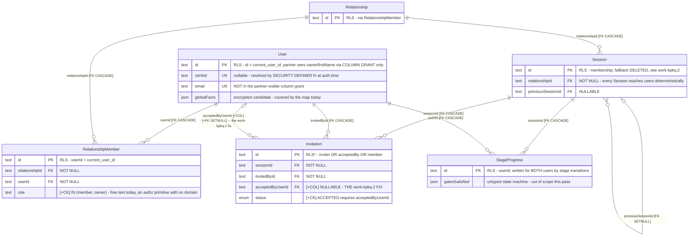
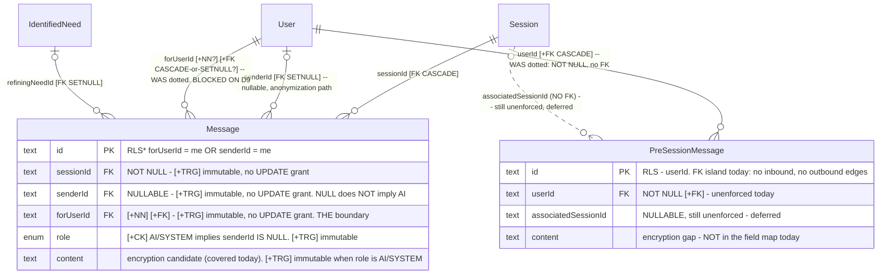
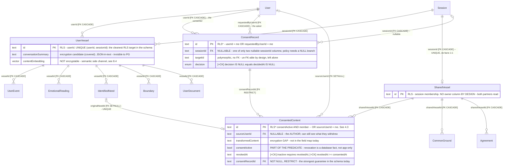
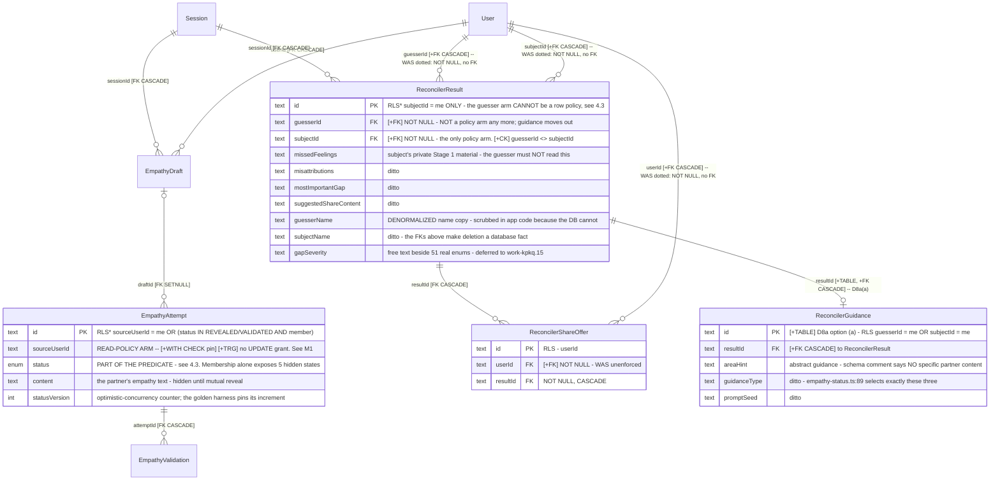
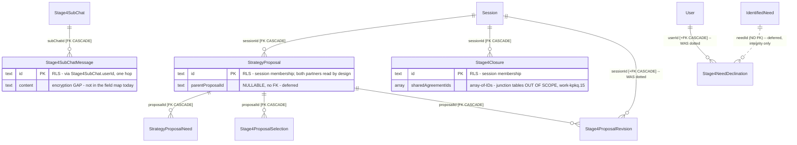
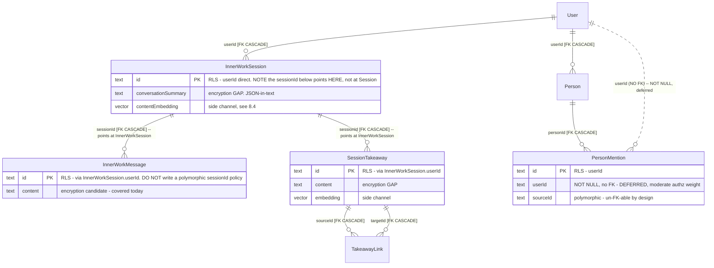

# Phase 3 — Database Security Model

**This is a design, not an implementation.** No migration has been written, no
application code changed, no database altered. Everything below is a proposal for the owner to
approve, amend or reject. Issue: `work-a39h.3`.

The companion document [Phase 3 Object Catalogue](./phase3-security-catalogue.md) lists every
database object this design creates or changes — policy by policy, grant by grant, constraint by
constraint — with the test that proves each one works. Read this document for the argument; read
the catalogue for the inventory.

## The short version

Fifteen things, if you read nothing else. The first six came out of two adversarial review passes
and are the reason this document is on its third draft.

-2. **A read policy that trusts a column requires a write policy that pins it.** Draft 2 narrowed
   reads on three tables and left their writes membership-wide, which was strictly worse than
   before: Ada could insert an `EmpathyAttempt` with `sourceUserId = bob`, and Bob then read her
   words as his own through the very arm that was supposed to protect him [V]. Narrowing a read
   over an unpinned author column is not a narrowing, it is a redirection. §4.3.
-1. **Shadow mode cannot detect a too-wide policy, and draft 2 claimed it could.** [V] The
   too-wide configuration matched 2/2 and passed; the *correct* narrow one was flagged. It fires on
   the safe direction and is silent on the dangerous one. It survives as a rollout/outage detector
   only. Nothing automated catches too-wide — that is human derivation plus a fixture matrix. §9.1.
0. **A policy that encodes a weaker sharing rule than the product is worse than no policy.** Three
   tables were caught doing exactly that — `EmpathyAttempt`, `ConsentedContent`,
   `ReconcilerResult`. A bare session-membership policy on `EmpathyAttempt` exposes the partner's
   empathy text in five statuses where the app hides it. RLS would have *blessed* the read the
   product forbids, while looking like protection. §4.3 re-derives all three from the vessel model
   instead of from the owner-column shape.
0b. **A missing write policy fails silently for UPDATE and DELETE.** Verified: `INSERT` raises an
   error, `UPDATE` and `DELETE` return zero rows affected with **no error at all**. Any table with
   a `_select` policy and no `_update` policy is a silent data-loss bug the day enforcement turns
   on. §7.10.
0c. **`SECURITY DEFINER` helpers are 8× slower than the inline predicate** and are only sometimes
   necessary. Measured: 196 ms vs 24 ms on 100k rows, because the planner cannot inline the
   function and calls it per row. The helper is genuinely required only for checks about *another*
   user; a self check is not double-filtered and stays inline. §7.9.
0d. **The `forUserId NOT NULL` change breaks message sending on the first user turn after it
   applies.** The primary send path sets no `forUserId` at all [C]. The write-path fix must ship
   and soak first — W6a before W7 — and the whole item is gated on D9 anyway. §7.12.
0e. **`ReconcilerResult` has 21 read sites, not 11, and two of them are live leaks** — a session-
   membership-only endpoint returning both partners' full gap analyses, and `empathy-status.ts:171`
   putting `gapSummary` into the guesser's response. Filed P0. This is what settles D8a. §4.3.
1. **The database can stop a backend authorization bug. It cannot stop a stolen `DATABASE_URL`.**
   Verified: the app role can claim any user's identity, because on any given request it
   legitimately is an arbitrary user. Anyone who tells you RLS defends a leaked credential is
   wrong. §1 T2.
2. **The previous RLS attempt failed because the app connected as the table owner.** That is a
   one-query check that nobody ran. It is now structural assertion 1 and it runs in CI. §11.2.
3. **`FORCE ROW LEVEL SECURITY` does not constrain a superuser.** Verified: 5 of 5 rows still
   visible. Locally `mwf_user` is a superuser *with* `BYPASSRLS`. Whether the Render role is too is
   **unverified and is the first thing to check.** §1 T4, §10 W0.
4. **RLS cannot stop a message being re-routed to the partner** — a policy has no access to the OLD
   row. Verified by doing it. The fix is column-level `UPDATE` grants plus a trigger, also
   verified. This threat was not in the brief; it came out of testing. §1 T7.
5. **A policy that subqueries an RLS-protected table is silently double-filtered.** Verified: the
   obvious `WITH CHECK` rejected a *legitimate* reveal, because `RelationshipMember`'s own policy
   hides the partner's row. `SECURITY DEFINER` helpers fix it. §3.3.
6. **pgcrypto is disqualified on measurement.** Its master key appears verbatim in query plans, and
   the functional index needed to make it searchable **writes plaintext to disk** — verified by
   grepping the index file. Use application-side envelope encryption. §8.2.
7. **`Message.forUserId` can become `NOT NULL` with a real foreign key** — but the syntax that
   makes it non-blocking is PG18-only (verified: syntax error on PG16). §3.2.
8. **The one thing that genuinely cannot be done database-first** is turning enforcement *on*.
   Prisma cannot set per-request identity. Ship the policies with the app role holding
   `BYPASSRLS`, and drop it in one line when Phase 4 lands. Everything else — roles, constraints,
   FKs, triggers, ~80% of the work — lands against the current backend. §2.3, §9.
9. **The golden harness cannot currently fail a negative-authorization test**, because the E2E
   bypass mints unknown users rather than rejecting them. Every claim in this document is a
   negative-authorization claim. Fixing that is a prerequisite, not a follow-up. §11.3.

Nine decisions need the owner (§10). Two of them are product calls, not engineering ones, and this
document deliberately makes no recommendation on either: **whether to launch encrypted** (D5), and
**whether deleting a user should delete the messages their partner sent them** (D9).

## Revision history

**Draft 5 (2026-08-18)** responds to a fourth adversarial pass, which **approved the architecture**
and found eight specification items to close before the DDL that depends on them. The role split,
derived inventory, vessel-derived predicates, column grants, immutability triggers, tiering and
threat model all survived untouched. What was broken: two objects that were specified rather than
built, and one CI query.

### The three failure classes, and the audit each one implies

Each review pass found a different *class*. Writing all three down together is more useful than any
individual fix, because they are what a future contributor needs to check for.

| Draft | Class | The audit that catches it |
|---|---|---|
| 2 | **Read-narrowing without write-pinning.** A read policy that trusts a column while the write side leaves it open is not a narrowing, it is a redirection. | For every column a SELECT policy reads, ask what pins it on INSERT and on UPDATE. Assertion 7. |
| 3 | **Pins that stop the product.** A constraint that correctly blocks an attacker and also blocks a real call site is not shippable. | For every pin, enumerate the legitimate writers *by reading the whole calling function*, not the one line that prompted the pin. |
| **5** | **Effective-principal confusion.** The `current_user` inside a privileged object is not who the surrounding control assumed. | **For every privileged object, ask "who is `current_user` on this line?" — including the principals Postgres supplies.** |

Three independent instances of the draft-5 class appeared at once, and **none of them is visible to
any assertion in the catalogue**:

- A `SECURITY DEFINER` function's `current_user` is its **owner**, so an owner-owned transition
  function under `FORCE` sees nothing, and a job-owned one under branch A sees nothing either.
- A foreign key's internal `ON DELETE SET NULL` fires triggers as the **table owner** — not the
  deleting role, not `mwf_job`. **[V]** `DELETE FROM "User"` produced
  `ERROR: senderId immutable (current_user=p5_owner)`.
- **[V]** Permissive policies are inherited through **role membership**, unlike `BYPASSRLS`. A
  single `GRANT mwf_job TO mwf_app` took an outsider identity from 1 row to **2 of 2** — a total
  boundary collapse from one grant that looks like a convenience.

**The rule, stated for the record:** *every privileged object must state its owner, and every
exemption must enumerate the principals that can reach it, including the ones Postgres supplies.*

### A premise I over-generalised

Draft 4 wrote *"RLS cannot let you write a row it will not let you read"* and promoted it to a law.
**It is false as stated.** **[V]** A blind constant write is not filtered:
`UPDATE t SET note='OVERWRITTEN BY ADA'` — no `WHERE`, no column read — returned `UPDATE 2` and
overwrote the hidden row. For `INSERT` it is false by construction, since `WITH CHECK` never
consults the SELECT policy.

**Correct wording: *a write that reads a column reaches only rows the SELECT policy admits.***
**[V]** The same table, `UPDATE … WHERE id = 2`, left the hidden row untouched.

The §4.3 mechanism choice is unaffected — all six call sites are `WHERE`-qualified — but the law
was wrong and is corrected wherever it appeared.

### Draft-5 items

| # | Item | Verified? | Response |
|---|---|---|---|
| 1 | `app.anonymize_user_in_session` has **no authorization check**; an outsider drove it | reported, and the shape is undeniable | §7.12a: own membership check, `p_display_name` dropped, `EXECUTE` narrowed |
| 2 | Both new functions must **name an owner**; §1 T4 wrongly calls the transition function branch-independent | **[V]** owner-owned + `FORCE` ⇒ inert | §4.3 and §1 T4 corrected |
| 3 | The trigger exemption must cover the **FK referential action** | **[V]** fires as the table owner | Catalogue §4 |
| 4 | The **`READY` path** re-opens disclosure one level up | reported; mechanism confirmed in `state.ts` | §4.3: disclosing set widened to the *reveal-reachable* closure |
| 5 | Transition function has a **TOCTOU** and is not idempotent | reported | §4.3: `FOR UPDATE` + status-guarded write + no-op on unchanged status |
| 6 | Assertion 7 is **wrong three ways** and passes an M1 | **[V]** all three, and the fix verified against the evasion | Catalogue §7.1 rewritten and re-tested |
| 7 | `services/account-deletion.ts` is a **second** anonymization path, session-less | **[C]** confirmed, incl. `GlobalLibraryItem` | §7.12a; two signatures, not one |
| 8 | Two new structural assertions | **[V]** role-membership collapse reproduced | Catalogue §7, assertions 9 and 10 |

**Draft 4 (2026-08-18)** responds to a third adversarial pass. Pass 3 confirmed the confidentiality
analysis is sound — no reviewer has found a way for a member to read hidden partner content through
the draft-3 policy set — and found that **the design was correct and unshippable**: three of its
four blockers are availability failures, where a pin that correctly stops an attacker also stops
the product.

| Draft-4 finding | Verified? | Response |
|---|---|---|
| **B1 — the `EmpathyAttempt` write treatment breaks Stage 2.** Six in-request handlers write `status`; the validation flow is *structurally non-author*. | **[V]** the naive repair fails three ways: silent half-apply, a hard `WITH CHECK` error, and it hands over the partner's `content` | §4.3 replaces the pin with a **`SECURITY DEFINER` transition function** and a transition table. All six call sites work; five attacks blocked; content hole closed. New **W4a**. |
| **B2 — anonymization is a systematic casualty**, six columns, and it binds at W1/W4 rather than W10. | **[C]** six writes, two more than review named | New §7.12a: one privileged `app.anonymize_user_in_session()`, not per-pin exemptions. New **W4b**. |
| **B3 — assertion 7 does not exist and is wrong in both directions.** | **[V]** the `OR` form green-lights M1 and permanently reds the sanctioned exception | Catalogue §7.1: per-command, conjunctive, `pg_depend`-based, with an exception registry. Tested in three configurations. |
| **B4 — `rolbypassrls` is a fork, not a check.** | **[V]** `BYPASSRLS` cannot be granted by a role that lacks it | §1 T4 now carries **both branches**; W0 gates W1; branch-dependent sections are named. |

Two things I found by following through on B2 and B4 rather than by review: **`StrategyProposal.createdByUserId`**
is a sixth anonymized column nobody had named, and **the trigger role-exemptions must key on the
job role's *name*, not on `BYPASSRLS`** — verified when the branch-A permissive policy let the job
role reach a row that the transition trigger then rejected.

**Draft 3 (2026-08-18)** responds to a second adversarial pass, which was run specifically to check
whether draft 2's fixes introduced new defects. **They did — two of them, both blocking.** That is
worth stating at the top rather than burying: a fix wave on a security design needs its own review,
and this one earned it.

| Draft-3 finding | Verified? | Response |
|---|---|---|
| **M1 — narrowing SELECT while leaving writes membership-wide reopened the hole on the write side.** Ada forged an `EmpathyAttempt` attributed to Bob; Bob read it as his own. | **[V] reproduced** | §4.3 now pins the author column in `WITH CHECK` on every bespoke table, extends the never-`UPDATE`-grantable set and the immutability trigger, and states the general rule: *a read policy that trusts a column requires a write policy that pins it*. |
| **M2 — shadow mode is inverted.** It cannot detect the too-wide policies it was sold on. | **[V] reproduced** — too-wide passed 2/2, correct-narrow flagged 2 vs 3 | §9.1 withdraws the claim, relabels shadow mode as a **rollout/outage** detector, and names what actually catches too-wide: human derivation plus a fixture-based visibility matrix. |
| **M3 — W7's `NOT NULL` breaks the primary message-send path** (`stream-turn-admission.ts:159` sets no `forUserId`). | **[C] confirmed**, plus 4 more sites in a script | New §7.12 enumerates the write-path changes; W6a added to the sequence ahead of W7. |
| **M4 — bound the `mwf_job` surface.** | **[V]** per-role `log_statement` sticks and the role cannot unset it | §10 D6 gains three bounding mechanisms, one enforced by the database itself. |
| **`ReconcilerResult` inventory wrong by nearly half; two live leaks.** 21 sites, not 11; 8 invisible to a `reconcilerResult` grep. | reported as P0 | §4.3 records both leaks, classifies the three ambiguous columns from the prompt builder, and hardens D8a from "open" to "specify as though it will be built". |
| **`REVOKE SET ON PARAMETER` fails on PG18 too**; a `PGC_SUSET` C extension works. | reported | §1 T3 and catalogue §2 — **gated on whether Render can run it**; see D10. |

**Draft 2 (2026-08-18)** responded to the first adversarial review. What survived, what changed:

| Review finding | Verified? | Response |
|---|---|---|
| **Predicates weaker than the product** on `EmpathyAttempt`, `ConsentedContent`, `ReconcilerResult` | **[C] confirmed, all three** | §4.3 re-derives all three from the vessel model. `ReconcilerResult`'s guesser arm is dropped and the split-table option becomes D8a. |
| **~34 tables with no write policies**; `UPDATE`/`DELETE` fail silently | **[V] confirmed** — INSERT errors, UPDATE/DELETE return 0 rows silently | §7.10; catalogue §5.2 now carries four commands for every shape. |
| **Table accounting does not close; `Relationship` has no policy** | **[V] confirmed** — three lists counting 71/73/65, `Relationship` in none | §4.1 is generated from `pg_catalog` and closes at 68; catalogue §1.3 asserts it in CI. |
| **D6 not a real choice** — session identity bounded to exclude `Message` cannot do its job | **[C] confirmed** — `state.ts:514` and `sharing.ts:1005-1040` both write `Message` for both partners | §10 D6 decided: **run those paths as `mwf_job`**, not a session GUC. |
| **Helpers leak the social graph** | **[V] confirmed** — a member of nothing resolved `is_member('r1','ada')` → true | Catalogue §3.1: helpers pinned to the caller's arity. |
| **CHECK `DETAIL` leaks for any non-RLS-enforced role** | **[V] confirmed**, and suppression is keyed to RLS being active, not row visibility | §5.2; W3 now has the error-path fix as a hard prerequisite. |
| **`mwf_analyst` cannot be built as specified** | **[V] confirmed** — `REVOKE SET ON PARAMETER` is a no-op for custom GUCs on PG16 | Withdrawn as a property; spike on PG18. T3 unmitigated. |
| **`SECURITY DEFINER` helper 8× slower than inline** | **[V] confirmed** — 196 ms vs 24 ms on 100k rows | §7.9, with the reviewer's self-versus-other refinement adopted. |
| **`StageProgress` both-partner writes missing** | **[V] confirmed** — 6 sites half-apply silently | §7.11. |
| **`SECURITY DEFINER` does not bypass triggers** | correct | Catalogue §4: explicit `current_user = 'mwf_job'` exemption. |
| **Flag day hides that nothing is exercised until W10** | correct | §9.1: per-tier enforcement plus shadow mode. |
| `Message.forUserId ON DELETE CASCADE` vs anonymise-don't-delete | correct | **D9 — left open for the owner**, and W7 is blocked on it. |

**Two review points I partly disagree with**, stated so they can be re-argued rather than
silently dropped:

- **`$queryRaw` is 19 non-test sites, not 22 or 23.** My first draft said 23 (it counted a test, two
  mocks and a comment); review said 22. The derivation is in §7.5 so the number is checkable.
- **The golden harness does not snapshot 41 of 68 tables.** That figure belongs to
  `backend/snapshots/create-snapshot.ts`, a legacy file the harness README itself criticises;
  `empathy-reveal` derives whole-database scope from `information_schema` [C]. The *action* review
  asked for is right and adopted — the new scenario must declare whole-database scope — but the
  diagnosis was of a different file. Catalogue §8.

## Evidence markers

This design will be adversarially reviewed, so every claim carries its provenance. Do not treat
them as interchangeable.

| Marker | Meaning |
|---|---|
| **[V]** | **Verified by execution.** Run against a throwaway database (`phase3_design_93198`) on the local PG16 container, with a real non-superuser role. The command and its output were observed. |
| **[V18]** | Verified by execution against the local **PostgreSQL 18.4** container (port 5433) — the production target version. |
| **[C]** | **Verified by reading the code or introspecting the live schema.** Not executed. |
| **[R]** | **Reasoned.** Not verified. Must be tested before anything is built on it. These are called out individually because they are where this design is most likely to be wrong. |

Two facts about the verification environment matter. The scratch database used a **cut-down
model** of the schema — `User`, `Relationship`, `RelationshipMember`, `Session`, `Message` with
50,005 rows — not all 68 tables. Results about *mechanism* (does RLS bind, does `SET LOCAL`
unwind, does a column grant stop a re-route) transfer. Results about *this schema at production
scale* do not. And the toy `MessageRole` enum used `ASSISTANT`; **the real enum value is `AI`,
with nine members** [C] — DDL below uses the real values.

---

## 1. Threat model

A design that does not say what it fails to prevent is not finished. This section is the contract
for the rest of the document: each later section says which of these threats it moves, and
§1.7 lists what nothing here touches.

The asset is singular and unusual. It is not credentials or payment data. It is **one person's
account of a conflict, told privately, that the other person must not see unless that person
consented to share it.** A breach is not a support ticket. It is the product being over.

### T1 — A backend authorization bug (the dominant threat)

**Concretely:** a developer writes `prisma.message.findMany({ where: { sessionId } })` and forgets
the `forUserId` arm. Or adds a Stage 5 endpoint behind `requireSessionAccess` without re-checking
membership — ~45 of 81 handlers already do exactly that [C, `work-kpkq.2`]. Or a code path that
correctly filters reads writes an unfiltered `include`.

**Why it dominates:** the audit's own conclusion is that *"a single missing `where` clause in any
of 261 backend files is a privacy breach"*. The privacy boundary is `Message.forUserId`, an
unenforced nullable `text` column with no foreign key, filtered by hand at 26 read sites in eleven
different predicate spellings [C]. Nothing checks that a new site spells it correctly.

**Status under this design: mostly stopped.** RLS makes the filter a property of the table rather
than of the query. A forgotten `where` returns fewer rows, not more. This is the single largest
security improvement available and it is what the rest of the document is mostly about.

**Residual:** a query that must legitimately span both partners still runs under an identity that
can see both (§7.3), and RLS cannot tell a legitimate cross-partner read from a buggy one. The
reconciler is the whole exposure here and it is irreducible — its purpose *is* to compare A's
words to B's.

### T2 — A compromised application credential

**Concretely:** `DATABASE_URL` leaks — from a Render environment variable, a CI log, a `.env`
committed by accident, an SSRF against the metadata endpoint, a dependency that exfiltrates
`process.env`.

**Status under this design: NOT stopped. Say this out loud.**

**[V]** The application role can set `app.current_user_id` to any value it likes and read that
user's rows. Verified directly: connected as the non-superuser, non-owner `p3_app`, issued
`SET LOCAL app.current_user_id='u_bob'`, and read Bob's four rows. There is no way around this —
the app must be able to claim an arbitrary identity, because on any given request it legitimately
is an arbitrary user.

An attacker with the app credential must iterate: they can read any *one* user at a time, and to
read everyone they must enumerate user ids. That is a real difference from today's `SELECT * FROM
"Message"`, and it is a difference that shows up in logs and in query volume. But it is a speed
bump, not a wall. **Anyone who says RLS defends against a stolen `DATABASE_URL` is wrong.**

What RLS *does* narrow, verified:

| Attempt as the app role | Result |
|---|---|
| `SET LOCAL app.current_user_id` to any user | **succeeds** — full read of that user [V] |
| `SET row_security = off` | `ERROR: query would be affected by row-level security policy` [V] |
| `SET ROLE` to the table owner | `ERROR: permission denied to set role` [V] |
| `DROP POLICY` | `ERROR: must be owner of relation Message` [V] |
| `TRUNCATE "Message"` | `ERROR: permission denied for table Message` [V] |
| `CREATE TABLE` in `public` | `ERROR: permission denied for schema public` [V] |
| Read `pg_policies` | **succeeds** — the policy set is discoverable [V] |

The last row is accepted. Policy text is not a secret; the design must be safe when published.

### T3 — An LLM-driven or LLM-authored query

**Concretely, two different things.** (a) A future agent, MCP server, or "ask your data" feature
issues SQL derived from model output. (b) A human uses an LLM coding assistant to write a
controller, and the model produces a plausible-looking query missing the `forUserId` arm.

**(b) is happening now** and is a special case of T1 — this repository is being developed with
agents. It is stopped to the same degree T1 is, and that is a strong argument for RLS
specifically: a generated query cannot be more permissive than the policy, whoever or whatever
wrote it.

**(a) is not stopped, the mechanism draft 1 proposed does not work, and the mechanism that *does*
work cannot run on Render. This is now a settled negative, not an open spike.**

Draft 1 proposed a read-only analytics role that inherits RLS and cannot set
`app.current_user_id`, via `REVOKE SET ON PARAMETER`.

**[V] That does nothing.** On PG16: `REVOKE SET ON PARAMETER "app.current_user_id" FROM <role>` is
**accepted without error**, `pg_parameter_acl` remains **empty**, and the role then set the GUC and
read another user's rows. Draft 3 review reproduced the same on **PG18**, and further showed it is
not placeholder-specific by reproducing it against core `work_mem`. It is documented Postgres
behaviour for `PGC_USERSET` GUCs: a user-settable parameter has no ACL to revoke.

A mechanism that *does* work was built and tested by review: declare `app.current_user_id` through
a small **C extension as `PGC_SUSET`**, which blocks non-superusers outright and permits
`GRANT SET ON PARAMETER` to the app role only.

**It cannot be deployed on Render, and it fails at two independent layers** [researched against
Render's full documentation corpus, with citations in the catalogue]:

1. **The extension cannot be installed.** Render publishes a closed "Supported Extensions" list
   whose only install path is `CREATE EXTENSION`; there is no filesystem or `$libdir` access to the
   database host, and **"Render Postgres does not provide superuser access to your database"** is
   stated outright in their `pg_repack` documentation.
2. **Even if Render allow-listed it, the GUC could not be set.** `PGC_SUSET` requires superuser, or
   a PG15+ `GRANT SET ON PARAMETER` issued *by* a superuser. Render provides neither and exposes no
   control-plane surface for parameter grants. The precedent is `pgaudit`: it *is* on Render's
   supported list, and its settings are `PGC_SUSET`.

Layer 2 is the one that matters, because it means "ask Render to add our extension" does not
rescue the design.

> **Therefore: T3 has no in-database mitigation on Render.** State it plainly rather than leaving a
> spike open. The `mwf_analyst` role is **withdrawn from this design**, and the control for
> LLM-driven and analytics queries becomes **operational**: who holds credentials, read replicas
> with their own credentials, request-level audit, and — most simply — **not creating an analyst
> role at all** until there is a concrete use case worth designing a service around.

If an analytics capability is later required, the shape that survives these constraints is a
`SECURITY DEFINER` API service that sets identity itself and never hands out a connection. That is
a service, not a role, and it is out of scope here. See **D10**.

### T4 — An insider with database access

**Concretely:** the owner, a future contractor, or anyone with the Render dashboard.

**Status: NOT stopped, and structurally cannot be by RLS.**

**[V]** A superuser bypasses RLS *even with* `FORCE ROW LEVEL SECURITY` — verified: 5 of 5 rows
visible. **[V]** A non-superuser with `BYPASSRLS` likewise — 5 of 5. RLS binds only a role that is
neither superuser, nor `BYPASSRLS`, nor the table owner (or is the owner *and* the table is
`FORCE`d):

| Role | `FORCE` | Rows visible (of 5) | |
|---|---|---|---|
| superuser + owner | no | 5 | [V] |
| superuser + owner | **yes** | **5** | [V] — *`FORCE` does not constrain a superuser* |
| non-superuser `BYPASSRLS` | yes | **5** | [V] |
| non-superuser owner | no | 5 | [V] |
| non-superuser owner | **yes** | **0** | [V] |
| non-owner app role | yes | 3 (Ada) / 3 (Bob) / 0 (outsider) | [V] |

Row 1 is exactly why the 2026-03-11 RLS migration was unenforced and correctly reverted on
2026-04-30 [C]. Rows 2 and 3 are why `FORCE` alone is not the fix. **Locally, `mwf_user` is a
superuser with `BYPASSRLS`** [V].

**Render grants no superuser** — stated outright in their `pg_repack` guide and corroborated by
their logical-replication guide, which routes `CREATE PUBLICATION … FOR ALL TABLES` through
support because it needs superuser. `CREATE ROLE` does work, so the role split is provisionable.

**But `rolbypassrls` is a fork in the design, not a residual check.** Draft 3 treated it as a
detail to confirm. It is not.

**[V] `BYPASSRLS` cannot be granted without already having it:**

```
CREATE ROLE p4_job LOGIN BYPASSRLS;   -- as a non-superuser CREATEROLE owner
  ERROR:  permission denied to create role
  DETAIL: Only roles with the BYPASSRLS attribute may create roles with the BYPASSRLS attribute.
ALTER ROLE p4_job2 BYPASSRLS;
  ERROR:  permission denied to alter role
  DETAIL: Only roles with the BYPASSRLS attribute may change the BYPASSRLS attribute.
```

This design needs `BYPASSRLS` on `mwf_migrator`, `mwf_job` and `mwf_ops`. So the answer to one
undocumented question decides whether W1 — **the first migration** — is writable as drafted.

#### Branch A — the Render role LACKS `rolbypassrls`

T4's good news holds in full: the production role is a non-superuser owner, `FORCE` binds it, and
the dashboard credential is not a bypass. But:

- **`mwf_job` and `mwf_ops` cannot be created as drafted**, and the failure is **silent**. **[V]** A
  non-`BYPASSRLS` job role on a `FORCE`d table with no policy for it **sees zero rows**, and its
  `UPDATE` reports success while affecting **zero rows**. D6 collapses without an error — the
  reveal simply never happens.
- **The fallback works and is a design change, not a parameter.** **[V]** With an explicit
  `CREATE POLICY … FOR ALL TO mwf_job USING (true) WITH CHECK (true)` the job role sees every row
  and writes normally. Every table `mwf_job` touches needs such a policy, written out.
- **That fallback is arguably better.** `BYPASSRLS` is all-or-nothing and invisible in the schema;
  per-table permissive policies are enumerable, greppable, and **scopable** — `mwf_ops` can be
  given `USING (true)` on the tables it reports on and simply omitted from the vessel tables. It
  turns the D6 residual from an attribute into a reviewable list, which is what §10 D6 wanted
  anyway.
- **`mwf_migrator` is fine either way.** **[V]** A non-superuser owner can toggle
  `FORCE ROW LEVEL SECURITY` off and back on — verified: sees 0 rows with `FORCE` and no policy,
  2 rows after `NO FORCE`, 0 again after re-enabling. That is the escape hatch for backfills and
  `VALIDATE CONSTRAINT`, and it needs no `BYPASSRLS`.
- **[V] The trigger role-exemptions must name the job role, not test for `BYPASSRLS`.** Measured:
  under branch A the permissive policy let the job role reach the row, and the transition trigger
  then rejected the write because the exemption named a different role. Key the exemptions to
  `current_user = 'mwf_job'` and nothing else.

#### Branch B — the Render role HAS `rolbypassrls`

The roles provision exactly as drafted, and W1 is writable as written. The cost is that **the
primary Render credential bypasses every policy**, so "FORCE genuinely binds in production"
weakens to "FORCE binds the roles we create". Treat the primary credential as break-glass: create
`mwf_app` as a separate `NOBYPASSRLS` role, never use the primary for application traffic, and
record in the runbook that anyone with the Render dashboard is outside the boundary (T4 was always
honest about this; branch B just makes the dashboard credential the concrete instance).

#### What is branch-dependent

Marked so a reader knows what to re-read once W0 returns: **W1** (role creation), **catalogue §2**
(the role table), **D6's mechanism** (attribute vs per-table policies), and **this section's T4
conclusion**. Everything else — policies, pins, triggers, constraints, the transition function — is
identical under both branches.

Encryption at rest (§8) is the only control that touches T4, and only if the key lives somewhere
the insider does not — which, for a two-person company, it does not. Be honest about that in the
co-founder conversation.

### T5 — A stolen backup or storage snapshot

**Concretely:** a Render backup, a `pg_dump` on a laptop, a compromised object store, a disk image.

**Status: NOT stopped by RLS at all.** RLS is a query-planner rewrite. It does not exist in the
file format. `pg_dump` run as a privileged role emits every row.

This is the threat that column encryption (§8) actually addresses, and the only one. It is also
the threat with the clearest regulatory framing if this product ever handles EU users.

**[V] and important:** the naive way to make encrypted columns searchable *reintroduces this
threat completely.* A functional index over `pgp_sym_decrypt(...)` writes **plaintext into the
index file** — verified by grepping the on-disk relation: the table file contained zero matches
for the plaintext, the index file contained one. The master key is also stored verbatim in
`pg_index` and is readable by the unprivileged app role [V]. See §8.2.

### T6 — Client-side forgery of facilitator speech (`work-kpkq.4`)

**Concretely:** a session member publishes `message.ai_response` on the shared Ably channel with
the partner's `forUserId`, and it renders as the neutral facilitator speaking.

**Status: partly stopped, and the DB part is worth having.** Today the forgery is
client-cache-only and vanishes on refetch [C], and no API route accepts a client-supplied `role`
or `forUserId` — verified exhaustively: zero `req.body` reads of `role`, zero `z.nativeEnum(MessageRole)`
in any request contract, every `role` a hard-coded server literal [C].

So the database cannot fix the Ably channel — that fix is server-only publish plus Ably presence
for typing, and it stays in the backend. What the database *can* do is make the forgery
**unpersistable**, so the day someone adds an endpoint that does accept a role, or the app
credential is used directly, the row is rejected:

- `CHECK (role NOT IN ('AI','SYSTEM') OR "senderId" IS NULL)` — a human-authored row can never
  claim to be the facilitator. **[V]** Verified: the forged insert
  `('u_ada', forUserId='u_bob', role=ASSISTANT)` was rejected; the genuine AI insert
  (`senderId IS NULL`) and the genuine user insert both succeeded.
- A `BEFORE UPDATE` trigger making facilitator content immutable. **[V]** Verified: rewriting an
  `AI`-role message's content was rejected, editing one's own `USER`-role content succeeded.

### T7 — Cross-partner exfiltration by re-routing

Not in the original brief. It came out of testing and it is the sharpest thing found.

**Concretely:** a bug — or the app credential — issues
`UPDATE "Message" SET "forUserId" = <partner> WHERE id = <my private row>`. The row is now in the
partner's view. No new row, no new content, one column flip.

**[V] RLS does not stop this, and cannot.** With a policy of
`USING (forUserId = me OR senderId = me)` and the same expression as `WITH CHECK`, Ada
successfully re-routed her own private message to Bob. The reason is structural: **a policy
expression has no access to the OLD row.** It can only ask "may I see the row I am producing",
and Ada may see a row she sent.

**[V] Two mechanisms do stop it,** and both are in the design:

1. **Column-level `UPDATE` privileges.** `REVOKE UPDATE ON "Message"` then
   `GRANT UPDATE ("content") ON "Message"`. Verified: the re-route attempt failed with
   `permission denied for table Message` before any policy or trigger ran.
2. **A `BEFORE UPDATE` trigger** pinning `forUserId`, `senderId` and `role`. Verified above.
   Belt-and-braces, and it survives someone re-running a `GRANT ALL`.

This threat generalises: **any column that carries authorization meaning must be immutable, not
merely policy-checked.** It applies to `forUserId`, `senderId`, `sessionId`, `role`, every
`userId`, every `vesselId`.

### 1.7 — Explicitly not addressed

State these plainly rather than letting them be discovered in review.

| Not addressed | Why |
|---|---|
| Stolen `DATABASE_URL` | T2. The app must be able to assume any identity. |
| Insider / superuser | T4. RLS is bypassed by superuser and `BYPASSRLS` [V]. |
| Backup theft, unless encryption ships | T5. RLS is not in the file format. |
| Ably channel forgery | T6. Backend and realtime fix; DB only makes it unpersistable. |
| Clerk account takeover | Out of scope. RLS faithfully serves whoever the JWT says you are. |
| The *embeddings* of private content | §8.4. A `vector(1024)` derived from plaintext is a semantic side channel that survives column encryption. **Unquantified — treat as an open question, not a solved one.** |
| Denormalized name copies in `ReconcilerResult` | Scrubbed in application code because no FK exists [C]. §9 adds the FKs; the scrub still has to run. |
| Traffic analysis / row-count inference | Accepted. A partner can infer that *something* was written. |
| `pg_policies` readability | Accepted [V]. The design is safe when published. |

---

## 2. What identity is, and how it reaches a query

This is decision **D1** and everything else depends on it.

### 2.1 The mechanism

```sql
-- STABLE: the planner may evaluate it once per statement, not once per row.
-- current_setting(..., missing_ok => true) returns NULL when unset, so every
-- comparison against it is NULL, therefore false. Fail-closed by construction.
-- nullif(...,'') collapses the "set then rolled back" state to NULL too.
CREATE FUNCTION app.current_user_id() RETURNS text
  LANGUAGE sql STABLE PARALLEL SAFE
  AS $$ SELECT nullif(current_setting('app.current_user_id', true), '') $$;
```

Per request: `BEGIN; SET LOCAL app.current_user_id = '<User.id from the verified Clerk JWT>'; …
COMMIT;`

**[V]** Verified end to end on the scratch database. Ada sees 3 rows, Bob sees 3 (a different 3,
overlapping on the broadcast), a session outsider sees 0, and a connection with **no identity set
sees 0**.

### 2.2 Four properties that were measured, not assumed

**Fail-closed on unset.** No identity → zero rows, not all rows [V]. This is the single most
important property and it falls out of SQL's NULL semantics rather than from anything we wrote.

**`SET LOCAL` outside a transaction block is a no-op.** [V] It emits
`WARNING: SET LOCAL can only be used in transaction blocks` and the identity is not set; the
subsequent read returned zero rows. **Most drivers do not surface warnings.** The failure mode is
therefore: identity silently absent, queries silently return nothing, and — because `forUserId` is
nullable and half the reads are "does this exist yet" probes — the application interprets empty as
*state absent* and re-runs initialisation. Duplicated onboarding messages, not an error page.
Mitigation is in §9.3.

**Plain `SET` leaks across pooled requests.** [V] Simulated a pool: request 1 issues
`SET app.current_user_id='u_ada'`, request 2 on the same connection forgets to set anything and
**inherits Ada's identity and reads Ada's rows**. `DISCARD ALL` clears it [V], but `node-postgres`
does not issue it on release by default and pgbouncer in transaction mode does not either [R]. So
`SET LOCAL` inside an explicit transaction is not a stylistic preference — plain `SET` is a
cross-user data leak with a pool in front of it.

**`SET LOCAL` is savepoint-scoped.** [V] If the `SET LOCAL` happens *inside* a savepoint that is
later rolled back, identity is lost and subsequent reads fail closed. If the savepoint is taken
*after* the `SET LOCAL`, identity survives the rollback [V]. Rule: **identity is the first
statement after `BEGIN`, before any savepoint.** Prisma uses savepoints for nested interactive
transactions [R] — worth confirming before relying on this.

One hazard that turned out **not** to exist: `SET LOCAL` before `SET TRANSACTION ISOLATION LEVEL
SERIALIZABLE` does not break the isolation level [V] — both orderings yielded `serializable`. Good
news for the six `Serializable` sites [C].

### 2.3 D1 — How identity is set per request under a connection pool

The hard part is not the SQL. It is that **Prisma cannot do this.**

`backend/src/lib/prisma.ts:16` creates one process-wide `PrismaClient` singleton shared by every
request, and there are roughly **700 bare (non-transaction) Prisma calls** [C]. A bare
`prisma.message.findMany()` gets an arbitrary pooled connection and its own implicit transaction.
There is no hook — no client extension, no middleware — that can put a `SET LOCAL` on *that*
connection before *that* query. Prisma 6.12.0 is in use with no driver adapters and no `pg`
dependency in the backend [C].

| | D1-a: Prisma interactive transactions | D1-b: Prisma driver adapter (`@prisma/adapter-pg`) | **D1-c: `pg` + per-request client (recommended)** | D1-d: Session-scoped `SET` + `DISCARD ALL` |
|---|---|---|---|---|
| Shape | wrap every request in `prisma.$transaction(async tx => …)`, `SET LOCAL` first | swap Prisma's connector for `pg`; set the GUC on pool checkout | Phase 4's `pg` layer acquires a client per request, `BEGIN; SET LOCAL …` | plain `SET` at checkout, `DISCARD ALL` at release |
| Touches | all ~700 call sites | pool config only, in principle | the rewrite that is happening anyway | pool config only |
| Long transactions | **yes** — whole request in one tx, 5s default timeout, lock hold | no | only where wanted | no |
| Array-form `$transaction` | **cannot inject `SET LOCAL`** [C] — 2 sites | n/a | n/a | n/a |
| `$queryRaw` (19 sites) | works if inside `tx` | works | works | works |
| Leak risk | none | none | none | **high** [V] — one missed reset leaks identity |
| Verdict | correct but ruinous | **[R]** untested here; adapter maturity unknown | clean | reject |

**Recommendation: D1-c.** Do not retrofit identity onto Prisma. Build it into the `pg` data layer
in Phase 4.

**This is the sequencing consequence the owner needs to see.** The brief asked what genuinely
cannot be done database-first. This is it: **the DDL can land without the backend, but RLS cannot
be *enforced* until the backend can set identity.** The resolution (§10) is to ship the policies
`ENABLE`d but grant the app role `BYPASSRLS` until Phase 4 lands, then drop it in a one-line
migration. The database work is real and testable throughout; the switch is a single flag.

D1-b deserves a spike. If `@prisma/adapter-pg` allows a connection-checkout hook, enforcement
could precede the rewrite by months. Half a day to find out. **[R] — not tested.**

### 2.4 D2 — One application role, or several?

| Role | Purpose | RLS | Why separate |
|---|---|---|---|
| `mwf_migrator` | owns tables, runs `prisma migrate deploy` | owner; `FORCE` applies but it needs to bypass, so it also holds `BYPASSRLS` | migration DDL cannot be constrained by policies |
| `mwf_app` | every authenticated HTTP request | **subject** | the boundary |
| `mwf_job` | retention sweeps, tending reminders, coordination cycles | `BYPASSRLS` | cross-tenant by definition — six such entrypoints [C] |
| `mwf_ops` | `/api/brain/*` dashboard (12 all-user endpoints, no `req.user`) [C] | `BYPASSRLS`, **`SELECT` only** | today it reads everything through the app credential |
| `mwf_analyst` | future BI / LLM-driven queries | **subject**, no `SET` privilege | T3 |

**Recommendation: five roles, phased.** `mwf_migrator` + `mwf_app` are mandatory and are the whole
of the boundary. `mwf_job` and `mwf_ops` can start as aliases for `mwf_migrator` and be split
later — but note `mwf_ops` read-only is cheap and immediately valuable, because
`backend/src/routes/brain.ts:32-39` **fails open in non-production when neither
`DASHBOARD_API_SECRET` nor `CLERK_SECRET_KEY` is set** [C]. A `SELECT`-only role caps the blast
radius of that today.

The alternative — one role for everything — is what exists now and is why the previous RLS attempt
was inert.

---

## 3. The `forUserId` boundary

### 3.1 What the column actually means, measured

Not what the schema comment says — what the write paths do. All 28 `Message.create` sites were
enumerated [C]:

| `role` | `senderId` at insert | `forUserId` at insert |
|---|---|---|
| `USER` | `req.user.id` | **NULL** |
| `AI` (20 sites) | `null` | non-null |
| `SYSTEM` | `null` | non-null |
| `EMPATHY_STATEMENT` | `req.user.id` | = sender (self) |
| `SHARED_CONTEXT` | `req.user.id` (subject) | **partner** |
| `VALIDATION_FEEDBACK` | `req.user.id` | **partner** |

Three findings that change the design:

**`forUserId` is never client-supplied.** Every value comes from `req.user.id`,
`getPartnerUserId()`, or a reconciler `guesserId`/`subjectId` — all of which resolve through
`RelationshipMember` [C]. The guarantee holds today purely by construction.

**`forUserId IS NULL` means exactly one thing:** a `USER`-role message from
`stream-turn-admission.ts:159` [C]. It is not "broadcast to both" in practice — it is "the user's
own typed message, whose audience is implicitly the sender". This is why every read pairs the
`IS NULL` arm with `senderId = me`.

**`senderId IS NULL` does *not* mean AI.** `session-deletion.ts:95` nulls `senderId` in place to
anonymize a departing user, and the FK is `onDelete: SetNull` [C]. So `role='USER' AND senderId IS
NULL` is a reachable state, and any constraint or policy that reads `senderId IS NULL` as
"facilitator-authored" is wrong. The implication for §5: the authorship CHECK must be
**one-directional**.

### 3.2 The proposal — make the column say what it means

```sql
-- ============================================================================
-- Step 1: backfill. The natural audience of a user's own typed message is the
-- user. This is a semantic change stated in the open, not a technicality:
-- forUserId stops meaning "AI reply target" and starts meaning "the view this
-- row belongs to". Both readings agree on every existing row.
-- ============================================================================
UPDATE "Message" SET "forUserId" = "senderId"
 WHERE "forUserId" IS NULL AND "senderId" IS NOT NULL;

-- Rows where BOTH are null are unaddressable and unreadable by anyone under the
-- proposed policy. Count them before running this; they are almost certainly
-- anonymized rows from session-deletion and should be deleted, not backfilled.
-- Do NOT let this UPDATE silently leave them behind.

-- ============================================================================
-- Step 2: NOT NULL. On PG18 this is non-blocking; on PG16 it is not available.
-- ============================================================================
ALTER TABLE "Message"
  ADD CONSTRAINT "Message_forUserId_nn" NOT NULL "forUserId" NOT VALID;   -- PG18
-- ... backfill/verify window ...
ALTER TABLE "Message" VALIDATE CONSTRAINT "Message_forUserId_nn";

-- ============================================================================
-- Step 3: the foreign key the column has never had.
-- CASCADE matches the 96 existing CASCADE edges and the privacy model: when a
-- user is deleted, rows addressed to them go too.
-- ============================================================================
ALTER TABLE "Message"
  ADD CONSTRAINT "Message_forUserId_fkey"
  FOREIGN KEY ("forUserId") REFERENCES "User"(id) ON DELETE CASCADE NOT VALID;
ALTER TABLE "Message" VALIDATE CONSTRAINT "Message_forUserId_fkey";
```

**[V18]** The PG18 form was executed on PostgreSQL 18.4: `ADD CONSTRAINT … NOT NULL col NOT VALID`
blocks new NULL inserts immediately, tolerates existing NULLs, and `VALIDATE` correctly fails
until they are backfilled. **[V]** The same statement on PG16 is a **syntax error**. This is a
concrete, non-negotiable reason Phase 3 must follow the PG18 upgrade (`work-a39h.1`, which already
blocks this issue).

**[V]** The FK itself was created and enforced on the toy table: an insert with a nonexistent
`forUserId` was rejected. **[C]** On the local dev database (only 4 `Message` rows — a weak
sample) there are zero orphan `forUserId` values and zero cases where `forUserId` is a non-member
of the session's relationship. **This must be re-run against production data before the migration
is written.** With 4 rows, the local check proves nothing.

### 3.3 The policy

```sql
-- Two arms, and both are load-bearing:
--   forUserId = me  — this row is addressed to my view
--   senderId  = me  — I wrote it, so I already know it
-- The second arm is not a concession. Dropping it breaks real reads:
-- reconciler.ts:901 counts SHARED_CONTEXT rows where senderId = me and
-- forUserId = the partner, and uses the count to branch between "first share"
-- and "subsequent share". Under a forUserId-only policy that count silently
-- becomes 0 and the product takes the wrong branch. [C]
CREATE POLICY "Message_select" ON "Message" FOR SELECT TO mwf_app
  USING (
    "forUserId" = app.current_user_id()
    OR "senderId" = app.current_user_id()
  );
```

Session membership is deliberately **not** in the `USING` clause. It is implied — you cannot be
`forUserId` or `senderId` on a session you are not in — and adding it costs a three-table subquery
on the hottest read in the product for no additional guarantee. It *is* in `WITH CHECK` on INSERT,
where it is the thing being established rather than the thing being relied on. **[R]** — the
"implied" claim depends on the INSERT policy being the only writer, which is true only once
`mwf_job`/`mwf_ops` are prevented from writing `Message`. Catalogue §2 does that.

The INSERT policy needs to see the *partner's* membership row, and that is where the second
verified footgun lives.

**[V] A policy that subqueries an RLS-protected table is silently double-filtered.** The naive
`WITH CHECK` — an `EXISTS` against `RelationshipMember` — **rejected a legitimate insert**: Ada
routing a facilitator message to Bob failed with
`new row violates row-level security policy`, because `RelationshipMember`'s own policy
(`userId = me`) hides Bob's membership row from Ada. This is not a bug in the predicate. It is RLS
composing with itself, and it would have shipped as "the reconciler reveal randomly fails".

**[V] The fix is `SECURITY DEFINER` helpers**, which run as the owner and are therefore not
re-filtered:

```sql
CREATE FUNCTION app.is_member(p_relationship_id text, p_user_id text) RETURNS boolean
  LANGUAGE sql STABLE SECURITY DEFINER SET search_path = pg_catalog, public
  AS $$ SELECT EXISTS (SELECT 1 FROM public."RelationshipMember" rm
                       WHERE rm."relationshipId" = p_relationship_id
                         AND rm."userId" = p_user_id) $$;

CREATE POLICY "Message_insert" ON "Message" FOR INSERT TO mwf_app
  WITH CHECK (
    app.is_member(app.session_relationship("sessionId"), app.current_user_id())
    AND app.is_member(app.session_relationship("sessionId"), "forUserId")
  );
```

**[V]** With the helpers: Ada→Bob succeeded; Ada→Eve (non-member) rejected; Eve→Ada (outsider
writing into someone else's session) rejected.

Every `SECURITY DEFINER` function is a privilege-escalation surface and each is justified
individually in the catalogue (§3). All of them take `SET search_path`, return `boolean` or a
single id, and have `EXECUTE` revoked from `PUBLIC`.

### 3.4 Two more things RLS alone does not do

**Re-routing (T7).** Handled by column-level `UPDATE` grants plus a `BEFORE UPDATE` trigger, both
verified [V]. See §1 T7 and catalogue §4–5.

**An existence oracle via foreign keys.** FK checks run as a system-internal query that bypasses
RLS, so on a table where the policy permits the insert, a distinguishable FK error reveals whether
a hidden row exists. **[V]** On `Message` this is closed, because the RLS `WITH CHECK` fires
*before* the FK and both probes returned the identical
`new row violates row-level security policy`. **[R]** That ordering is relied on, not documented
as guaranteed; and on tables whose policy does not itself constrain the FK target the oracle is
open. Treat it as accepted low-severity leakage (existence, never content) and re-test after any
policy change.

---

## 4. RLS coverage — D3

### 4.1 The inventory is derived, not hand-maintained

The first draft of this section carried three hand-written table lists that counted to 71, 73 and
65 — and left exactly one model, **`Relationship`**, in none of them. That is the same antipattern
the golden harness README spends a section on ("hand-maintained table lists rot"), and it was
caught in review rather than by me.

The inventory below is **generated from `pg_catalog`** against the live schema and it closes at
68 [V]. The generating query is in catalogue §1.3 and it runs as a coverage assertion in CI, so a
table added by a future migration cannot silently miss a policy.

| Shape | n | Predicate |
|---|---|---|
| **A** — `userId`, no `sessionId` | 19 | `"userId" = app.current_user_id()` |
| **B** — `userId` **and** `sessionId` | 16 | `"userId" = app.current_user_id()` — the session join is redundant |
| **C** — `sessionId`, no `userId` | 16 | session membership, **inline** (§7.9) — but see §4.3 |
| **D** — parent hop via `vesselId`/`sharedVesselId` | 8 | parent's owner |
| **D2** — parent hop, other key | 4 | `Stage4SubChatMessage`, `StrategyProposalNeed`, `TakeawayLink`, `TendingResponsePartialClosure` |
| **E** — `relationshipId` | 1 | `Session` |
| **F** — no owner column of any kind | 4 | `Relationship`, `User`, `Need`, `GlobalLibraryItem` |
| | **68** | |

**`Relationship` — the table the first draft lost.** It has no `userId`, no `sessionId`, and no
owner column at all; it is reached *only* through `RelationshipMember`. It is also the root of
every membership check in the design, so leaving it without a policy would have meant either
denying every membership lookup or leaving the relationship graph world-readable. Its policy:

```sql
CREATE POLICY "Relationship_select" ON "Relationship" FOR SELECT TO mwf_app
  USING (EXISTS (SELECT 1 FROM "RelationshipMember" rm
                 WHERE rm."relationshipId" = "Relationship".id
                   AND rm."userId" = app.current_user_id()));
```

Inline, not a helper: this is a **self** check (§7.9), so `RelationshipMember`'s own policy does
not wrongly filter it — the caller is looking for their own membership row [V].

### 4.2 Tables where the shape is not the answer

- **`Message`** — session membership is insufficient; both partners are members. §3.3.
- **`EmpathyAttempt`** — likewise. **This corrects a wrong claim in the first draft**, which said
  `Message` was the only such table. §4.3.
- **`ConsentedContent`** — Shape D by structure, but the parent hop is not the whole predicate.
  §4.3.
- **`ReconcilerResult` / `ReconcilerShareOffer`** — no owner column; `guesserId` **OR**
  `subjectId`, and the two arms are not symmetric. §4.3.
- **`Invitation`** — the invitee is not a `RelationshipMember` when the row is created [C]. §6.2.
- **`InnerWorkMessage.sessionId` and `SessionTakeaway.sessionId` point at `InnerWorkSession`**, not
  `Session` [C]. Do not write one polymorphic `sessionId` policy.

### 4.3 Predicate fidelity — the three tables where consent actually lives

**This is the most serious finding in the review and it deserves its own framing.** A policy that
is *narrower* than the product is an outage: loud, quickly found, quickly fixed. A policy that is
*wider* than the product is a privacy breach wearing the costume of a security control — it will
be cited in review as "the database enforces this", and it will be wrong.

The first draft derived predicates from the **owner-column shape**. That is the wrong source. The
right source is the vessel model plus the gating the application already performs. All three below
were re-derived that way, and all three were wider than the product in the first draft.

#### `EmpathyAttempt` — status is part of the predicate

`empathy-status.ts:234` returns `partnerAttempt` only when
`status === 'REVEALED' || status === 'VALIDATED'` [C]. A bare Shape C policy exposes `content` in
`HELD`, `ANALYZING`, `AWAITING_SHARING`, `REFINING` and `READY` — the whole point of the mutual-
reveal design is that neither partner sees the other's attempt until both are ready.

```sql
-- My own attempt, always. The partner's, only once revealed.
-- The status arm is not defence in depth for an app check; it IS the product rule,
-- and the app check at empathy-status.ts:234 is the redundant copy.
CREATE POLICY "EmpathyAttempt_select" ON "EmpathyAttempt" FOR SELECT TO mwf_app
  USING (
    "sourceUserId" = app.current_user_id()
    OR (
      status IN ('REVEALED','VALIDATED')
      AND EXISTS (SELECT 1 FROM "Session" s
                  JOIN "RelationshipMember" rm ON rm."relationshipId" = s."relationshipId"
                  WHERE s.id = "EmpathyAttempt"."sessionId"
                    AND rm."userId" = app.current_user_id())
    )
  );
```

**[R] One consequence must be checked before this ships.** The reconciler's own reads
(`state.ts:401`, `sharing.ts:153`, `analysis.ts:212`) read attempts in `HELD` and `READY` — that
is their job. Under this policy they must run with an identity that is the attempt's
`sourceUserId`, or as `mwf_job`. See D6 (§10), which this makes sharper rather than softer.

#### `ConsentedContent` — revocation must be in the predicate

`shared-context.ts:253` filters `consentActive: true`; `controllers/consent.ts:224` sets it
`false` inside the revocation transaction; and `retrieval-planner.ts:65` types the retrieval
contract as `consentActive: z.literal(true)` [C]. **Revocability is a named guarantee in the
vessel model.** The first draft's Shape D policy had no `consentActive` arm, so revoked content
stayed readable at the database layer — and it added `consent_no_resurrect` to stop
`false → true` while never adding the read predicate that gives revocation its meaning. That is
a guard on a door that was standing open.

```sql
CREATE POLICY "ConsentedContent_select" ON "ConsentedContent" FOR SELECT TO mwf_app
  USING (
    "consentActive"                              -- revocation is a database fact
    AND EXISTS (SELECT 1 FROM "SharedVessel" sv
                JOIN "Session" s ON s.id = sv."sessionId"
                JOIN "RelationshipMember" rm ON rm."relationshipId" = s."relationshipId"
                WHERE sv.id = "ConsentedContent"."sharedVesselId"
                  AND rm."userId" = app.current_user_id())
  );

-- The author can still see what they withdrew — otherwise "review what you have
-- shared", also a named vessel-model guarantee, breaks the moment you revoke.
CREATE POLICY "ConsentedContent_select_own" ON "ConsentedContent" FOR SELECT TO mwf_app
  USING ("sourceUserId" = app.current_user_id());
```

**[R]** The second policy is a judgement call: it means revoked content is visible to its author
and invisible to the partner, which is what the product's "Viewing What Has Been Shared" screen
implies. Confirm against `controllers/consent.ts:167`, which reads `consentActive` rather than
filtering on it — suggesting the owner-facing list is meant to show inactive items with a flag.

#### All three need author-pinned writes, and draft 2 did not give them any

**This is a defect draft 2 introduced.** Narrowing SELECT on these three tables while leaving
INSERT to the generic Shape C/D template reopened the same hole on the write side — and made it
worse than before, because the narrowed read policy now *trusts* an author column that any member
could set.

**[V] Demonstrated.** With draft 2's exact policies:

```
identity=u_ada  INSERT INTO "EmpathyAttempt" (sourceUserId='u_bob',
                content='FORGED BY ADA AS BOB')            -> INSERT 0 1
identity=u_bob  SELECT ...  -> forged | u_bob | FORGED BY ADA AS BOB
```

Ada forged an empathy attempt attributed to Bob, and **Bob reads it as his own** through the
`sourceUserId = me` arm — the arm that exists to let him see his own work. In a product whose
Stage 2 is "did my partner understand me", injecting words into the partner's own attempt is close
to the worst available forgery, and it is the same threat class as `work-kpkq.4`.

`Message` got a CHECK, an immutability trigger *and* an author-pinned `WITH CHECK` for exactly
this. That treatment did not carry across. It does now:

```sql
-- EmpathyAttempt: the author column is pinned, not merely membership-checked.
CREATE POLICY "EmpathyAttempt_insert" ON "EmpathyAttempt" FOR INSERT TO mwf_app
  WITH CHECK (
    "sourceUserId" = app.current_user_id()          -- the pin
    AND EXISTS (SELECT 1 FROM "Session" s
                JOIN "RelationshipMember" rm ON rm."relationshipId" = s."relationshipId"
                WHERE s.id = "EmpathyAttempt"."sessionId"
                  AND rm."userId" = app.current_user_id())
  );

-- ConsentedContent: you may only publish content attributed to yourself.
CREATE POLICY "ConsentedContent_insert" ON "ConsentedContent" FOR INSERT TO mwf_app
  WITH CHECK ("sourceUserId" = app.current_user_id() AND <hop to session membership>);

-- ReconcilerResult / ReconcilerShareOffer: written ONLY by the reconciler, which
-- runs as mwf_job under D6. So mwf_app gets no INSERT/UPDATE policy and no grant
-- at all. Narrower than a pinned WITH CHECK, and correct: no user-facing code
-- path creates an analysis of their own empathy gap.
```

**[V]** With the pin, the forge is rejected (`new row violates row-level security policy`) and
Ada's own legitimate write still succeeds.

Three consequences that must ship together, or the pin is theatre:

1. **`sourceUserId`, `guesserId` and `subjectId` join the never-`UPDATE`-grantable set** (catalogue
   §2.1). A pinned INSERT with a grantable UPDATE is not a pin.
2. **The immutability trigger extends to `EmpathyAttempt.sourceUserId` and
   `ConsentedContent.sourceUserId`** (catalogue §4). Same argument as T7.
3. **`EmpathyAttempt.status` needs a transition mechanism, not a pin.** Draft 3 said "the reveal
   runs as `mwf_job`, so `mwf_app` needs no such grant". **That is wrong and it would have broken
   Stage 2 the day the DDL applied.** See §4.4.

The general rule, which draft 2 lacked and which is why this happened:

> **Whenever a read policy trusts a column, the write policy must pin that column.** A narrowed
> SELECT over an unpinned author column is not a narrowing — it is a redirection.

#### `EmpathyAttempt.status` — a transition table, because pins and policies both fail

Draft 3 assumed the reveal was the only writer of `status`. **[C] It is not — there are six
in-request writers, none of them on the D6 allowlist:**

| Site | Actor | Row written | Transition |
|---|---|---|---|
| `stage2.ts:768` `consentToShare` | either partner | **both rows**, one `updateMany` | `HELD → ANALYZING` |
| `stage2.ts:1147` `validateEmpathy` | the **subject** | the **guesser's** row | `REVEALED → VALIDATED` |
| `stage2.ts:1161` `validateEmpathy` | the **subject** | the **guesser's** row | `REVEALED → REFINING`/`NEEDS_WORK` |
| `stage2.ts:2066` `resubmit` | author | own row | `REFINING → ANALYZING` |
| `stage2.ts:1396` `skipRefinement` | author | own row | `* → VALIDATED` |
| `reconciler.ts:960` share-offer accept | the **subject** | the **guesser's** row | `* → REFINING` |

**The validation flow is structurally non-author**: the subject sets `VALIDATED` on the guesser's
row. So immutability is not available, and neither is an author pin.

The obvious repair — grant `status` and widen the UPDATE policy to session members — was built and
measured, and it fails in three separate ways [V]:

| | Result with a session-wide UPDATE policy |
|---|---|
| `768` both rows `HELD → ANALYZING` | **silent half-apply** — only the actor's row moves. Widening UPDATE does **not** fix it, because `UPDATE` can only find rows the **SELECT** policy admits, and §4.3 just hid the partner's `HELD` row. |
| `1161` `REVEALED → REFINING` on the partner's row | **`ERROR: new row violates row-level security policy`** — the row leaves the actor's own visibility, so the `WITH CHECK` fails. A legitimate product path, dead. |
| `960` `READY → REFINING` on the partner's row | **silently blocked**, `UPDATE 0` |
| Ada rewrites Bob's `content` | **succeeds** — a session-wide UPDATE policy hands over the partner's empathy text |

So for these six call sites the read narrowing of §4.3 and any policy-based write widening are
mutually exclusive. The precise rule — draft 4 over-generalised it and the corrected form is in the
revision history — is: **a write that reads a column reaches only rows the SELECT policy admits.**
All six sites are `WHERE`-qualified, so all six are caught. A *blind constant* write is not
filtered [V], and `INSERT` never consults the SELECT policy at all.

**The mechanism that works is a `SECURITY DEFINER` transition function**, with `status` not
column-granted to `mwf_app` at all and the row `UPDATE` policy left author-only:

```sql
-- mwf_app: author-only UPDATE, and no grant on status.
CREATE POLICY "EmpathyAttempt_update" ON "EmpathyAttempt" FOR UPDATE TO mwf_app
  USING ("sourceUserId" = app.current_user_id())
  WITH CHECK ("sourceUserId" = app.current_user_id());
REVOKE UPDATE ON "EmpathyAttempt" FROM mwf_app;
GRANT  UPDATE (content, "revisionCount") ON "EmpathyAttempt" TO mwf_app;

-- OWNER MATTERS AND MUST BE STATED. A SECURITY DEFINER function runs as its
-- owner, so:
--   * owned by the table owner + FORCE ROW LEVEL SECURITY  -> the body sees zero
--     rows and every call raises 'no such attempt' [V]
--   * owned by mwf_job under branch A (no BYPASSRLS, no permissive policy) -> the
--     same, silently
-- So: owned by mwf_job, and under branch A mwf_job additionally needs
-- USING (true) policies on EmpathyAttempt, Session and RelationshipMember.
-- This function is therefore BRANCH-DEPENDENT (§1 T4).
CREATE FUNCTION app.empathy_set_status(p_id text, p_new "EmpathyStatus") RETURNS void
  LANGUAGE plpgsql SECURITY DEFINER SET search_path = pg_catalog, public, app AS $$
DECLARE r record;
        -- NOT the SELECT predicate's set. This is the set of states the PRODUCT
        -- converts into disclosure. checkAndRevealBothIfReady reveals every READY
        -- attempt once both sides are READY/VALIDATED, and it runs outside this
        -- function -- so letting a non-author write READY is letting them reveal,
        -- one step later. Same shape for AWAITING_SHARING, which the sharing flow
        -- can carry into a reveal. Matching this set to the read predicate was
        -- exactly the sin of section 4.3, one level up.
        reveal_reachable "EmpathyStatus"[] :=
          ARRAY['REVEALED','VALIDATED','READY','AWAITING_SHARING']::"EmpathyStatus"[];
BEGIN
  -- FOR UPDATE, not a bare SELECT. Without it: a concurrent REVEALED -> HELD
  -- committing underneath let a non-author read REVEALED, pass the guard, block
  -- on the lock, and write VALIDATED onto a row whose committed prior state was
  -- HELD. The guard has to hold over the write, not merely precede it.
  SELECT * INTO r FROM public."EmpathyAttempt" WHERE id = p_id FOR UPDATE;
  IF NOT FOUND THEN RAISE EXCEPTION 'no such attempt' USING ERRCODE='42501'; END IF;

  -- Idempotent. The callers include retried fire-and-forget paths, and two
  -- identical calls previously moved statusVersion 4 -> 6 with no state change.
  IF r.status IS NOT DISTINCT FROM p_new THEN RETURN; END IF;

  IF NOT EXISTS (SELECT 1 FROM public."Session" s
                 JOIN public."RelationshipMember" rm ON rm."relationshipId" = s."relationshipId"
                 WHERE s.id = r."sessionId" AND rm."userId" = app.current_user_id()) THEN
    RAISE EXCEPTION 'not a session member' USING ERRCODE='42501';
  END IF;

  -- THE RULE: a non-author may never move a row into a state the reveal path can
  -- turn into disclosure. Everything else narrows visibility or moves between two
  -- states that are both already reveal-unreachable.
  IF r."sourceUserId" IS DISTINCT FROM app.current_user_id()
     AND p_new = ANY(reveal_reachable) AND NOT (r.status = ANY(reveal_reachable)) THEN
    RAISE EXCEPTION 'non-author may not advance an EmpathyAttempt toward disclosure (% -> %)',
      r.status, p_new USING ERRCODE = '42501';
  END IF;

  -- Status-guarded write: if anything moved between the lock and here, fail loudly
  -- rather than clobbering. Belt and braces over FOR UPDATE.
  UPDATE public."EmpathyAttempt"
     SET status = p_new, "statusVersion" = "statusVersion" + 1
   WHERE id = p_id AND status = r.status;
  IF NOT FOUND THEN
    RAISE EXCEPTION 'concurrent status change on % (expected %)', p_id, r.status
      USING ERRCODE = '40001';
  END IF;
END $$;
ALTER FUNCTION app.empathy_set_status(text, "EmpathyStatus") OWNER TO mwf_job;
REVOKE EXECUTE ON FUNCTION app.empathy_set_status(text, "EmpathyStatus") FROM PUBLIC;
GRANT  EXECUTE ON FUNCTION app.empathy_set_status(text, "EmpathyStatus") TO mwf_app;
```

**The `READY` widening is the item to re-check first.** **[R]** Widening the set from
`{REVEALED, VALIDATED}` to include `READY` and `AWAITING_SHARING` is the right *shape* — it closes
the reported escalation, where Ada sets Bob's row `READY`, sets her own, and
`checkAndRevealBothIfReady` does the disclosing for her — but it has **not** been re-run against
the six call sites, and `768`'s `HELD → ANALYZING` and `960`'s `* → REFINING` are the ones to
verify, since a guesser sitting in `READY` moving to `REFINING` is a *narrowing* and must stay
legal. The alternative placement is to make `checkAndRevealBothIfReady` enforce the non-author rule
itself; that is more precise and more code. **Decide with the D6 work, not before it.**

**[V] Verified against ground truth** (row state read back as superuser after each attempt, not
merely absence of error):

| | Result |
|---|---|
| all **six** real call sites, including both-row `768` and non-author `1147`/`1161`/`960` | **all succeed** |
| Ada reveals Bob's `HELD` row | `ERROR: non-author may not disclose` |
| Ada moves Bob `HELD → VALIDATED` | `ERROR: non-author may not disclose` |
| Ada reveals Bob's `READY` row | `ERROR: non-author may not disclose` |
| Eve (outsider) reveals Bob's row | `ERROR: not a session member` |
| Ada rewrites **Bob's** content | **blocked** — row unchanged |
| Ada rewrites **her own** content | succeeds |

Why the rule is the right one, in one line: **the danger is a non-author moving a row into a
disclosing state**; a transition whose target is non-disclosing cannot leak, and one whose source
was already disclosing leaks nothing new.

**Cost, stated plainly:** six application call sites stop being `prisma.empathyAttempt.update({
status })` and become a function call. That is Phase 4 work and it belongs on the W-list, not in a
footnote — it is now **W4a**.

#### `ReconcilerResult` — the guesser arm cannot be expressed as a row policy

The schema itself draws the line. `areaHint`, `guidanceType` and `promptSeed` are commented
*"Abstract guidance for refinement (no specific partner content)"* [C], and `empathy-status.ts:89`
selects exactly those three, filtered on `guesserId: userId`. Everything else on the table —
`missedFeelings`, `misattributions`, `mostImportantGap`, `gapSummary`, `alignmentSummary`,
`suggestedShareContent`, `suggestedShareReason` — is derived from the **subject's** private Stage 1
material and is precisely what the consent flow exists to gate.

The first draft's `USING ("guesserId" = me OR "subjectId" = me)` hands the guesser all of it.

**Postgres has no per-policy column scoping**, so I will say plainly what the review asked me to
say: **the guesser arm cannot be expressed as a row policy.** Three options, and the choice is the
owner's:

| | Option | Cost | Verdict |
|---|---|---|---|
| **(a)** | **Split the table.** Move the three abstract columns to `ReconcilerGuidance` (`resultId`, `sessionId`, `guesserId`, `subjectId`, `areaHint`, `guidanceType`, `promptSeed`), FK to `ReconcilerResult`. Then `ReconcilerResult` policy is `subjectId = me` alone, and `ReconcilerGuidance` is `guesserId = me OR subjectId = me`. | one migration, one write-path change, two read-path changes | **recommended — and now the fix for a live defect, so specify it as though it will be built** |
| (b) | `SECURITY DEFINER` function `app.refinement_hint(sessionId)` returning the three columns; row policy is `subjectId = me` only | no schema change; one more privileged function; the guesser's read stops being a query | acceptable fallback |
| (c) | Leave the row policy wide and rely on `select:` clauses in application code | zero DB work | **reject** — this is the status quo, and the status quo has now been shown to leak (below) |

Under (a) or (b), `ReconcilerResult`'s policy becomes:

```sql
CREATE POLICY "ReconcilerResult_select" ON "ReconcilerResult" FOR SELECT TO mwf_app
  USING ("subjectId" = app.current_user_id());
-- No INSERT/UPDATE policy and no grant for mwf_app: the reconciler writes this
-- table and the reconciler runs as mwf_job (D6).
```

##### The read inventory was wrong by nearly half, and option (c) already failed

Draft 2 said "eleven read sites". **The real figure is 21 non-test sites** — 13 direct, plus **8
that a grep for `reconcilerResult` cannot see at all**, reached through
`reconcilerShareOffer.find*({ include: { result: true } })`. The 8 indirect reads are scoped by
`ReconcilerShareOffer.userId` and are legitimate.

**Two are live leaks, now filed as P0:**

- `controllers/reconciler.ts` — `getReconcilerStatusHandler`
  (`GET /sessions/:id/reconciler/status`) and `runReconcilerHandler` (`POST /reconciler/run`)
  authorize on **session membership only** and return **both** `aUnderstandingB.result` and
  `bUnderstandingA.result` in full. Either partner can read the complete gap analysis about
  themselves *and* about the other.
- `services/empathy-status.ts:171` selects `gapSummary` filtered by `guesserId: userId` into the
  **guesser's** response — about eighty lines below the line 89 that draft 2 cited as the safe
  example. Citing 89 without reading 171 is exactly the error this document keeps warning about.

That settles the argument for (a): the application-side `select:` discipline is not merely
fragile in principle, it has already failed twice in the file draft 2 held up as the model.
`ReconcilerResult_select USING ("subjectId" = me)` makes both leaks return zero rows.

##### The classification, completed — and two errors of mine corrected

All 21 sites are now classified. **The leak surface is exactly three functions**, and 17 of the
remaining 18 sites are correctly scoped. The codebase already shows the right discipline:
`stream-turn-context.ts:527` carries a comment forbidding precisely these fields in the guesser's
prompt.

| # | Leak | Shape |
|---|---|---|
| 1 | `runReconcilerHandler` (`POST /reconciler/run`) | session-membership auth; returns **both** directions' results in full |
| 2 | `getReconcilerStatusHandler` (`GET /sessions/:id/reconciler/status`) | same |
| 3 | **`generateReconcilerSummary` (`GET /sessions/:id/reconciler/summary`)** | session-membership auth; feeds **both** directions' `alignmentSummary` verbatim into an LLM prompt and returns the synthesis to **either** partner |

**Leak 3 was hiding behind an error of mine.** Draft 3 left `alignmentSummary` on `ReconcilerResult`
on the grounds that its only cross-partner use was "LLM synthesis inside a two-party path, which
runs as `mwf_job` under D6". **That privileged job identity does not exist.** There is no queue, no
worker and no system identity touching the reconciler anywhere in `backend/src` — I conflated the
*unbuilt* `mwf_job` with current behaviour and used a design artefact as evidence about production.
`generateReconcilerSummary` is an ordinary authenticated HTTP handler.

Second correction: **`rationale` has no legitimate guesser audience at all** once leak 1 is fixed. I
classified it as "never reaches a user", which was true only because leak 1 returns the whole row
and I was reading the *intended* consumers rather than the actual ones.

Also worth recording: `suggestedShareContent` and `suggestedShareReason` are **write-only in
production** — generated and stored, never read back on any live path.

Final column assignment:

| Column | Table | Reason |
|---|---|---|
| `areaHint`, `guidanceType`, `promptSeed` | **`ReconcilerGuidance`** | the schema's own comment: *"Abstract guidance … no specific partner content"*, and `empathy-status.ts:89` selects exactly these three |
| `alignmentSummary`, `correctlyIdentified`, `rationale`, `missedFeelings`, `misattributions`, `mostImportantGap`, `gapSummary`, `suggestedShareContent`, `suggestedShareReason`, `alignmentScore`, `gapSeverity`, `recommendedAction`, `sharingWouldHelp`, `suggestedShareFocus` | **`ReconcilerResult`** (subject-only) | all derived from the subject's private Stage 1 material |

**Say this plainly: the table split does not fix leak 3.** Splitting the table makes
`ReconcilerResult` unreadable by the guesser, which closes leaks 1 and 2 structurally. Leak 3 reads
both rows *server-side* and returns a **synthesis**, so it survives any row policy — the handler
would still read both subjects' rows under whatever identity it runs as, and the LLM output crosses
the boundary in prose. **Leak 3 is behavioural and needs a behavioural fix:** either the summary is
generated once under a privileged identity and delivered identically to both partners as shared
content (which is arguably what it is meant to be), or it is generated per-recipient from only that
recipient's own row. The database can bound it but cannot decide it.

D8a is therefore specifiable now, with that caveat attached.

### 4.4 The recommendation

**Enable RLS on all 68 tables; write real policies on a tiered rollout; deny-by-default everywhere
else.**

The argument for all-68 is that "which tables hold sensitive data" is not a stable judgement —
`BrainActivity.input/output` holds full LLM prompts and is the most sensitive table in the schema
while looking like telemetry [C, `work-kpkq.8`]. The argument against is that 68 policy sets are a
lot of surface to get right at once.

The reconciliation: enabling RLS with **no policy** on a table means the app role sees **zero
rows** — deny by default. So enable everywhere, then add policies tier by tier, and a table you
have not reached yet fails closed rather than open.

**But "fails closed and loudly" was wrong, and the correction matters more than the claim.** [V]
Measured on a table with a `SELECT` policy and no write policies:

| Statement | With no matching policy |
|---|---|
| `INSERT` | `ERROR: new row violates row-level security policy` — **loud** |
| `UPDATE` | **zero rows affected, no error, no warning** |
| `DELETE` | **zero rows affected, no error, no warning** |

So a partially-policied table is not a safe intermediate state. It is a silent write-loss bug.
This is why every table now gets a full four-command policy set in the same migration that enables
RLS on it (catalogue §5.2), and why the tiering below is about *ordering*, not about leaving
tables half-done.

| Tier | Tables | Content |
|---|---|---|
| 1 | `Message`, `Session`, `Relationship`, `RelationshipMember`, `User`, `Invitation`, `UserVessel` + 5 children, `SharedVessel` + 3 children, `ConsentRecord`, `ConsentedContent` | the privacy boundary itself, plus the membership root everything else depends on |
| 2 | `EmpathyDraft`, `EmpathyAttempt`, `EmpathyValidation`, `ReconcilerResult` (+ `ReconcilerGuidance` if D8a), `ReconcilerShareOffer`, `InnerWorkSession`, `InnerWorkMessage`, `SessionTakeaway`, `UserMemory`, `PreSessionMessage` | private content one hop out — and the three predicate-fidelity cases of §4.3 |
| 3 | Stage 3/4 (10 + `Stage4SubChatMessage`, `StrategyProposalNeed`), Tending (10 + `TendingResponsePartialClosure`), `StageProgress`, `TakeawayLink` | session-scoped, both partners |
| 4 | wellbeing satellites (8), `Person`, `PersonMention`, `Insight`, `RecurringTheme`, `NeedScore`, `NeedsAssessmentState`, `EmotionalExerciseCompletion`, `RefinementAttemptCounter`, `ValidationFeedbackDraft` | private, lower consequence |
| — | **RLS on, zero policies, all grants revoked:** `BrainActivity` | no owning user; written from paths with no identity [C]. `mwf_ops` reads, `mwf_job` writes. Belt and braces: revoked *and* deny-by-default. |
| — | **no RLS at all:** `Need`, `GlobalLibraryItem` | genuinely global reference data; `SELECT` only for `mwf_app` |
| — | **not application data:** `_prisma_migrations` | `mwf_migrator` only |

That is 66 tables with RLS enabled, 2 without, 68 total — and the coverage assertion in catalogue
§1.3 is what keeps that arithmetic true rather than a sentence I typed.

`User` needs a carve-out: a partner must read the other's `name`/`firstName` [C]. Options are a
policy admitting co-members (leaks `email`, `pushToken`, `globalFacts`), or column-level `SELECT`
grants plus a narrow policy. **Recommend the latter**; catalogue §2 has the grant list.

---

## 5. CHECK constraints and enums

Zero CHECK constraints exist [C]. Prioritising by *security* consequence rather than data hygiene,
as the brief asks:

### 5.1 Security-bearing (ship with Tier 1)

```sql
-- (1) work-kpkq.4. One-directional on purpose: senderId IS NULL does NOT imply
--     AI, because session-deletion.ts:95 nulls senderId to anonymize departing
--     users and the FK is ON DELETE SET NULL. The reverse implication would
--     reject a legitimate anonymized USER row. [C]
ALTER TABLE "Message" ADD CONSTRAINT "Message_ai_authorship_ck"
  CHECK (role NOT IN ('AI','SYSTEM') OR "senderId" IS NULL) NOT VALID;
-- [V] verified on the model schema: forged AI insert rejected, genuine AI and
-- genuine USER inserts accepted.

-- (2) A consent decision must be dated. `decidedAt` is what the audit trail is;
--     a decision with no timestamp is unauditable and revocation ordering
--     becomes undefined.
ALTER TABLE "ConsentRecord" ADD CONSTRAINT "ConsentRecord_decision_dated_ck"
  CHECK ((decision IS NULL) = ("decidedAt" IS NULL)) NOT VALID;

-- (3) Consent cannot be revoked before it was given.
ALTER TABLE "ConsentedContent" ADD CONSTRAINT "ConsentedContent_revocation_ck"
  CHECK ("revokedAt" IS NULL OR "revokedAt" >= "consentedAt") NOT VALID;

-- (4) An inactive consent must carry its revocation time — otherwise "why is
--     this hidden" has no answer and revocation cannot be audited.
ALTER TABLE "ConsentedContent" ADD CONSTRAINT "ConsentedContent_inactive_dated_ck"
  CHECK ("consentActive" OR "revokedAt" IS NOT NULL) NOT VALID;

-- (5) A user cannot be their own partner in an empathy gap analysis. Cheap, and
--     it catches a whole class of parameter-swap bug in the reconciler.
ALTER TABLE "ReconcilerResult" ADD CONSTRAINT "ReconcilerResult_distinct_parties_ck"
  CHECK ("guesserId" <> "subjectId") NOT VALID;

-- (6) An invitation that has been accepted must say by whom (see §6.2).
ALTER TABLE "Invitation" ADD CONSTRAINT "Invitation_accepted_bound_ck"
  CHECK (status <> 'ACCEPTED' OR "acceptedByUserId" IS NOT NULL) NOT VALID;
```

**[R]** Constraints (2)–(6) were **not** executed and their current data has **not** been checked.
Every one must be run as a `SELECT count(*) WHERE NOT (<predicate>)` against production before it
is written into a migration. `NOT VALID` on every one is deliberate: it binds new writes
immediately and defers the scan.

### 5.2 A privacy caveat on CHECK constraints, verified

**[V]** A constraint violation emits
`DETAIL: Failing row contains (…, MY PARTNER HIT ME IN 2019)` — the full row, including content —
into the server log and to the client.

The first draft reported that Postgres suppressed this for the app role and marked the reason
**[R]**. Review forced the measurement, and the answer changes the sequencing. **[V]**, four
configurations:

| Role | RLS active for it? | `DETAIL` emitted? |
|---|---|---|
| `mwf_app` under enforcement | yes | **no** — suppressed |
| role holding `BYPASSRLS` | no | **yes — full row content** |
| superuser | no | **yes — full row content** |
| `mwf_app`, row it cannot see | yes | no — the RLS error fires first, before the CHECK |

**Suppression is keyed to RLS being active for the role, not to per-row visibility.** That is
stronger than the first draft guessed, and it has a sharp sequencing consequence the first draft
got exactly backwards:

> **During the entire W3→W10 window, `mwf_app` holds `BYPASSRLS`. So CHECK constraints added at W3
> leak full row content — conflict narratives, trauma descriptions — into logs and API errors for
> the whole period, on a live product with real users.**

The first draft listed W3 as "independent — no RLS needed" and treated the error-path fix as an
aside. Both were wrong. **W3 now has a hard prerequisite:** the API error handler must strip
`PostgresError.detail`, and `log_min_error_statement` must be reviewed, *before* the first CHECK
constraint ships. Moving W3/W4 after W10 is the alternative, but it delays the `work-kpkq.4` fix
behind the whole RLS programme, which is worse.

This also interacts with the golden harness's rule that a traced statement has no text-shaped
field — an unfiltered error path would reintroduce exactly what that rule exists to prevent.

### 5.3 The six free-text status columns

`TendingResponse.status`, `TendingReminder.status`, `ReconcilerResult.gapSeverity`,
`ReconcilerResult.recommendedAction`, `RelationshipMember.role`, `UserDocument.type` [C].

Only one has security weight: **`RelationshipMember.role`** (`text DEFAULT 'member'`). If any
future policy or handler branches on `role = 'owner'`, a free-text column with no constraint is an
authorization primitive with no domain. Constrain it now, before something depends on it:

```sql
ALTER TABLE "RelationshipMember" ADD CONSTRAINT "RelationshipMember_role_ck"
  CHECK (role IN ('member','owner'));   -- verify the actual distinct set first
```

The other five are data hygiene. **Out of scope for this pass** — they belong with the enum
migration in `work-kpkq.15`, and converting `text` to an enum requires a rewrite plus coordinated
application changes.

---

## 6. The 9 unenforced NOT NULL relations

Only those carrying authorization meaning are in scope. All 9 are listed for completeness; four
matter here.

| Table.column | Target | Authorization weight | In scope |
|---|---|---|---|
| `ReconcilerResult.guesserId` | User | **yes** — an RLS policy arm | **yes** |
| `ReconcilerResult.subjectId` | User | **yes** — an RLS policy arm | **yes** |
| `ReconcilerShareOffer.userId` | User | **yes** — sole owner column | **yes** |
| `Stage4NeedDeclination.userId` | User | **yes** — sole owner column | **yes** |
| `PreSessionMessage.userId` | User | yes, but the table is an FK island [C] | yes |
| `PersonMention.userId` | User | moderate | defer |
| `PersonMention.sourceId` | polymorphic | none (un-FK-able) | no |
| `Stage4NeedDeclination.needId` | IdentifiedNeed | integrity only | defer |
| `Stage4ProposalRevision.sessionId` | Session | moderate — a policy join target | yes |

### 6.1 Why an RLS policy arm must be FK-backed

`ReconcilerResult` is the sharpest case in the schema. It holds the empathy-gap analysis for a
pair of users, identifies both by unenforced string, and carries **denormalized copies of their
names** [C]. Account deletion scrubs those names in application code *precisely because the
database cannot* [C].

If the policy is `USING ("guesserId" = app.current_user_id() OR "subjectId" = app.current_user_id())`,
then a stale `guesserId` pointing at a deleted user is a row **no one can read and no cascade will
ever remove** — an unreachable object holding the most sensitive derived content in the product.
With the FK and `ON DELETE CASCADE`, deletion is a database fact and the name-scrubbing code
becomes belt-and-braces rather than the only mechanism.

```sql
ALTER TABLE "ReconcilerResult"
  ADD CONSTRAINT "ReconcilerResult_guesserId_fkey"
    FOREIGN KEY ("guesserId") REFERENCES "User"(id) ON DELETE CASCADE NOT VALID,
  ADD CONSTRAINT "ReconcilerResult_subjectId_fkey"
    FOREIGN KEY ("subjectId") REFERENCES "User"(id) ON DELETE CASCADE NOT VALID;
-- ... likewise ReconcilerShareOffer.userId, Stage4NeedDeclination.userId,
--     PreSessionMessage.userId, Stage4ProposalRevision.sessionId.
```

**[R]** Orphan counts unmeasured. Run the `NOT EXISTS` count for each before writing the
migration; `VALIDATE` will fail loudly if you skip it, which is the desired failure mode.

The 25 missing FK indexes are **out of scope** (`work-kpkq.15`) — except to note that adding five
FKs without indexes makes parent deletes measurably worse, so the index for each *new* FK ships
with it. That is not scope creep; an FK without its index is an incomplete FK.

### 6.2 `Invitation` — the one place the schema must change for a security fix

`work-kpkq.2`: the `requireSessionAccess` invitation fallback grants access to **any authenticated
non-inviter** on a session with an `ACCEPTED` invitation, permanently, and `sessionId`s are handed
out by the public unauthenticated `GET /invitations/:id` [C]. The root cause is stated in the
issue: `Invitation` has **no invitee identity field**, so the check can never verify the caller is
the invitee.

```sql
ALTER TABLE "Invitation"
  ADD COLUMN "acceptedByUserId" text NULL
    REFERENCES "User"(id) ON DELETE SET NULL;
ALTER TABLE "Invitation" ADD CONSTRAINT "Invitation_accepted_bound_ck"
  CHECK (status <> 'ACCEPTED' OR "acceptedByUserId" IS NOT NULL) NOT VALID;
CREATE INDEX "Invitation_acceptedByUserId_idx" ON "Invitation"("acceptedByUserId");
```

The RLS policy then admits the invitee before they are a member:

```sql
CREATE POLICY "Invitation_select" ON "Invitation" FOR SELECT TO mwf_app
  USING ("invitedById" = app.current_user_id()
         OR "acceptedByUserId" = app.current_user_id()
         OR app.is_member(app.session_relationship("sessionId"), app.current_user_id()));
```

**This makes `work-kpkq.2` structurally impossible rather than merely fixed.** With the column in
place, `Session`'s policy can be membership-only and the fallback deleted — the acceptance-timing
gap it was written for closes because acceptance now *is* an identity binding. **[R]** — designed,
not tested; and it requires a coordinated backfill, because existing `ACCEPTED` invitations have
no recorded invitee (join through `RelationshipMember.joinedAt` to guess, or leave them NULL and
let the constraint stay `NOT VALID`).

### 6.3 Which live bugs the database can make impossible

The brief asks this directly.

| Bug | Can the DB make it structurally impossible? |
|---|---|
| **`work-kpkq.2`** — invitation fallback grants non-members access | **Yes, with a schema change.** §6.2. The column is the fix; the middleware change follows from it. |
| **`work-kpkq.4`** — members forge AI messages | **Persistence: yes** [V]. `CHECK (role NOT IN ('AI','SYSTEM') OR senderId IS NULL)` plus the immutability trigger. **The Ably transport: no** — server-only publish and presence-based typing stay a backend fix. |
| **`work-kpkq.8`** — plaintext at rest | **Mechanism yes, decision no.** §8. Whether to launch encrypted is a product call. |
| Missing `where` on a `Message` read (T1) | **Yes**, once identity is wired. §3.3. |
| Cross-partner re-route (T7) | **Yes** [V], but *not* by RLS — by column grants and a trigger. §1 T7. |

---

## 7. What breaks

The most concrete section, because it is the one most likely to be underdone. Every item is a
real, named site.

### 7.1 The migration runner

`render.yaml:8` runs `npx prisma migrate deploy` as the `DATABASE_URL` role [C].

- If the app and the migrator share a role, RLS is inert — that is the 2026-03 failure repeating
  [C], now with `FORCE` making it worse rather than better [V].
- **Prisma cannot express any of this.** No RLS, no roles, no grants, no policies, no triggers, no
  CHECKs in the DSL. Everything here lives in raw SQL inside migration files, and
  `prisma migrate diff` will not see it — which means **`prisma migrate dev` can generate a
  migration that silently drops it.**
- Prisma's shadow database gets a fresh `CREATE DATABASE`; roles are cluster-wide so `CREATE ROLE`
  must be `IF NOT EXISTS`-guarded (`DO $$ … EXCEPTION WHEN duplicate_object …`).

**Handling:** split `DATABASE_URL` (migrator) from `APP_DATABASE_URL` (app) — this is a Render
config change and a `prisma.ts` change, and it is **W0**, the first thing that lands. Prisma is
being removed in Phase 4 anyway, so the DSL gap is temporary; the risk is only during the overlap.

### 7.2 Background jobs with no user

Six cross-tenant entrypoints, none with a possible single identity [C]:

| Entrypoint | Scope |
|---|---|
| `services/session-retention.ts:42` | all sessions — archive + hard delete |
| `services/tending.service.ts:1482` | all sessions — open due entries |
| `services/tending.service.ts:1551` | all due reminders |
| `services/tending.service.ts:1607`, `:1649` | coordination cycles (**no caller in `src/`** — dead or unwired) |
| `services/data-retention.ts:36` | `BrainActivity` across all users (**no caller**) |

**Good news:** there is no in-process scheduler at all — no `node-cron`, no `setInterval`, no cron
service in `render.yaml` [C]. These are standalone CLI entrypoints. They run as `mwf_job` with
`BYPASSRLS`. Zero code change; a different connection string.

### 7.3 Fire-and-forget work that outlives the request

**The largest breakage surface, and the one with no clean answer.** ~30 sites [C]. Identity lives
in `AsyncLocalStorage` (`lib/request-context.ts:60`) and survives the promise chain, but the
**database session does not** — the request's transaction has committed and the connection is back
in the pool.

Worst cases:

- `controllers/stage2.ts:784` — `consentToShare` fires the full reconciler unawaited and returns.
  The golden harness already records this as a measured race [C].
- `services/reconciler/state.ts:393` `checkAndRevealBothIfReady` — `Serializable`, reads
  `empathyAttempt.findMany({ where: { sessionId } })` with **no user filter**, updates both
  attempts, creates reveal messages for both, reached from a detached path. There is no single
  identity and there cannot be.
- `services/stream-turn-background.ts:38` — scheduled 12 lines before `res.end()`; embeddings and
  the fact classifier.
- `services/realtime.ts:335` — `notifySessionMembers` does `session.update({ updatedAt })`, a write
  to a shared row on behalf of nobody, fired from nearly every mutation.
- `services/push.ts:528` — nulls **another user's** `User.pushToken` on `DeviceNotRegistered`.

**Handling, three tiers:**

1. **Single-user work** (embeddings, summaries, classification — most of the ~30) — pass `userId`
   explicitly and open a fresh identity-scoped transaction in the detached function. Mechanical,
   but it is ~30 call sites and it is Phase 4 work.
2. **Genuinely two-party work** — see **D6 (§10), which the review forced me to actually decide.**
   The first draft proposed a session-scoped identity bounded to `SELECT`-only and "never
   `Message`", and that bound is incoherent: **[C]** `state.ts:514` creates a `Message` row
   addressed to each subject from inside the detached mutual-reveal path, and
   `sharing.ts:1005-1040` creates three `Message` rows in one transaction — a `SHARED_CONTEXT` to
   the guesser, an AI reflection to the guesser, and an AI acknowledgement to the subject. A
   session identity that cannot write `Message` cannot do the only job it exists for.
   The corrected recommendation is in §10 D6.
3. **`BrainActivity`** — revoke from `mwf_app`; no policy needed.

### 7.4 The E2E auth bypass and the golden harness

**`handleE2EAuthBypass` upserts `User` on a caller-supplied id** (`middleware/auth.ts:96`) [C]. Two
consequences.

The `User` upsert is a write with no prior identity, and so is Clerk's own first-auth path
(`auth.ts:177–219`) — **determining the id *is* the operation.** Handling: `User` INSERT and the
`clerkId` lookup go through a narrow `SECURITY DEFINER` function, or authentication uses a separate
minimal-privilege role. Recommend the function: one object, auditable, justified in catalogue §3.

The golden harness (`testing/golden/db.ts:15`) connects with raw `pg` as a superuser to
`CREATE DATABASE … TEMPLATE`, snapshot 68 tables and read the statement log [C]. **It must keep
`BYPASSRLS`** — its oracle role requires seeing everything. But note the tension the harness's own
README already names: its value is observing *real* row visibility, and a bypassing role cannot.
The resolution is that the harness snapshots as superuser while the **application under test**
connects as `mwf_app`. Those must be two different connection strings, and the harness must assert
that they are — otherwise the day someone points the app at the superuser URL, every negative test
passes for the wrong reason.

`state-factory.ts:142` seeds both users in one transaction; runs as the fixture superuser,
unaffected.

### 7.5 `$queryRaw` — 19 sites

**Count corrected.** The first draft said 23 and `work-kpkq.8` says "~20"; review said 22. The
figure is **19** non-test call sites [C], derived by excluding `__tests__` (1), `__mocks__` (2) and
a comment line in the encryption middleware (1) from the raw grep total of 23. Breakdown, so it is
checkable: `services/embedding.ts` (9), `scripts/reset-db-data.ts` (2),
`controllers/needs-assessment.ts` (2), `controllers/meditation.ts` (2), `controllers/gratitude.ts`
(2), `services/cross-feature-context.ts` (1), `services/context-retriever.ts` (1). Two of the 19
are in a script, so **17 in application code**.

These **already bypass the encryption middleware** [C, `work-kpkq.8`] — that is a pre-existing bug,
not one RLS creates. Under RLS they behave *better*: raw SQL is still subject to policy, so a raw
query that forgets its user filter now returns fewer rows instead of more. But:

- Three are `$executeRaw` vector writes reached from **fire-and-forget** paths
  (`embedding.ts:202,355,475`) — §7.3 tier 1.
- `embedding.ts:238` joins `RelationshipMember`/`User` with `partner_member."userId" != ${userId}`
  purely to get a display name — a deliberate cross-partner read that a naive `User` policy breaks.
- `scripts/reset-db-data.ts:31` `$executeRawUnsafe('TRUNCATE …')` — **[V]** `TRUNCATE` is not
  covered by RLS at all and the privilege must simply be withheld from `mwf_app`. Verified: denied.

### 7.6 The test harness

39 of 81 backend suites mock Prisma [C] — unaffected, and that is the problem: they will keep
passing whatever RLS does. The suites that hit a real database need `mwf_app` or they test nothing.
Recommend a Jest global-setup assertion that the app's connection role is **not** superuser and
**not** `BYPASSRLS` when `RLS_ENFORCED=true`. One query, `pg_roles`, fails the whole run.

### 7.7 The 404-vs-403 distinction

`middleware/auth.ts:317` does a deliberately **unfiltered** `session.findUnique` to distinguish
"does not exist" from "exists but forbidden", so that stale client polling does not flood Sentry
with 403s [C]. Under RLS that row vanishes and every 403 becomes a 404.

That is arguably *more* correct — leaking existence is a real if minor disclosure — but it is a
behaviour change the mobile client may branch on, and the golden harness will see it. Decide
deliberately: accept the 404, or keep the probe via a `SECURITY DEFINER` existence function.
**Recommend accepting the 404** and deleting the probe.

### 7.8 Ten debug scripts that read across all users

`scripts/query-facts.ts:10` reads **every user's `UserVessel.notableFacts`**;
`extract-session-transcripts.ts` writes both partners' transcripts to disk;
`investigate_*.ts` instantiate a **bare `new PrismaClient()`**, bypassing even the encryption
wrapper [C]. Plus four `temp-*.ts` files at `src/` root, one of which mutates
(`fix-empty-messages.ts:29`).

**Handling: this is a finding, not just a breakage.** They run as `mwf_job`/`mwf_ops` if kept; the
`temp-*` files should be deleted. Under encryption (§8) the ones using bare `PrismaClient` would
read ciphertext and appear broken — a useful forcing function.

### 7.9 Performance — and the helper-versus-inline rule

The first draft measured an **inline** policy and then recommended a **`SECURITY DEFINER` helper**
for the ~30 Shape C and D tables. Those are not the same thing, and the difference is large.

**[V]** Measured on 100,000 rows, three runs each, same data, same query, only the policy differs:

| Policy form | Execution time | Plan |
|---|---|---|
| `"userId" = app.current_user_id()` (Shape A/B self) | **3.5 – 3.9 ms** | index-driven |
| inline `EXISTS (… JOIN RelationshipMember …)` | **24 – 26 ms** | `hashed SubPlan`, evaluated **once** |
| `app.is_session_member("sessionId", …)` helper | **194 – 200 ms** | function in `Filter`, called **per row** |

An **8× regression**, and the plan says why: the planner can hoist an inline `EXISTS` into a hashed
SubPlan evaluated once per statement, but it cannot inline a `SECURITY DEFINER` SQL function, so
the function is invoked for every candidate row.

**The rule this produces is precise, and it is a genuine improvement on the first draft:**

> A `SECURITY DEFINER` helper is required **only** where the predicate asks about a user other than
> the caller. A predicate about the caller's own membership is not wrongly double-filtered, because
> the caller can see their own `RelationshipMember` row — so it can and should be inline.

- **`USING` clauses: inline.** Every read policy asks "is the *caller* a member", which is a self
  check. **[V]** Verified correct as well as fast: with the inline Shape C policy, both members saw
  all 100,000 rows and an outsider saw zero.
- **`WITH CHECK` on INSERT: helper, where it asks about the partner.** `Message_insert` must
  confirm that **`forUserId`** is a member — a different user — and that is exactly the case the
  first draft proved fails silently without a helper [V]. It runs once per inserted row, so the
  per-row cost is one call.

Net effect: the helpers stay where they are load-bearing and disappear from the hot read path.

Remaining caveats, honestly: 100k rows in one session is not production shape [R]; a
non-`LEAKPROOF` user qual can be evaluated after the RLS qual, changing plans; and the golden
harness's `planNodes` field will move for every traced statement the first time policies are
enabled — expected churn, needing a written reason rather than a bulk re-record.

### 7.10 The write-policy gap — the largest omission in the first draft

The first draft gave full four-command templates for Shapes A and B, and `_select` only for Shape
C (16), Shape D/D2 (12) and four of the five bespoke tables. It also forbade `ALL` policies. Those
two rules together leave **roughly 34 tables readable and unwritable**, and — per §4.4 — half of
that is silent.

**[V]** `INSERT` errors; `UPDATE` and `DELETE` return zero rows with no error. The silent half
lands on `Session`, `EmpathyAttempt`, `StrategyProposal`, every Stage 4 table, `ConsentedContent`,
`IdentifiedNeed` and `Boundary`.

**Handling:** catalogue §5.2 now carries four-command templates for every shape, and the coverage
assertion (catalogue §1.3, structural assertion 3) fails if any RLS-enabled table has fewer than
the commands its grants allow. A table may legitimately have no `DELETE` policy — but then it must
also have no `DELETE` grant, so the failure is loud.

**`User` is the sharpest case.** 27 non-test write sites [C], and §2.2 planned `REVOKE SELECT` plus
column grants while never mentioning `UPDATE` at all. Under enforcement the E2E bypass — which
upserts `User` on **every** request including GETs [C] — would 500 before any privacy assertion in
the harness ran. `User` needs `_insert`/`_update` policies and an explicit `UPDATE` column grant
list, and it needs them in Tier 1.

### 7.11 Both-partner writes that silently half-apply

Missing from the first draft entirely. Under a Shape B `userId = me` policy, an `updateMany`
spanning both partners updates only the caller's row — **no error** [V].

Enumerated [C]:

| Site | Predicate | Under RLS |
|---|---|---|
| `sessions.ts:474` | `where: { sessionId }` | **half-applies silently** |
| `stage4.ts:1476` | `where: { sessionId, completedAt: null }` | **half-applies silently** |
| `stage4.ts:2326` | `where: { sessionId, completedAt: null }` | **half-applies silently** |
| `stage4-auto-closure.service.ts:182` | `where: { sessionId, completedAt: null }` | **half-applies silently** |
| `stage3.ts:981` | `userId: { in: [user.id, partnerId] }` | **half-applies silently** |
| `stage2.ts:1738` | `userId: { in: userIds }` | **half-applies silently** |
| `sessions.ts:893`, `stage0.ts:186` | `userId: user.id` | fine |
| `invitations.ts:469`, `:731` | `stageProgress.create` for the joining user | fails **loudly** if it creates for the partner — check |

Six sites silently half-apply. Every one of them is a stage transition — the thing that decides
whether a session can progress — so the failure mode is "the partner is stuck at Stage 3 and
nobody knows why".

**And two partner-*detection* failures, which are worse because they invert a boolean rather than
losing a write.** `RelationshipMember`'s policy is `userId = app.current_user_id()`, so a read of a
session's members returns **1 of 2** and any "find the other member" logic returns nothing:

| Site | Code | Consequence |
|---|---|---|
| `session-deletion.ts` step 1 | reads members, then `if (!partner)` | **deletes the caller's own `RelationshipMember` row despite a partner existing** — a silent self-lockout from a live session |
| `account-deletion.ts:77` | `members.find(m => m.userId !== userId)` then `if (partner)` | **partners are never notified** that an account was deleted; `partnersNotified` reports 0 and nothing errors |

Both are `if (partner)` guards reading a list RLS has truncated to one element. Neither raises, and
both produce a plausible-looking result. This is the same shape as the silent `UPDATE 0` and
belongs in the same audit: **every `.find(m => m.userId !== …)` and every `if (!partner)` in the
codebase must be re-checked against the `RelationshipMember` policy.** The fix for both is that
partner resolution goes through a `SECURITY DEFINER` helper (`app.partner_user_id(sessionId)`),
because "who is my partner" is a fact the caller is entitled to and the policy hides.

### 7.12a Anonymization is systematically incompatible with every pin — and it binds early

Draft 2 noticed `session-deletion.ts:95` for `Message`, added a `mwf_job` trigger exemption, and
moved on. Draft 3 then pinned three more tables **without re-reading the rest of that same
function**. Same mistake as M1, one layer out.

**[C] `deleteSessionForUser` writes six columns this design pins or refuses to grant** — and it is
called **in-request** from `controllers/invitations.ts:1193`, running as `mwf_app`, not on the D6
allowlist:

| Line | Write | Blocked by |
|---|---|---|
| `:95` | `Message.senderId → NULL` | column grant (T7) + immutability trigger |
| `:147` | `EmpathyAttempt.sourceUserId → NULL` | column grant (M1) + trigger + INSERT/UPDATE `WITH CHECK` |
| `:153` | `EmpathyValidation.userId → NULL` | Shape A `WITH CHECK ("userId" = …)` — fails on NULL |
| `:165` | `StrategyProposal.createdByUserId → NULL` | **not currently pinned — and it should be.** An author column that review did not name and draft 3 missed. |
| `:183` | `ConsentedContent.sourceUserId → NULL` | column grant + trigger + `ConsentedContent_select_own` |
| `:192`, `:196` | `ReconcilerResult.guesserName` / `subjectName` scrub | **no `UPDATE` grant at all** for `mwf_app` (catalogue §5.1a) |

This is not six coincidences. **Anonymization is definitionally the removal of ownership, and an
RLS write policy is definitionally an assertion of ownership.** Every `WITH CHECK (col =
app.current_user_id())` rejects `col → NULL` by construction. The two are incompatible in general,
not in these six instances, and any future anonymization column will collide the same way.

**And the timing is worse than the RLS breakages, which review is right to flag.** Column grants
and triggers bind **the day their DDL applies** — W1 and W4 — while `mwf_app` still holds
`BYPASSRLS` and every RLS breakage is still dormant. So this lands weeks before the flag day and
will look unrelated to it.

**Resolution: anonymization becomes one privileged mechanism, not a set of per-pin exemptions.**

**There is a second anonymization path, and draft 4 named neither its existence nor its shape.**
**[C]** `services/account-deletion.ts`, reached in-request from `controllers/auth.ts:650`, also runs
as `mwf_app` and writes:

| Line | Write | Blocked by |
|---|---|---|
| `:92` | `GlobalLibraryItem.contributedBy → NULL` | **`GlobalLibraryItem` is `SELECT`-only for `mwf_app`** (catalogue §1.1) → `permission denied` at **W1** |
| `:100`, `:104` | `ReconcilerResult.guesserName` / `subjectName` scrub | no `UPDATE` grant |
| `:110` | `PreSessionMessage` delete | needs a DELETE policy |
| `:160` | `User` delete | cascades; see D9 |

**Its writes are session-less** — `GlobalLibraryItem` and the `ReconcilerResult` scrubs are keyed on
`userId` across every session — so `app.anonymize_user_in_session(session, user, name)` cannot
express them. **Two functions are needed, not one.**

```sql
-- (1) Per-session anonymization  <- services/session-deletion.ts
--
-- OWNER: mwf_job. That is load-bearing twice over. SECURITY DEFINER does not
-- bypass triggers (catalogue §4); it makes current_user predictable, and the
-- trigger exemptions key on exactly that. Under branch A, mwf_job also needs
-- USING (true) policies on every table touched here.
--
-- p_display_name is GONE. Both call sites passed the literal '[Deleted User]',
-- and it was an attacker-controlled string landing in ReconcilerResult.subjectName,
-- which the partner reads. The literal is now internal to the function.
CREATE FUNCTION app.anonymize_user_in_session(p_session_id text, p_user_id text)
  RETURNS void LANGUAGE plpgsql SECURITY DEFINER SET search_path = pg_catalog, public
  AS $$
BEGIN
  -- ITS OWN AUTHORIZATION CHECK. "The handler keeps its check" is not an answer
  -- when the handler runs as mwf_app and a backend authorization bug is the
  -- dominant threat this design exists to stop (T1). Without this, an outsider
  -- nulled another user's Message.senderId and EmpathyAttempt.sourceUserId --
  -- and the victim then could not see their own attempt.
  IF app.current_user_id() IS DISTINCT FROM p_user_id THEN
    RAISE EXCEPTION 'may only anonymize yourself' USING ERRCODE = '42501';
  END IF;
  IF NOT EXISTS (SELECT 1 FROM public."Session" s
                 JOIN public."RelationshipMember" rm ON rm."relationshipId" = s."relationshipId"
                 WHERE s.id = p_session_id AND rm."userId" = p_user_id) THEN
    RAISE EXCEPTION 'not a member of that session' USING ERRCODE = '42501';
  END IF;
  /* the six per-session writes, one transaction, one auditable place */
END $$;
ALTER FUNCTION app.anonymize_user_in_session(text, text) OWNER TO mwf_job;

-- (2) Account-wide anonymization  <- services/account-deletion.ts
--     Session-less by nature; same self-only check, no membership check to make.
CREATE FUNCTION app.anonymize_user_account(p_user_id text)
  RETURNS void LANGUAGE plpgsql SECURITY DEFINER SET search_path = pg_catalog, public
  AS $$
BEGIN
  IF app.current_user_id() IS DISTINCT FROM p_user_id THEN
    RAISE EXCEPTION 'may only anonymize yourself' USING ERRCODE = '42501';
  END IF;
  /* GlobalLibraryItem.contributedBy, both ReconcilerResult scrubs, PreSessionMessage */
END $$;
ALTER FUNCTION app.anonymize_user_account(text) OWNER TO mwf_job;

REVOKE EXECUTE ON FUNCTION app.anonymize_user_in_session(text,text) FROM PUBLIC;
REVOKE EXECUTE ON FUNCTION app.anonymize_user_account(text)         FROM PUBLIC;
GRANT  EXECUTE ON FUNCTION app.anonymize_user_in_session(text,text) TO mwf_app;
GRANT  EXECUTE ON FUNCTION app.anonymize_user_account(text)         TO mwf_app;
```

If an admin-initiated deletion is ever needed, it gets a **separate** function granted to
`mwf_ops` — not a widened check on these two. A parameter that lets the caller name someone else
is the hole; keeping the self-only rule absolute is what makes these safe to grant to `mwf_app` at
all.

Three properties this buys over per-pin exemptions: the privilege is two greppable objects rather
than carve-outs in six triggers; the deletion semantics live in one place each; and adding a
seventh anonymized column is a change to a function, not a silent discovery in production.

**The alternative — an `mwf_app` exemption in every pin — is rejected**, because an exemption that
names `mwf_app` is not an exemption, it is the removal of the pin.

**[R]** The function is designed, not built. `StrategyProposal.createdByUserId` should be added to
the never-`UPDATE`-grantable set at the same time (catalogue §2.1); it is an author column that
happens not to be a read-policy arm today, which is exactly the kind of latent case that becomes a
defect when a policy is later widened.

### 7.12 W7 breaks the primary message-send path — and draft 2 had the evidence already

**Missing from draft 2's breakage list entirely, which is the embarrassing part: §3.1 documents the
NULL insert and §3.2 documents that `NOT VALID` blocks new NULLs immediately, and I did not put the
two together.**

**[C]** `services/stream-turn-admission.ts:159` — the primary message-send path, every user turn in
every stage — creates its row with **no `forUserId` key at all**:

```ts
const userMessage = await prisma.message.create({
  data: { sessionId, senderId: user.id, role: 'USER', content, stage: currentStage,
          refiningNeedId: refiningNeedContext?.id ?? null },   // no forUserId
});
```

§3.2's Step 1 backfill repairs **existing** rows. `ADD CONSTRAINT … NOT NULL … NOT VALID` binds
**new** writes from the moment it is applied [V18]. So W7 as written 500s message creation
product-wide, on the first user turn after the migration.

**[C]** Four more sites in `scripts/mwf-moment-real.ts` (`:187`, `:207`, `:227`, `:373`) do the
same; they are a demo script, so they break loudly and harmlessly, but they must be fixed or the
script is dead.

**The write-path changes that must ship in the same deploy as W7** (this is the list the W7 row now
points at):

| Site | Change |
|---|---|
| `stream-turn-admission.ts:159` | add `forUserId: user.id` — the user's own typed message is addressed to their own view, which is precisely §3.1's re-reading of the column |
| `scripts/mwf-moment-real.ts` ×4 | same |
| any `Message.create` added between now and W7 | the CI assertion below |

**And a guard, because "remember to set it" is not a plan.** Before W7 ships, add a lint or CI
check that every `prisma.message.create` / `tx.message.create` call site passes `forUserId`. This
is cheap while Prisma still exists and becomes unnecessary once the column is `NOT NULL` and the
data layer is hand-written.

**Ordering.** The write-path change is safe to ship *before* W7 and must be: set `forUserId` on
every create, verify zero new NULLs for a full retention window, then backfill, then constrain.
That ordering also makes W7 revertible — the constraint can be dropped without reverting the
application.

**This interacts with D9.** In D9's `SET NULL` branch, `forUserId` cannot be `NOT NULL` at all and
this whole item collapses to "set the column anyway, for correctness". In the `CASCADE` branch it
is a hard prerequisite. Do not sequence W7 before D9 is answered.

**Handling:** these are two-party writes with no single identity, and they are D6's real
constituency alongside the reconciler. Either `StageProgress` gets a session-scoped write policy,
or these six run as `mwf_job`. Deciding that is D6, not a detail.

---

## 8. Encryption at rest — `work-kpkq.8`

> **This is a product decision, not an engineering one.** Whether to launch encrypted — accepting
> that prompt debugging becomes materially harder and that a key-management mistake is
> unrecoverable data loss — is a conversation the owner must have with their co-founder. This
> section designs the *mechanism* and makes no recommendation about *whether*. `server.ts:64-84`
> deliberately runs production keyless today "for prompt debugging" [C], which was a defensible
> pre-launch call and is a different call now that there are real users.

### 8.1 What exists

`utils/field-encryption.ts` — AES-256-GCM, `enc:v1:<iv>:<authTag>:<ciphertext>`, key from
`FIELD_ENCRYPTION_KEY`, pass-through when unset [C]. `SENSITIVE_FIELD_MAP` covers **9 of 68
models** [C]. Uncovered: `BrainActivity.input/output` (full LLM prompts — the most sensitive table
in the schema), `PreSessionMessage.content`, `Stage4SubChatMessage.content`,
`SessionTakeaway.content`, `UserMemory.content`, `ReconcilerResult.*`,
`ConsentedContent.transformedContent`, `InnerWorkSession.*`, `TendingResponse.reflection`, ~20 more.

Two defects independent of the coverage gap:

- **`decrypt()` returns `''` on failure and logs** (`field-encryption.ts:113`) [C]. On a wrong key
  this is **silent, total, irreversible data loss** presented as empty content. It must throw.
  Fix this *before* enabling encryption anywhere, not after — it is the difference between a
  rotation bug you notice and one you discover months later.
- **23 `$queryRaw` sites bypass the middleware entirely** [C].

### 8.2 D4 — pgcrypto or application-side?

**[V] pgcrypto fails on measurement, decisively.**

| Property | Measured |
|---|---|
| Deterministic? | **No** [V] — `pgp_sym_encrypt('hello','k')` differs between calls. No equality index, no unique constraint, no join on an encrypted column. |
| Size | 46 bytes → **112** [V]. |
| Where does the key go? | **Into the SQL text, and into the query plan.** [V] `EXPLAIN` produced `Filter: (pgp_sym_decrypt(ct, 'THE-MASTER-KEY'::text) = 'my partner hit me'::text)` — key *and* plaintext in one qual. The golden harness captures plans via auto_explain, and its README already documents that Postgres inlines bind values into plan quals [C]. |
| Functional index workaround | **Catastrophic** [V]. `CREATE INDEX ON t (pgp_sym_decrypt(ct,'KEY'))` succeeds and writes **plaintext into the index file** — grep of the on-disk relation: table file 0 matches, index file 1 match. The key is stored verbatim in `pg_index` and was read by the unprivileged app role [V]. This defeats T5 entirely while looking like it works. |

pgcrypto also puts the key inside the trust boundary it is supposed to protect against: an insider
with database access (T4) can read it from `pg_stat_activity` or a functional index definition.

**Recommendation: application-side envelope encryption.** Extend the existing AES-256-GCM
implementation to a two-tier scheme:

```
KEK (AWS KMS / Render secret, never in the DB)
  └─ DEK per row-group, wrapped, stored beside the ciphertext
       └─ AES-256-GCM ciphertext in the column
```

The one thing pgcrypto is genuinely good for is `gen_random_bytes()` for key material.
`gen_random_uuid()` needs no extension on PG13+. **[V18]** pgcrypto 1.4 is available on PG18 if
wanted.

### 8.3 Storage model

```sql
-- Widen in place rather than adding columns: the app already writes a
-- self-describing prefixed string, so the version lives in the value.
--   plaintext             -> legacy, readable
--   enc:v1:<iv>:<tag>:<ct> -> current app format
--   enc:v2:<keyId>:<iv>:<tag>:<ct> -> envelope; keyId names the wrapping key
-- v2's keyId is what makes rotation possible without a flag day: a reader
-- resolves the key by id, so two generations coexist.
ALTER TABLE "BrainActivity" ALTER COLUMN input  TYPE text;   -- already text
```

**Two rules the design must not break:**

1. **Never encrypt an authorization column.** `forUserId`, `senderId`, `userId`, `sessionId`,
   `guesserId`, `subjectId`, every FK, every column named in a policy — these must stay plaintext.
   RLS is a SQL predicate; it cannot decrypt. This is not a limitation to work around, it is the
   correct boundary: authorization metadata is not the secret, *content* is.
2. **Encrypted columns cannot be searched, sorted, joined, or `LIKE`d.** Audit every predicate
   before encrypting a column. Two `$queryRaw` sites and several dedupe probes filter on
   `content` [C] — `stage2.ts:1293`, `stage4.ts:1030` compare content equality to detect
   duplicates. Those break and need a hash column or a different dedupe key.

### 8.4 The embedding side channel — flagged, not solved

`UserVessel.contentEmbedding`, `InnerWorkSession.contentEmbedding`, `SessionTakeaway.embedding` are
`vector(1024)` derived from plaintext [C]. **An embedding is not encrypted and cannot be** — its
whole purpose is that distance in the vector space tracks meaning.

So a stolen backup containing embeddings retains a semantically searchable index of private
content even if every text column is ciphertext. Embedding-inversion attacks against 1024-dim
models are a live research area and can recover substantial content. **[R] — unquantified for this
model.** Options: encrypt the vectors and give up ANN entirely; accept the leak and document it;
or keep vectors in a separate store with its own key. **This is an open question and the honest
answer is that no one has costed it.** Do not let the encryption decision be taken without it on
the table.

### 8.5 Key rotation

Rotation is where field encryption usually dies. The `keyId` in the `v2` prefix is what prevents
a flag day: readers resolve by id, so generations coexist and rotation is a background re-wrap
rather than a stop-the-world rewrite. Prerequisites: `decrypt()` must **throw**, not return `''`
[C]; and there must be a re-encryption job that can be interrupted and resumed. Neither exists.

---

## 9. Sequencing

`work-a39h.1` (PG18) already blocks `work-a39h.3`. That dependency is load-bearing: **[V]**
`ADD CONSTRAINT … NOT NULL … NOT VALID` is a syntax error on PG16 and **[V18]** works on PG18.

| # | Work | Depends on | Independent? | Simultaneous with Phase 4? |
|---|---|---|---|---|
| **W0** | Verify the Render role's `rolbypassrls`. Split `DATABASE_URL` from `APP_DATABASE_URL`. | — | **yes — do this first; W1 is not writable until it returns** | no |
| W1 | Create the four roles; grants; `REVOKE TRUNCATE`; column-level `UPDATE` grants. **Branch-dependent: see §1 T4** — branch A also needs `USING (true)` policies per table for `mwf_job`/`mwf_ops` | **W0** | no — gated on W0 | no |
| W2 | `app.*` helper functions (`current_user_id`, `is_member`, `session_relationship`, `is_session_member`) | W1 | yes | no |
| W3 | CHECK constraints (§5.1), all `NOT VALID` | **the error-path fix (§5.2) — not optional** | yes, *after* that | no |
| W4 | Immutability triggers on `Message`, `EmpathyAttempt`, `ConsentedContent`. **Binds the day it applies, not at W10 — see §7.12a** | W3, **W4b** | yes | no |
| **W4a** | `app.empathy_set_status()` + move the **6** status call sites onto it (§4.3) | W1 | schema yes; **the 6 call sites are Phase 4** | **partly** |
| **W4b** | `app.anonymize_user_in_session()` + move `deleteSessionForUser` onto it (§7.12a) | W1 | schema yes; **the call site is Phase 4** | **partly** |
| W5 | The 5 FKs (§6) + their indexes | — | yes | no |
| W6 | `Invitation.acceptedByUserId` + backfill | W5 | schema yes; **middleware fix is Phase 4** | partly |
| W6a | **Write-path fix: set `forUserId` on all 5 `Message.create` sites** + CI guard (§7.12) | — | yes | no |
| W7 | `Message.forUserId` backfill → `NOT NULL` → FK. **Blocked on D9. Requires W6a shipped and soaked, or message sending 500s product-wide** (§7.12) | PG18, W5, W6a, **D9** | no — gated on an owner decision | no |
| W8 | `ENABLE`/`FORCE` RLS on all 68; Tier 1 policies | W2, W7 | yes, **with `mwf_app` holding `BYPASSRLS`** | no |
| W9 | Tiers 2–4 policies | W8 | yes | no |
| **W10** | **Enforcement, per tier — not a flag day.** See §9.1 | W8/W9 **and** D1-c | **NO** | **YES** |
| W11 | Detached-work identity plumbing (§7.3 tier 1, ~30 sites) | D1-c | no | **yes** |
| W12 | Session-scoped identity for two-party paths (§7.3 tier 2) | W11 | no | **yes** |
| W13 | Encryption: fix `decrypt()` to throw; extend the field map; envelope + `keyId` | product decision | mostly yes | partly |

**What genuinely cannot be done database-first:** only **W10, W11, W12**. Everything else lands
against the current Prisma backend without breaking it, because a policy on a table whose reader
holds `BYPASSRLS` is inert but *testable* — the golden harness can connect as a non-bypassing role
and prove the policies work while production still runs on the old path.

That is the answer to "the owner is deliberately working database-first": the strategy is sound,
and **W0–W9 plus W13 is roughly 80% of the work.**

### 9.1 Enforcement is a gradient, not a switch

The first draft called W10 "a one-line switch". That framing was wrong in a way worth naming: a
single `ALTER ROLE mwf_app NOBYPASSRLS` means **the entire policy set gets zero production
exercise until the instant it governs every endpoint** — at which point findings §4.3 (wrong
predicates), §7.10 (missing write policies) and §7.11 (half-applying writes) all trip at once,
across the whole product, with the silent half invisible.

Three mechanisms turn it into a gradient. Use all three.

**(1) Per-tier enforcement via per-table `FORCE`.** Enforcement does not have to be role-wide.
Enable RLS and policies on every table at W8/W9, but apply `FORCE ROW LEVEL SECURITY` **tier by
tier** while `mwf_app` still owns nothing and holds `BYPASSRLS`… which does not work, because
`BYPASSRLS` is role-wide [V]. The workable form is the inverse: drop `BYPASSRLS` at W10 but ship
each tier's policies as `USING (true)` placeholders, then replace tier N's placeholders with the
real predicates in its own migration. Each tier is then independently revertible, and a bad
predicate affects one tier. **[R] — not tested; the placeholder-swap migration needs a rehearsal.**

**(2) Shadow mode — an outage detector. Draft 2 claimed the opposite and was wrong.**

The mechanism: before enforcing, run every read twice — once as `mwf_app` with identity set, once
as `mwf_job` — and compare **row counts only** (never content). Log mismatches, do not fail.

Draft 2 called this "the only mechanism that finds a too-wide policy". **That is backwards, and
the review's set-theoretic argument is correct.** The two runs are `app_WHERE ∩ policy` versus
`app_WHERE`. When the policy is *wider* than the app's own scoping — the §4.3 defect class — the
intersection **equals** the app query and the counts match exactly.

**[V] Demonstrated on the real `EmpathyAttempt` shapes:**

| Configuration | app-as-`mwf_app` | app-as-`mwf_job` | Result |
|---|---|---|---|
| **too-wide** bare-membership policy, correctly-scoped app query | 2 | 2 | **match — silent.** The dangerous case passes. |
| **correct** narrow policy, app query wider than it | 2 | 3 | **mismatch — flagged.** The safe case fires. |

It fires on the safe direction and is silent on the dangerous one. Draft 2's justification for it
is withdrawn.

**What it is still good for, honestly labelled: rollout breakage.** Narrower-than-the-app is
precisely the W10 outage risk — §7.10's silent `UPDATE 0`, §7.11's half-applied writes, §4.3's
reconciler reads that must move to `mwf_job`. Shadow mode finds those before they reach users, and
that is worth building. It is a **deployment-safety tool, not a privacy control.**

**What actually catches a too-wide policy.** Nothing automated, and the design should say so
rather than imply otherwise. "Too wide" means "wider than the product intends", and product intent
is not machine-readable — the app's own `WHERE` clause is the only candidate, and it is exactly
what the comparison cancels out. The two things that do work are both human-anchored:

1. **Derivation from the product rules** — §4.3, done by reading the vessel model and the app's
   gating rather than the column shape. This found all three defects.
2. **A fixture-based visibility matrix in the golden harness** — hand-specified ground truth
   ("Ada may read her own attempt in any status; Bob's only in `REVEALED`/`VALIDATED`; Eve none"),
   asserted at the database layer per table. This is §11.3's negative-authorization scenario, and
   it is the real safety net. An inverted automated detector would be worse than none, because it
   would be trusted.

**[R] — shadow mode designed here, not built.**

**(3) Reversibility.** Every enforcement step is one `ALTER ROLE`, and the rollback is the
inverse. Rehearse the rollback before the first tier, not after the first incident.

---

## 10. Decisions the owner must make

Nothing below is silently picked. **§10.0 is the version to put in front of the owner**; the
detail follows.

### 10.0 The decision list

*Self-contained: everything needed to decide is in this section.*

**Status.** The architecture has been through four adversarial review passes and is approved. No
reviewer has found a way for one partner to read the other's hidden content through the current
policy set. What remains is specification work on two functions and one CI query, plus the
decisions below.

**Three of these are genuinely yours** — they are product judgements, not engineering ones, and I
have deliberately made no recommendation: **D5** (launch encrypted), **D8** (embeddings),
**D9** (what deletion means). Everything else is an engineering call I have made and am
accountable for; overrule any of it, but none of it needs your time to proceed.

**One is not a decision at all — D0 is a query, and nothing can start until it returns.**

| # | Decision | Options | Recommendation | Blocks |
|---|---|---|---|---|
| **D0** | Does the Render database role have the `rolbypassrls` attribute? | `SELECT rolsuper, rolbypassrls FROM pg_roles WHERE rolname = current_user;` — one query against production | **Run it first.** A role that lacks `BYPASSRLS` cannot grant it [V], so the answer decides whether the role architecture is writable as designed or needs per-table permissive policies instead. Both branches are written up (§1 T4). | **W1 — the first migration, and everything after it** |
| **D1** | How per-request user identity reaches the database under a connection pool | (a) wrap every request in a Prisma interactive transaction (b) spike the `@prisma/adapter-pg` driver adapter (c) **`pg` client per request, in the Phase 4 rewrite** (d) session-level `SET` | **(c).** (d) is a verified cross-user data leak. (a) touches ~700 call sites. Worth half a day on (b) first: if it works it could bring enforcement forward by months. | W10, W11, W12 |
| **D2** | One database role, or several | 1 / 2 / **4** | **4** — `mwf_migrator`, `mwf_app`, `mwf_job`, `mwf_ops`. The first two are the boundary; `mwf_ops` as read-only is cheap and caps a live fail-open in the ops dashboard. | W1 |
| **D3** | RLS on all 68 tables, or a subset | all at once / highest-risk only / **all enabled, policies delivered in tiers** | **Tiered.** 66 tables enabled, 2 exempt as genuinely global reference data. A table with RLS on and no policy returns nothing, so unfinished tiers fail closed. | W8, W9 |
| **D4** | Which column-encryption mechanism, if we encrypt | pgcrypto / **application-side envelope encryption** / none | **App-side envelope.** pgcrypto was disqualified on measurement, not preference: its master key appears verbatim in query plans, and the index needed to make it searchable writes **plaintext to disk**. | W13 |
| **D5** | **Do we launch encrypted?** | now / at launch / not yet | **None — this is yours and your co-founder's.** What it costs: prompt debugging gets materially harder, 19 raw-SQL sites need rework, content-equality de-duplication breaks, and a key-management mistake is unrecoverable data loss. What it buys: protection against a stolen backup, and nothing else. Do not decide without **D8**. | W13 |
| **D6** | How the two-party background paths run (mutual reveal, share-offer accept, 6 stage-progress writes) | session-scoped identity variable / **run them as `mwf_job`** / restructure into per-user passes | **`mwf_job`.** A session-scoped variable that can write `Message` is most of the privacy boundary re-exposed as a setting any code can change. A named role is auditable; the privilege is the same and the visibility is much better. | W10, W12 |
| **D7** | When a user requests a session they cannot access, return 404 or 403 | keep the existence probe (403) / **accept 404** | **Accept the 404** and delete the probe. Leaking "this session exists" is a small real disclosure, and the probe is the only thing preserving it. | W8 |
| **D8** | What happens to vector embeddings under encryption | encrypt them (lose similarity search) / accept the leak and document it / separate store with its own key | **None — this needs costing that nobody has done.** An embedding is derived from plaintext and is a semantically searchable side channel that **survives** column encryption. A stolen backup with embeddings retains much of what encryption was meant to protect. **This must be on the table when you decide D5.** | D5 |
| **D8a** | How the "guesser" reads their refinement hint without reading the analysis about their partner | **split three columns into `ReconcilerGuidance`** / a privileged accessor function / keep relying on application-side field selection | **Split the table.** Not hypothetical: **three live leaks** already exist in exactly the application-side discipline the third option depends on, including one endpoint returning both partners' full gap analyses. **Note: the split fixes two of the three. The third feeds both partners' text into an LLM and returns the synthesis — that one is behavioural and needs a code fix regardless.** | W9 |
| **D9** | **What should deleting a user do to messages their partner sent them?** | delete them (`CASCADE`) / keep them and drop the link (`SET NULL`) | **None — this is yours.** It is a product question about what deletion *means* here. `CASCADE` contradicts the anonymise-don't-delete behaviour the code already implements. `SET NULL` is compatible with it but makes the `forUserId NOT NULL` change **impossible**, which removes one of the design's headline items entirely. Related: `Message.senderId`'s existing `SET NULL` rule is a hidden writer that complicates the immutability trigger (catalogue §4) — the same conversation. | **W7 — do not sequence it before this is answered** |
| **D10** | LLM-driven and analytics queries have no in-database mitigation on Render | **accept it; use operational controls** / move off managed Postgres | **Accept.** Render permits no custom extensions and grants no superuser, so the mechanism that would work cannot be deployed there. Self-hosting would trade managed backups, point-in-time recovery, HA and read replicas for one control on a threat that is currently hypothetical. Revisit only if an analytics capability is actually built. | — |

#### If you only answer three things

**D0** unblocks all engineering. **D9** unblocks W7 and is genuinely a question about your product's
promise to users. **D5 + D8 together** are the encryption conversation with your co-founder — and
D8 is the part most likely to be missed, because embeddings look like an implementation detail and
are not.

### 10.1 Detail

| # | Decision | Options | Recommendation |
|---|---|---|---|
| **D1** | Per-request identity under a pool | (a) Prisma interactive tx everywhere (b) driver adapter (c) **`pg` per-request client in Phase 4** (d) session `SET` + `DISCARD ALL` | **(c)**. (d) is a verified cross-user leak [V]. Spike (b) — half a day, could bring enforcement forward by months. |
| **D2** | One app role or several | 1 / 2 / **5** | **5**, phased. `mwf_migrator` + `mwf_app` are mandatory; `mwf_ops` read-only is cheap and caps the `brain.ts` fail-open [C]. |
| **D3** | RLS on all 68 or a subset | all-68 / Tier 1 only / **all enabled, policies tiered** | **Tiered**, because no policy = zero rows = fail closed. Exempt `Need`, `GlobalLibraryItem`; revoke `BrainActivity` from `mwf_app`. |
| **D4** | pgcrypto vs application-side | pgcrypto / **app-side envelope** / none | **App-side envelope.** pgcrypto is disqualified on measurement [V]: non-deterministic, key in plans, functional index writes plaintext to disk. |
| **D5** | **Launch encrypted?** | now / at launch / never | **No recommendation — owner + co-founder.** Cost: prompt debugging, 23 raw-SQL sites, content-equality dedupe, key loss = data loss. Benefit: T5 only. |
| **D6** | Two-party detached work: reconciler reveal, share-offer accept, the six `StageProgress` sites | (a) session-scoped GUC **including** an INSERT policy on `Message` (b) **run these paths as `mwf_job`** (c) restructure to per-user passes | **(b) — changed from the first draft.** See below. |
| **D7** | 404-vs-403 on inaccessible sessions | keep the probe / **accept 404** | **Accept the 404** and delete the probe. |
| **D8** | Vector embeddings under encryption | encrypt (lose ANN) / accept the leak / separate store | **No recommendation — needs costing.** Do not decide D5 without this on the table. |
| **D8a** | `ReconcilerResult` guesser access (§4.3) | (a) **split out `ReconcilerGuidance`** (b) `SECURITY DEFINER` accessor (c) leave it to app-side `select:` | **(a) — and this is no longer a hypothetical.** Two live leaks were confirmed in exactly the code option (c) relies on. Specify and build it. |
| **D10** | **T3: accept that it has no in-database mitigation, or move off managed Render Postgres?** | (a) **accept; operational controls only** (b) self-host Postgres on a Render private service to regain `shared_preload_libraries` and custom extensions | **(a).** (b) trades managed backups, PITR, HA and read replicas for one control on a threat that is currently hypothetical. Revisit only if an analytics/LLM-query capability is actually built. |
| **D9** | **`Message.forUserId` delete rule** — see below | `CASCADE` / `SET NULL` + retain / restructure | **No recommendation — product decision.** |

### D6, decided

The first draft dismissed option (b) and bounded option (a) so tightly it could not work. Picking
a side, as asked:

**Run the two-party detached paths as `mwf_job`.** Concretely: `checkAndRevealBothIfReady`
(`state.ts`), the share-offer accept transaction (`sharing.ts`), `refreshStage4NeedCoverage`,
`applyStage4AutoClosureFromSignal`, and the six `StageProgress` both-partner writes of §7.11.

Why (b) over (a):

- Option (a) needs a session-scoped **write** policy on `Message` to do its job. A session-scoped
  INSERT policy on `Message` is, in practice, "any code holding a `sessionId` may write a message
  into either partner's view" — which is most of the boundary this whole design exists to build,
  reintroduced as a GUC that any `$queryRaw` site can set.
- (b) concentrates the same privilege in a **named role with a different connection string**,
  which is auditable, greppable, and visible in the golden harness's connection assertions. The
  privilege is identical; the difference is that it is legible.
- Getting this wrong is silent — the reveal path is `.catch(err => logger.warn(...))` [C] — so
  legibility is worth more than elegance here.

The cost is honest and should be stated: **`mwf_job` bypasses RLS entirely**, so these paths get no
database-layer protection at all. They are the residual, and review is right that it is larger than
draft 2 framed and will grow with every future two-party path.

**Bounding it — three mechanisms, one of which the database can enforce by itself.**

**(1) DB-side per-role statement logging — works, but NOT on Render.**

```sql
ALTER ROLE mwf_job SET log_statement = 'all';
ALTER ROLE mwf_job SET log_parameter_max_length = 0;   -- or this logs conflict content
```

**[V]** As a superuser this works exactly as wanted: the setting sticks in `pg_roles.rolconfig`,
and **`mwf_job` cannot undo it** — `SET log_statement='none'` returns
`ERROR: permission denied to set parameter "log_statement"`, because it is `PGC_SUSET`.

**[V] And that is precisely why it fails on Render.** I first wrote this up as a working control,
then tested it under Render's actual role shape — a non-superuser with `CREATEROLE` — and it does
not work:

```
ALTER ROLE p3m_child SET statement_timeout = '30s'      -- ok        (USERSET)
ALTER ROLE p3m_child SET log_statement = 'all'          -- ERROR: permission denied (SUSET)
ALTER ROLE p3m_child SET log_parameter_max_length = 0   -- ERROR: permission denied (SUSET)
```

Isolated against the `ADMIN OPTION` confound by having the role alter a role it created itself.
Render documents that it **does not provide superuser access**, so this control is unavailable
there. It works locally and on self-hosted Postgres.

Compounding it: Render exposes no `log_statement` setting and pins `log_min_duration_statement` at
2 seconds as fixed platform behaviour, and `auto_explain` is not on its supported-extension list.

> **Residual, stated plainly: on Render's managed Postgres there is no statement-level audit trail
> for the RLS-bypassing role.** The one avenue is a support ticket — Render does make server-side
> changes on request, which is how `wal_level` is enabled — so *"can you set
> `log_statement='all'` and `log_parameter_max_length=0` for role `mwf_job`?"* is worth asking. Do
> not assume the answer is yes.

**[V] `application_name` is *not* a substitute** — it is `USERSET`, and a role-level default was
overwritten at will in testing. Debugging hint only, never an audit boundary.

**(2) CI-side: bound which code can obtain the credential. On Render this is the *only* mechanism,
so it carries the whole weight.** `mwf_job` is reachable by anything holding `JOB_DATABASE_URL`,
and no database mechanism can restrict that — `pg_hba.conf` is not user-editable on Render
[researched]. So assert it in the build:

- `JOB_DATABASE_URL` may be referenced in exactly one module, which owns the pool.
- That module exports the pool only to an **enumerated allowlist of entrypoints**, and the
  allowlist is the D6 list: `checkAndRevealBothIfReady`, the share-offer accept transaction,
  `refreshStage4NeedCoverage`, `applyStage4AutoClosureFromSignal`, the six `StageProgress` sites
  (§7.11), the six retention/tending CLI entrypoints (§7.2), and the reconciler's own
  `ReconcilerResult` reads and writes.
- CI fails on any reference outside that module, and on any addition to the allowlist that does not
  also touch this document.

**(3) Keep the list short and make growth visible.** A new two-party path joining the allowlist is
a reviewable event, not a config change. That is the whole mechanism — there is no clever
alternative, and pretending otherwise would be the same mistake as shadow mode.

### D9 — the `ON DELETE CASCADE` question, for the owner

§3.2 proposes `Message.forUserId REFERENCES "User"(id) ON DELETE CASCADE`. **Cascades ignore RLS**,
and this one has a product consequence I should not decide:

- Deleting a user would also delete **messages their partner sent to them** — including
  `SHARED_CONTEXT` rows that represent consented disclosures. That contradicts
  `session-deletion.ts`, which deliberately implements *anonymise, don't delete* by nulling
  `senderId` [C].
- Independently confirmed in review: a member deleting a session cascades away messages they could
  not read.

Both are product decisions. **Design for either answer:** if the answer is "delete", `CASCADE` is
right and `session-deletion.ts` should be simplified to match. If the answer is "retain", the FK
must be `ON DELETE SET NULL` — which means `forUserId` **cannot** be `NOT NULL`, and §3.2's
headline change is off the table, replaced by a CHECK that tolerates a tombstone value. Do not
let W7 be written before this is answered.

---

## 11. Verification strategy

An unverifiable policy is a claim. Three layers.

### 11.1 Catalogue-level: every object has a test

Each row of the [object catalogue](./phase3-security-catalogue.md) carries a verification query.
These run as a SQL test suite against a fresh database, independent of the application, in CI.
They answer "is the object present and does it behave", not "does the product still work".

### 11.2 Structural assertions — the cheap, high-value layer

A single suite that fails the build on regression. Every one of these is one query:

```sql
-- 1. The app role is not superuser and does not bypass RLS.
--    [V] This is exactly how the 2026-03 RLS attempt failed silently.
SELECT rolsuper OR rolbypassrls AS fail FROM pg_roles WHERE rolname = current_user;

-- 2. Every table that should have RLS has it, and FORCEd.
SELECT relname FROM pg_class c JOIN pg_namespace n ON n.oid = c.relnamespace
 WHERE n.nspname='public' AND c.relkind='r'
   AND relname NOT IN ('Need','GlobalLibraryItem','_prisma_migrations')
   AND NOT (relrowsecurity AND relforcerowsecurity);

-- 3. No RLS-enabled table is left without a policy AND still readable.
SELECT c.relname FROM pg_class c JOIN pg_namespace n ON n.oid=c.relnamespace
 WHERE n.nspname='public' AND c.relrowsecurity
   AND NOT EXISTS (SELECT 1 FROM pg_policy p WHERE p.polrelid=c.oid);

-- 4. The app role holds no TRUNCATE anywhere. [V] TRUNCATE ignores RLS.
SELECT table_name FROM information_schema.role_table_grants
 WHERE grantee='mwf_app' AND privilege_type='TRUNCATE';

-- 5. Authorization columns are not UPDATE-grantable. [V] This is T7.
SELECT table_name, column_name FROM information_schema.column_privileges
 WHERE grantee='mwf_app' AND privilege_type='UPDATE'
   AND column_name IN ('forUserId','senderId','sessionId','userId','role',
                       'vesselId','guesserId','subjectId','relationshipId');

-- 6. Every SECURITY DEFINER function pins search_path and is not PUBLIC-executable.
SELECT p.proname FROM pg_proc p JOIN pg_namespace n ON n.oid=p.pronamespace
 WHERE n.nspname='app' AND p.prosecdef
   AND (p.proconfig IS NULL OR NOT (p.proconfig @> ARRAY['search_path=pg_catalog, public']));
```

Every one must return **zero rows**. Assertion 1 alone would have caught the entire 2026-03
failure on the day it shipped.

### 11.3 The golden harness — "user A cannot read user B's rows" as an executable test

`backend/src/testing/golden/` is the right place. It drives the real app over HTTP, snapshots
through raw `pg` rather than through Prisma, and captures a per-step SQL trace [C]. It already
proves that Ada and Bob see different, overlapping row sets, and its mutation gate already catches
stripping the `forUserId` filter and routing reads to the partner [C].

**The stated gap and what it costs.** The harness's README says it outright: *"Negative
authorization cannot currently fail. `handleE2EAuthBypass` **creates** an unknown `x-e2e-user-id`
rather than rejecting it, so a scenario asserting 'an outsider gets 403' would mint that outsider
and record whatever they can see as the expected result."*

That is not a small gap for this work. **Every claim in this document is a negative-authorization
claim.** "Eve cannot read Ada's messages" is precisely the assertion the harness cannot currently
make fail — and a test that cannot fail is worse than no test, because it will be cited as
evidence.

**What has to change, concretely:**

1. **A strict bypass mode.** `E2E_AUTH_BYPASS=strict` (or `E2E_AUTH_STRICT=true`): the bypass
   *resolves* `x-e2e-user-id` against existing `User` rows and returns **401** if absent, instead
   of upserting. `state-factory` keeps the permissive mode for seeding. This is a small change in
   `middleware/auth.ts` and it is the prerequisite for everything else here.
2. **A registered-but-unrelated third user in the fixture** — `eve`, a real `User` with no
   `RelationshipMember` row in Ada and Bob's relationship. Strict mode authenticates her; RLS
   denies her. That distinction is the whole test.
3. **A `privacy-boundary` scenario** asserting, per endpoint: Eve gets 403/404 and **zero rows**;
   Bob cannot read Ada's `forUserId` rows through *any* endpoint; the re-route attempt (T7) fails.
4. **A mutation gate**, per the harness's own standard that a harness which cannot fail is
   worthless. Each mutation applied to the real code, harness required to go red:

   | Mutation | Must be caught by |
   |---|---|
   | **Drop `sourceUserId = me` from `EmpathyAttempt_insert`** | **the M1 forge**: Ada writes an attempt as Bob, Bob reads it as his own [V] |
   | **Drop the status arm from `EmpathyAttempt_select`** | Ada reads Bob's `HELD` attempt |
   | **Drop `consentActive` from `ConsentedContent_select`** | revoked content still readable after revocation |
   | **Widen `ReconcilerResult_select` to include `guesserId = me`** | the guesser reads `missedFeelings` about their partner |
   | `GRANT UPDATE ("sourceUserId")` on `EmpathyAttempt` | re-attribution of an existing attempt |
   | `ALTER TABLE "Message" DISABLE ROW LEVEL SECURITY` | Eve/Bob row counts |
   | `ALTER ROLE mwf_app BYPASSRLS` | structural assertion 1 |
   | Drop `Message_select`; leave RLS on | fail-closed: everyone sees 0 |
   | Widen the policy to `USING (true)` | Eve sees Ada's rows |
   | Drop the `senderId = me` arm | `reconciler.ts:901` branch flips (§3.3) |
   | `GRANT UPDATE ("forUserId")` to `mwf_app` | the T7 re-route succeeds |
   | Drop the authorship CHECK | forged AI insert succeeds |
   | Point the app at the superuser URL | structural assertion 1 |

   The last two are the ones a normal test suite would never catch.
5. **The trace is already a privacy oracle and should be pointed at this.** `protocol: 'simple'` on
   a data query means values were interpolated into SQL text [C]. Identity-setting statements are
   the newest place that can happen — a hand-written `SET LOCAL app.current_user_id = '` + id + `'`
   is string interpolation of a user id by construction, and the trace would see it.

**Expect churn.** Enabling RLS changes `planNodes` on essentially every traced statement, because
the policy qual joins the plan. Per the harness's own convention — never bulk-regenerate; every
accepted change needs a written reason — the RLS PR should re-record deliberately, and the written
reason is this document.

---

## 12. Target-state ERDs

Diagrams of the schema **as this design leaves it**. The "before" picture is a separate workstream
— [ERD — Current State (As-Is)](./erd-current.md) — and these are not a diff of it. Read them side
by side; everything this design changes is marked inline so the two are comparable without
diffing.

### Legend

**Notation is identical to the as-is ERD** ([`erd-current.md` §2](./erd-current.md#2-entity-relationship-diagrams))
so the two sets can be laid side by side:

| Notation | Meaning |
|---|---|
| solid `--` | enforced by a real foreign key |
| dotted `..` | relation-shaped column with **no FK** |
| `\|\|` at the parent | child's referencing column is `NOT NULL` |
| `\|o` at the parent | child's referencing column is **NULLABLE** |
| `o{` at the child | zero-or-many (ordinary FK) |
| `o\|` at the child | zero-or-one (referencing column also carries a UNIQUE constraint) |
| edge label | `columnName [FK <ON DELETE>]`, as in the as-is diagrams |

Nullability is drawn on every edge because on this schema **nullability is the security story**:
a nullable `forUserId` with no FK is the entire finding.

**An edge that is dotted in the as-is ERD and solid here is a change.** That is the clearest single
signal on these diagrams and it needs no marker.

Mermaid `erDiagram` cannot colour entities portably, so everything else is marked in text:

| Marker | Meaning |
|---|---|
| `[+FK]` | relationship gains a foreign key it does not have today (dotted → solid) |
| `[+NN]` | column becomes `NOT NULL` |
| `[+COL]` | new column |
| `[+CK]` | new CHECK constraint |
| `[+TRG]` | new trigger |
| `RLS` | table gains row-level security in this design |
| `RLS*` | RLS with a **non-obvious** policy — read §4 and catalogue §5.1 before assuming its shape |
| `no-RLS` | deliberately left without RLS; see catalogue §1.1 |

### 12.1 Overview — domain clusters

**Grouping rationale, and why it differs from the as-is ERD.** The as-is document groups by
product domain, which is right for describing what exists. This design groups **by RLS policy
shape**, because that is what a reviewer of a *security* model needs: two tables in the same
cluster here get structurally the same policy, so a cluster can be checked once instead of table by
table. The mapping between the two groupings:

| This document | as-is ERD §2 group(s) | Why they differ |
|---|---|---|
| `IDENTITY_CORE` | Core identity & session, **minus** `Message`/`PreSessionMessage` | membership is the root of every policy; messaging is not |
| `MESSAGING` | (split out of Core identity & session) | **the only cluster where session membership is not sufficient for read access** — `forUserId` is the whole reason |
| `VESSELS_CONSENT` | Vessels, consent & shared state | same |
| `EMPATHY_RECONCILER` | Empathy & reconciler (Stage 2) | same |
| `STAGE_3_4` | Stage 3/4 — strategy & closure | same |
| `TENDING` | Tending | same |
| `INNER_WORK_MEMORY` | Inner work & knowledge + `UserMemory`, `Insight` | all reach a user by `userId`, never via `Session` |
| `WELLBEING` | Wellbeing satellites + Needs reference & assessment (minus `Need`) | uniform Shape A |
| `OPERATIONS` | Operations / global + `BrainActivity` + `Need` | the three tables with **no** RLS |

All 68 tables are accounted for once each, as in the as-is document.

```mermaid
erDiagram
    IDENTITY_CORE {
        string note "User, Relationship, RelationshipMember, Session, Invitation, StageProgress"
        string rls "RLS - membership is the root of every other policy"
        string change "Invitation +COL acceptedByUserId, +CK, +FK"
    }
    MESSAGING {
        string note "Message, PreSessionMessage"
        string rls "RLS* - the forUserId boundary; membership alone is NOT sufficient"
        string change "Message forUserId +NN +FK, +CK authorship, +TRG immutable"
    }
    VESSELS_CONSENT {
        string note "UserVessel +5 children, SharedVessel +3 children, ConsentRecord, ConsentedContent"
        string rls "RLS - private by userId; shared by session membership"
        string change "+CK consent dating and revocation ordering"
    }
    EMPATHY_RECONCILER {
        string note "EmpathyDraft, EmpathyAttempt, EmpathyValidation, ReconcilerResult, ReconcilerShareOffer"
        string rls "RLS* - guesserId OR subjectId; no single owner column"
        string change "+FK on 3 unenforced NOT NULL columns, +CK distinct parties"
    }
    STAGE_3_4 {
        string note "StrategyProposal, Stage4* (9 tables), StrategyRanking"
        string rls "RLS - session membership; both partners read"
        string change "+FK Stage4NeedDeclination.userId, Stage4ProposalRevision.sessionId"
    }
    TENDING {
        string note "TendingEntry, TendingCheckin, TendingResponse, +7 more"
        string rls "RLS - Tier 3"
        string change "none in this pass"
    }
    INNER_WORK_MEMORY {
        string note "InnerWorkSession, InnerWorkMessage, SessionTakeaway, TakeawayLink, UserMemory, Person, PersonMention, Insight, RecurringTheme"
        string rls "RLS - userId direct; note sessionId points at InnerWorkSession NOT Session"
        string change "none in this pass"
    }
    WELLBEING {
        string note "Gratitude*, Meditation* (6), EmotionalExerciseCompletion, NeedScore, NeedsAssessmentState"
        string rls "RLS - Tier 4, userId direct"
        string change "none in this pass"
    }
    OPERATIONS {
        string note "BrainActivity, Need, GlobalLibraryItem"
        string rls "no-RLS - BrainActivity REVOKED from mwf_app; Need and GlobalLibraryItem are global"
        string change "grants only"
    }

    IDENTITY_CORE   ||--o{ MESSAGING          : "Session to Message [sessionId FK CASCADE]"
    IDENTITY_CORE   ||--o{ VESSELS_CONSENT    : "Session to UserVessel and SharedVessel [FK CASCADE]"
    IDENTITY_CORE   ||--o{ EMPATHY_RECONCILER : "Session [FK CASCADE]; User via guesserId/subjectId [+FK]"
    IDENTITY_CORE   ||--o{ STAGE_3_4          : "Session [FK CASCADE]"
    IDENTITY_CORE   ||--o{ TENDING            : "Session [FK CASCADE]"
    IDENTITY_CORE   ||--o{ WELLBEING          : "User [FK CASCADE]"
    IDENTITY_CORE   ||--o{ INNER_WORK_MEMORY  : "User [FK CASCADE] -- NOT via Session"
    VESSELS_CONSENT ||--o{ STAGE_3_4          : "IdentifiedNeed to StrategyProposalNeed [FK CASCADE]"
    VESSELS_CONSENT |o--o{ MESSAGING          : "IdentifiedNeed to Message [refiningNeedId FK SETNULL]"
    STAGE_3_4       ||--o{ TENDING            : "Agreement to TendingEntry [FK CASCADE]"
```



Two cross-cluster edges are worth naming because they are where policies must agree.
`VESSELS_CONSENT → STAGE_3_4` crosses from a `userId`-owned table to a session-scoped one: an
`IdentifiedNeed` is private to one partner, but a `StrategyProposal` referencing it is visible to
both. `INNER_WORK_MEMORY` deliberately does **not** hang off `Session` — its `sessionId` columns
point at `InnerWorkSession` [C], and a policy that assumes otherwise is wrong.

### 12.2 Identity and session core

The root of every policy in the design. If `RelationshipMember` is wrong, everything is wrong.



### 12.3 Messaging — the privacy boundary

The one diagram that matters most. Every marker here is load-bearing.



Read the three `[+TRG]` markers together with the missing `UPDATE` grant. **[V]** RLS alone permits
a re-route (T7); it is the column grant and the trigger that stop it, and neither is expressible as
a policy.

### 12.4 Vessels and consent

The vessel model made structural. Note the asymmetry: `UserVessel` is owned, `SharedVessel` is
deliberately not.



The single `RESTRICT` edge in the whole database guards exactly the right thing: consent records
cannot be deleted while content depends on them [C]. This design does not weaken it.

### 12.5 Empathy and reconciler — Stage 2

Three of the nine unenforced `NOT NULL` relations live here, and they are the ones with
authorization meaning.



This is the subsystem that decides what crosses between the two participants, and today it has
three foreign keys [C]. The design adds three more, all on columns an RLS policy would depend on.

### 12.6 Stage 3 / Stage 4, tending, inner work

Lower-consequence tiers. Drawn at cluster granularity because the policy shape is uniform within
each and the per-table detail adds nothing a reviewer can act on.





Tending (10 tables) and the wellbeing satellites (8) are structurally uniform: `TendingEntry` and
`TendingCheckin` are the roots, everything else is `ON DELETE CASCADE` beneath them, and the
wellbeing tables have exactly one edge each, to `User`. This design changes **nothing** in either
cluster beyond enabling RLS with a Shape A or C policy. They are drawn in full in the as-is ERD;
redrawing them here would add pages and no information.

---

## 13. What this design deliberately leaves alone

Named so a reviewer can see they were considered rather than missed. All belong to `work-kpkq.15`.

| Left alone | Why |
|---|---|
| Junction tables for the 10 array-of-IDs columns | Integrity and queryability, not authorization. Would double the size of this change. |
| 25 missing FK indexes | Performance. **Exception:** each of the 6 new FKs ships with its index — an FK without one is incomplete. |
| HNSW indexes on the 3 vector columns | Performance. But see §8.4: the vectors are a security question even though the *index* is not. |
| `timestamptz` for all 144 columns | Correctness. Touches every table and would swamp the diff. Note the harness already found a real timezone bug here [C]. |
| `uuidv7` / cuid2 migration | **[V18]** `uuidv7()` exists on PG18. Still schema-wide and orthogonal. The security-relevant part — cuid v1 leaking creation time and host fingerprint in values used as capabilities — is real and is made *less* urgent by RLS, since an id stops being a capability once policies bind. |
| `Need.id` having no sequence | A reference table. Latent. |
| The 5 non-security free-text status columns | Data hygiene. Only `RelationshipMember.role` is kept (§5.3) because it is an authorization primitive. |

---

## 14. Open questions

Where this design is least certain, so review can be pointed at it.

1. **Does the Render production role carry `rolbypassrls`?** **Superuser is now answered: Render
   documents that it grants none**, so `FORCE` binds the owner. `rolbypassrls` is undocumented and
   still unverified. One query against production; still W0.
2. **Does `@prisma/adapter-pg` allow a connection-checkout hook?** [R] Half a day to find out;
   could bring enforcement forward by months.
3. **Does the production `Message` table satisfy the authorship CHECK and the `forUserId` FK?** The
   local sample is 4 rows [C]. Meaningless. Must be re-run against production.
4. **Session-scoped identity (D6).** The largest untested piece. It admits both partners' rows into
   one transaction and needs its own adversarial review.
5. **Does Prisma use savepoints in interactive transactions?** [R] If so, §2.2's identity-loss
   hazard applies to the interim period.
6. **How much does a 1024-dim embedding leak?** [R] Unquantified, and D5 should not be decided
   without it.
7. **Is `pg_policies` readability acceptable?** [V] It is readable. Assumed yes.
8. **RLS performance on production-shaped data.** [V] on synthetic 100k rows in one session, which
   is not production shape.
9. **D9 — the `Message.forUserId` delete rule.** Owner decision, §10. **W7 is blocked on it.**
10. ~~**`REVOKE SET ON PARAMETER` on PG18.**~~ **Closed.** It does nothing on PG16 or PG18, for
    custom *or* core GUCs. The working alternative (a `PGC_SUSET` C extension) is undeployable on
    Render. **T3 has no in-database mitigation on Render — this is now a settled negative, not an
    open question.** See D10.
11. **Which of the 21 `ReconcilerResult` readers are guesser-facing versus reconciler-internal?**
    Draft 2 said eleven and was wrong by nearly half — 8 are reachable only through
    `reconcilerShareOffer.include.result`. Two are live leaks (P0). The remaining 19 need
    classifying before D8a(a) is written.
14. **Will Render set `log_statement='all'` for a named role on request?** [V] The customer cannot;
    Render can. Determines whether the `mwf_job` residual is auditable in production at all.
15. **Is `EmpathyAttempt.status` reachable by `mwf_app` on any write path?** It is half the read
    predicate after §4.3, so a member who can set it to `REVEALED` reveals their partner's attempt
    to themselves. **[R] — the sharpest untested hole in the design; test before anything else.**
12. **Does `ConsentedContent_select_own` match the product?** §4.3. `consent.ts:167` reads
    `consentActive` rather than filtering on it, which suggests the owner-facing list shows
    inactive items with a flag — but that is an inference, not a confirmation.
13. **Are the two `invitations.ts` `stageProgress.create` calls for the partner or the joining
    user?** [C] shows creates at `:469` and `:731`; if either creates the partner's row it fails
    loudly under a Shape B INSERT policy. Unresolved.

---

## Related

- [ERD — Current State (As-Is)](./erd-current.md) — the "before" picture; read §12 beside its §2
- [Database Schema Audit](./schema-audit.md) — the ground truth this design responds to
- [Phase 3 Object Catalogue](./phase3-security-catalogue.md) — every object, with its test
- [Database Row-Level Security](../security/rls-policies.md) — current (empty) state; **supersede
  when this lands**
- [Vessel Architecture](../../product/privacy/vessel-model.md) — the rules this enforces
- `backend/src/testing/golden/README.md` — the harness and its stated gaps
- Issues: `work-a39h.3`, `work-kpkq.15`, `work-kpkq.2`, `work-kpkq.4`, `work-kpkq.8`
