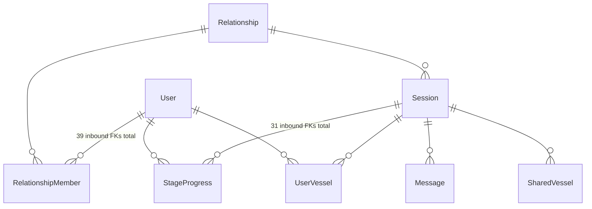
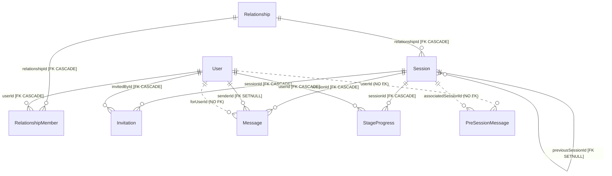
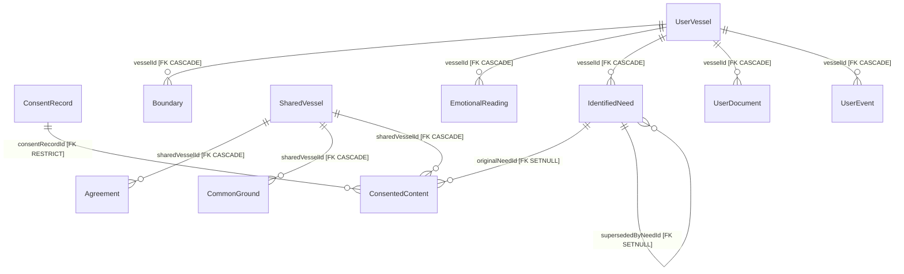
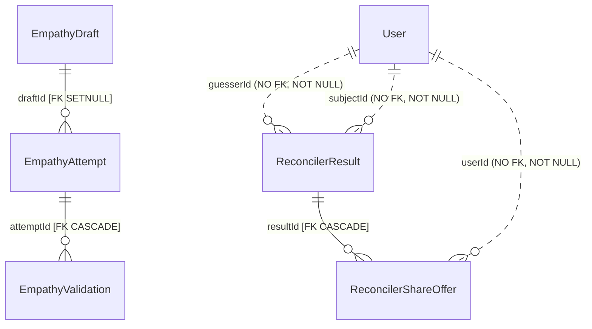
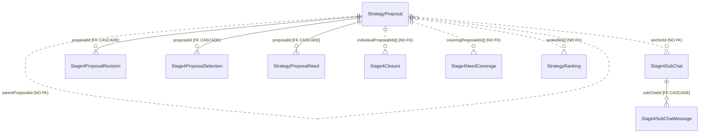
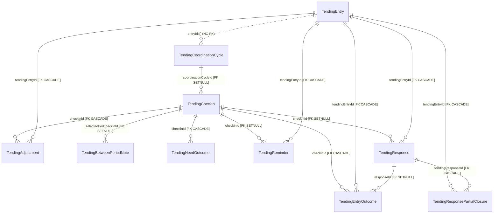
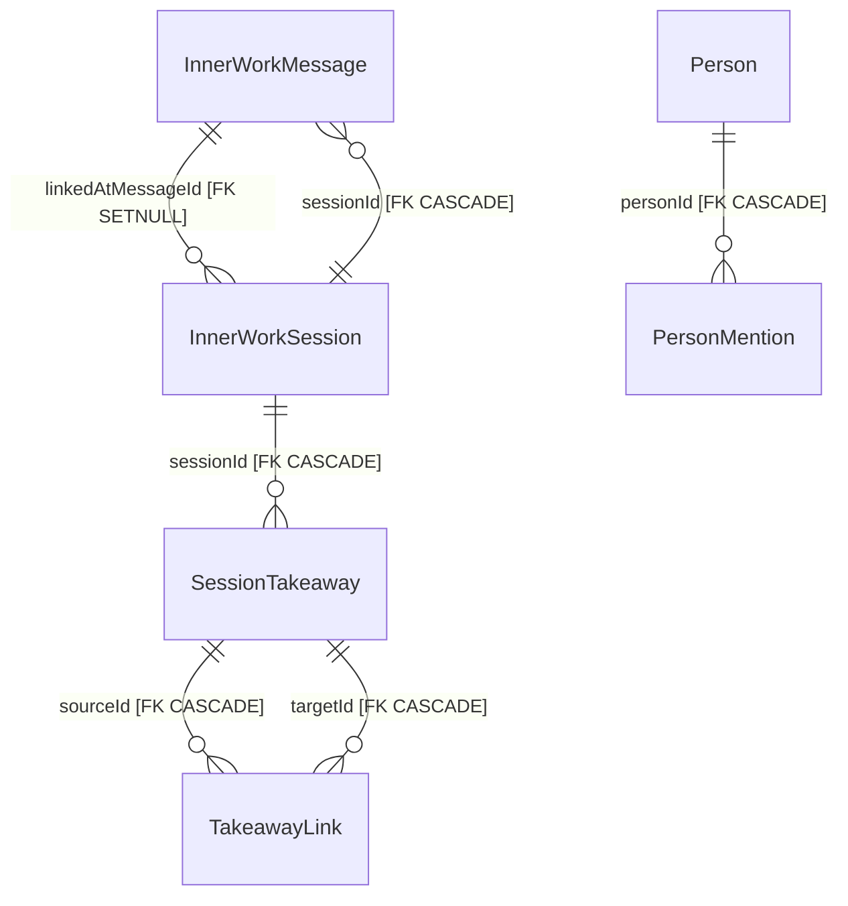
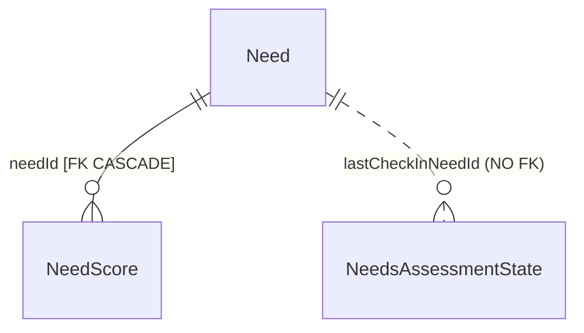

# Database Schema Audit

**Method:** every figure below was obtained by introspecting the `pg_catalog` /
`information_schema` of a **live database** with all 74 migrations applied — not by reading
`schema.prisma`. Where the schema file and the database disagree, the database wins.

Environment audited: PostgreSQL 16.14, pgvector 0.8.6, Prisma 6.12.0.

---

## 1. Headline numbers

| Measure | Value |
|---|---|
| Tables | 68 (+ `_prisma_migrations`) |
| Columns | 669 (434 NOT NULL, 235 nullable) |
| Enum types | 51 |
| Indexes | 203 total, 98 unique |
| Foreign keys | 118 (96 `CASCADE`, 21 `SET NULL`, 1 `RESTRICT`) |
| Relation-shaped columns | 159 — **118 enforced, 41 unenforced (26%)** |
| Migrations | 74, linear, applied cleanly, no table/column drift |

### What the database does *not* have

This list is the most important thing in the audit. Every one of these is **zero**:

| Feature | Count |
|---|---|
| Row-level security policies | **0** |
| Tables with RLS enabled | **0** |
| Triggers | **0** |
| CHECK constraints | **0** |
| Views / materialized views | **0** |
| Stored procedures / user-defined functions | **0** (all functions present belong to pgvector) |
| Database roles besides the app's own | **0** |
| `GRANT` / `REVOKE` / `CREATE ROLE` in any migration | **0** |
| Sequences | **0** |
| Identity columns | **0** |
| Database-side defaults on any primary key | **0** |
| ANN (hnsw/ivfflat) indexes on the 3 vector columns | **0** |

The database is a **passive persistence layer**. It stores rows and enforces referential
integrity where a foreign key happens to exist. It performs no validation, no authorization, no
derivation, and no business-rule enforcement. Every invariant in this product lives in TypeScript.

---

## 2. Identifiers

### There are no UUIDs anywhere

```
uuid-typed columns:            0
sequences:                     0
identity columns:              0
primary keys of type text:     68
primary keys of type integer:   1   (Need.id)
DB-side default on any PK:      0
```

Declared generators in `schema.prisma`: **66 × `@default(cuid())`**, 0 × `uuid()`,
0 × `autoincrement()`, 0 × `cuid(2)`.

### The format is cuid v1, generated in application code

Prisma 6.12's `cuid()` is **cuid v1**: 25 characters, `text`, structured as

```
c  msqngoku  0000  9k7u  yag6r1hg
│  │         │     │     └─ 8 chars random
│  │         │     └─────── 4 chars host fingerprint
│  │         └───────────── 4 chars per-process counter
│  └─────────────────────── 8 chars millisecond timestamp, base36
└────────────────────────── literal 'c'
```

Because there is no database-side default, **IDs are minted client-side by the Prisma client**.
Any writer that is not Prisma — a raw SQL script, a BI tool, a future service — must generate
conforming IDs itself. Nothing in the database enforces the format.

### Are they sortable? Yes — verified empirically

This was tested, not assumed. Decoding the base36 timestamp block of real rows reproduces their
`createdAt` to the millisecond:

| id | decoded timestamp | actual `createdAt` |
|---|---|---|
| `cmsqngoku00009k7uyag6r1hg` | 2026-08-12T22:17:25.614Z | 22:17:25.615 |
| `cmsqngokw00019k7uqmbgdtgt` | 2026-08-12T22:17:25.616Z | 22:17:25.616 |
| `cmsqngol000079k7uilns46bw` | 2026-08-12T22:17:25.620Z | 22:17:25.620 |

Sorting rows lexicographically by `id` produced the same order as sorting by timestamp, with zero
inversions. **cuid v1 is k-sortable**, giving the index-locality benefit usually cited for UUIDv7
and avoiding the random-insert page-split problem of UUIDv4.

Caveats worth knowing:

- **Monotonic per process, not globally.** Ordering within the same millisecond is decided by a
  counter and a host fingerprint, so across multiple API instances same-millisecond ordering is
  arbitrary. Fine for index locality; do not treat `id` ordering as a total event order.
- **cuid v1 is deprecated by its author** in favour of cuid2, partly *because* it leaks
  information: the creation timestamp and a stable host fingerprint are both recoverable from any
  ID, as demonstrated above.
- **That leak matters here.** Session IDs travel in URLs, push payloads and logs, and — per the
  broken-access-control finding on `requireSessionAccess` — function as de-facto capabilities. An
  ID discloses when its row was created and which host minted it.
- **Storage cost.** 25-byte `text` keys against 118 foreign keys and 203 indexes, versus 16 bytes
  for a native `uuid`. Not urgent at current scale; it compounds.

### The one integer primary key is a trap

`Need.id` is `Int @id` with **no** `@default(autoincrement())`, no sequence, and no identity.
Values 1–19 were inserted literally by migration `20260106083657_add_inner_work_features`. Any
code inserting a `Need` must supply the integer itself, and two concurrent inserts choosing the
same number collide on the primary key. It is a reference table, so this is latent rather than
active — but it is a footgun, and it makes `Need` the only table whose IDs cannot be minted
without coordination.

### Client-controlled primary keys are reachable

Two rows in `User` on the local instance have IDs that are not cuids at all —
`phoenix-local-1` (15 chars) and `e2e-test-user` (13 chars). These came from the E2E auth-bypass
path, which upserts `User` on a **caller-supplied** `id` header. The bypass is correctly gated to
non-production, but it demonstrates that primary keys are an application-layer convention, not a
database-enforced one.

---

## 3. Relationships

### Enforced (118 foreign keys)

`User` (39 inbound FKs) and `Session` (31) are the hubs; everything else hangs off them.
`CASCADE` dominates at 96, which matches the privacy model — deleting a user should take their
private data with it. The 21 `SET NULL` edges are content the partner co-owns (e.g.
`Message.senderId`), deliberately outliving the account.

One `RESTRICT`: `ConsentedContent.consentRecordId` — consent records cannot be deleted while
content depends on them. That is the single strongest integrity guarantee in the schema, and it
is guarding exactly the right thing.

### Unenforced (41 columns) — the real finding

26% of relation-shaped columns have no foreign key. They break into four kinds:

**(a) Mandatory relations with zero integrity guarantee — 9 columns.** `NOT NULL`, so the
application treats them as required, yet nothing stops them pointing at a deleted or nonexistent
row:

| Table | Column | Points at |
|---|---|---|
| `ReconcilerResult` | `guesserId` | User |
| `ReconcilerResult` | `subjectId` | User |
| `ReconcilerShareOffer` | `userId` | User |
| `PreSessionMessage` | `userId` | User |
| `PersonMention` | `userId` | User |
| `PersonMention` | `sourceId` | polymorphic |
| `Stage4NeedDeclination` | `userId` | User |
| `Stage4NeedDeclination` | `needId` | IdentifiedNeed |
| `Stage4ProposalRevision` | `sessionId` | Session |

`ReconcilerResult` is the sharpest case: it carries the empathy-gap analysis for a pair of users
and identifies both by unenforced string, alongside *denormalized copies of their names*. Account
deletion has to scrub those names in application code precisely because the database cannot.

**(b) Array-valued ID lists — 10 columns.** Postgres cannot foreign-key an array element without
a trigger or a junction table, so these are unenforceable *by construction*:

`Stage4Closure.{sharedAgreementIds, individualProposalIds, openNeedIds}`,
`Stage4NeedCoverage.coveringProposalIds`, `StrategyRanking.rankedIds`,
`TendingCoordinationCycle.{entryIds, participantUserIds, submittedUserIds}`,
`GratitudeEntry.linkedNeedIds`, `MeditationSession.linkedNeedIds`.

Each is a many-to-many relation that should be a junction table. `StrategyRanking.rankedIds` can
reference deleted proposals — the schema's own comment admits it.

**(c) Genuine polymorphic references — 2, plus 1 near-miss.** These are un-FK-able by design, and
that design choice is defensible:

| Table | Id column | Discriminator | Possible targets |
|---|---|---|---|
| `ConsentRecord` | `targetId` | `targetType` | 7 (`IDENTIFIED_NEED`, `EVENT_SUMMARY`, `EMOTIONAL_PATTERN`, `BOUNDARY`, `EMPATHY_DRAFT`, `EMPATHY_ATTEMPT`, `STRATEGY_PROPOSAL`) |
| `PersonMention` | `sourceId` | `sourceType` | 4 (`INNER_THOUGHTS`, `GRATITUDE`, `NEEDS_CHECKIN`, `PARTNER_SESSION`) |
| `Stage4SubChat` | `anchorId` | `anchorType` | anchor is a *context*, not a table |

**(d) The privacy column.** `Message.forUserId` is a nullable, unindexed-as-leading-column,
un-foreign-keyed `text`. `NULL` means "broadcast to both participants"; a value means "visible
only to this user". This single column is the entire mechanism separating what each partner can
see, and the database knows nothing about it.

### Structural islands

`GlobalLibraryItem` and `PreSessionMessage` have **no inbound and no outbound foreign keys at
all**. For `GlobalLibraryItem` (a global suggestion library) that is arguably correct. For
`PreSessionMessage` it is an omission — it has a `NOT NULL userId` and an `associatedSessionId`,
both unenforced, so it is an island by accident.

### 25 foreign keys have no supporting index

A foreign key without an index on the referencing column forces a sequential scan of the child
table on every parent delete, and holds locks while it does. Affected include
`EmpathyDraft.userId`, `EmpathyValidation.userId`, `TendingResponse.userId`, `UserMemory.sessionId`,
`StrategyProposal.createdByUserId`, `Invitation.invitedById`. Deleting a busy user today is cheap
because the tables are small; it degrades linearly with usage.

---

## 4. Entity-relationship diagrams

Solid lines are FK-enforced. **Dotted lines are implied-only, with no database enforcement.**
`User` and `Session` are omitted from the per-domain diagrams below because nearly every table
links to them — see the hub diagram first.

### Hubs



### Core identity & session



### Vessels, consent & shared state



### Stage 2 — empathy & reconciler



Note how thin the enforced structure is here. This is the subsystem that decides what crosses
between the two participants, and it has three foreign keys.

### Stage 4 — proposals & closure



### Tending (post-resolution)



### Inner work & knowledge



### Needs reference & assessment



**Wellbeing satellites** (`GratitudeEntry`, `MeditationSession`, `MeditationStats`,
`MeditationFavorite`, `MeditationPreferences`, `SavedMeditation`, `GratitudePreferences`,
`EmotionalExerciseCompletion`) and **Operations** (`BrainActivity`, `GlobalLibraryItem`) have no
intra-cluster foreign keys — every edge they have goes to `User`.

---

## 5. Security model

There isn't one at the database layer. Concretely:

- **No RLS.** Migration `20260311000000_add_row_level_security` added policies on six tables;
  `20260430000000_remove_unenforced_rls` removed them, correctly noting they were never enforced
  because the app connects as table owner and never set `app.current_user_id`.
- **No role separation.** The only `CREATE ROLE` / `GRANT` / `FORCE ROW LEVEL SECURITY` statements
  in the entire 74-migration history are **commented out** inside that reverted migration. There
  is no application role, no read-only role, no least privilege — in version control or otherwise.
- **No per-request database identity.** Grepping `backend/src` for `SET LOCAL`, `set_config`,
  `current_setting` or `SET ROLE` returns nothing. RLS is therefore not merely absent but
  architecturally unavailable until a request-scoped DB identity exists.
- **The connection role owns everything.** On the local container `mwf_user` is a superuser with
  all privileges on all 69 tables *(a property of the local setup, not necessarily production —
  the Render role configuration is unverified)*. What is verifiable from the repo is that the app
  connects as the table owner, which bypasses RLS regardless, absent `FORCE ROW LEVEL SECURITY`.
- **No CHECK constraints.** Not one. Every value-level invariant — valid stage numbers, non-empty
  content, sane ranges on the 1–10 mood intensity, status strings on the tables that use free text
  instead of enums — is unvalidated at rest.
- **Encryption at rest is application-side, optional, and currently off.** See the field-encryption
  middleware; the key is deliberately unset in production, and the covered-field map spans 9 of 68
  models.

The practical consequence: **a single missing `where` clause in any of 261 backend files is a
privacy breach, and the database will neither prevent it nor record that it happened.**

---

## 6. Type-level observations

**Every application timestamp is timezone-naive.** 144 columns are
`timestamp without time zone`; the only 3 `timestamptz` columns belong to Prisma's own
`_prisma_migrations` table. Prisma writes UTC by convention, but the database does not know that,
so any consumer outside Prisma — the ~20 `$queryRaw` sites, `pg_dump` snapshots, a future BI tool —
can silently misread them. This product schedules cooling periods, reminders, check-in windows and
invitation expiry across two people who may be in different timezones; naive timestamps are a poor
foundation for that.

**17 `jsonb` columns hold structure that the database cannot validate**, including
`StageProgress.gatesSatisfied` — the stage-gate state machine that enforces the product's pacing
lives in an untyped blob.

**Two summary fields are JSON serialized into `text`** (`UserVessel.conversationSummary`,
`InnerWorkSession.conversationSummary`) rather than `jsonb` — invisible to Postgres entirely.

**51 enum types exist, yet several status columns are free `text`**: `TendingResponse.status`,
`TendingReminder.status`, `ReconcilerResult.gapSeverity`, `ReconcilerResult.recommendedAction`,
`RelationshipMember.role`, `UserDocument.type`.

**No ANN index on any vector column.** `UserVessel.contentEmbedding`,
`InnerWorkSession.contentEmbedding` and `SessionTakeaway.embedding` are all `vector(1024)` with no
`hnsw` or `ivfflat` index, so every similarity search is a sequential scan computing distance
against every row. Correct results, linear cost.

**The schema does not declare its own extensions.** `datasource db` has
`// extensions = [vector]` commented out while migration `20251228220702` runs
`CREATE EXTENSION "vector"`. `prisma migrate diff` consequently always reports the `vector` and
`plpgsql` extensions as a difference — expected noise, but it trains you to ignore drift output.

---

## 7. Summary of what is missing

Ordered by how much each would change the system's safety.

1. **A database-level authorization boundary.** RLS plus a non-owner application role plus a
   request-scoped identity. Today the app layer is the only boundary and there is no defence in depth.
2. **Foreign keys on the 9 mandatory unenforced relations**, starting with `ReconcilerResult`
   and `Message.forUserId`.
3. **Junction tables replacing the 10 array-of-IDs columns**, which would make those relations
   enforceable and queryable.
4. **CHECK constraints** for value-level invariants, and enums for the six free-text status columns.
5. **`timestamptz` everywhere**, or an explicit written decision that UTC-naive is the contract.
6. **Indexes on the 25 unindexed foreign keys.**
7. **ANN indexes** on the three vector columns before the corpus grows.
8. **A decision on identifiers:** cuid v1 is sortable and adequate, but it is deprecated upstream
   and leaks creation time and host fingerprint in values that are used as capabilities. Migrating
   to UUIDv7 (`uuid` type, 16 bytes, sortable, no fingerprint) or cuid2 is a schema-wide change
   that gets harder every month.
